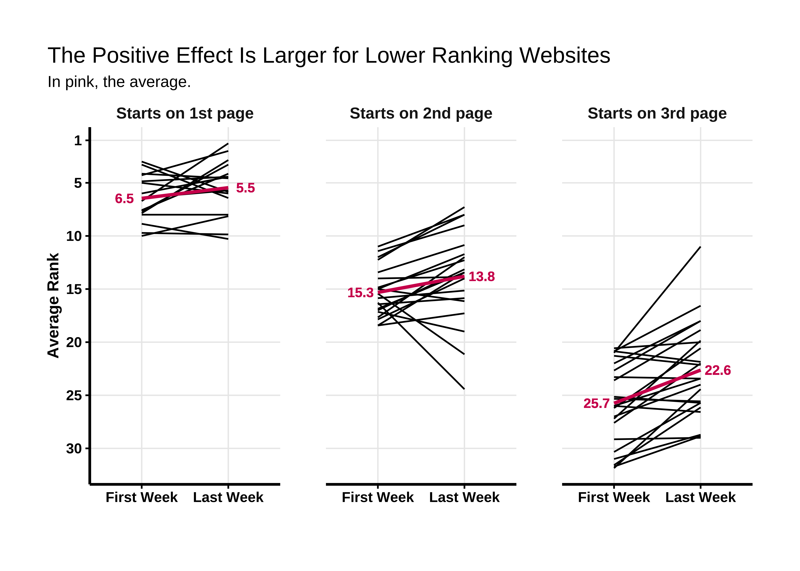

<style>
.list-group-item.active, .list-group-item.active:hover, .list-group-item.active:focus {
background-color: #D21D5C;
border-color: #D21D5C;
}

body {
font-family: 'Alegreya Sans', sans-serif;
color: #333333;
font-size: 18px;
}

h1 {
font-weight: bold;
font-size: 28px;
}

h1.title {
font-size: 30px;
color: #111111;
}

h2 {
font-size: 24px;
}

h3 {
font-size: 18px;
}
</style>


# Introduction 

Does organic CTR impact SEO rankings? In this study, we want to answer this question and  test for the effect of increasing [Click-Through Rates](https://support.google.com/google-ads/answer/2615875?hl=en) (CTRs) on Google Search rankings.  
We focus on a particular niche: car accident lawyers (personal injury lawyers). We “artificially” increased the number of visits to randomly selected car accident lawyers’ websites and measured the impact on Google rankings.  
By “artificially” increasing the number of searches and visits per day, we improve the CTR, which is considered a ranking factor. As background, [see Larry Kim's post](https://moz.com/blog/does-organic-ctr-impact-seo-rankings-new-data) for a captivating discussion on the issue.


# Methodology

We use [SERP Empire](https://www.serpempire.com) as our organic traffic provider. We launched campaigns for 60 selected personal injury lawyers’ websites. Each campaign is “artificially” boosting the number of searches and clicks for the keyword “[city] car accident lawyer”. By doing so, we increase their CTR for 30 days.  

We collect the position (Google Search ranking) of the website daily from the SERP Empire interface. We then analyzed the position of each website throughout the study to assess the strength of the effect and effectiveness of using a traffic provider.  

One of the major caveats of this study is that we used SERP Empire both to boost the number of visits and to measure the effect of this boost.  

Finally, it is worth noting that while the ranking of any website is expected to vary over time,we anticipate to see a possible impact when looking at many websites. This is the reason we collected 60 samples from a variety of cities and initial rankings.  

See also the [Detailed Methodology](#detailed-methodology) in the Annex.  


# Research Findings 

## Ranking Over Time

We started by visualizing the rank evolution of the 60 websites. Each line represents the ranking of a personal injury lawyer’s website for the keyword “car accident lawyer” over time. The pink line is a LOESS regression ([locally estimated scatterplot smoothing](https://en.wikipedia.org/wiki/Local_regression)) and represents a smoothed average, similar to a moving average but better.    


```{=html}
<div id="htmlwidget-f541dda9c9869cf9c92e" style="width:80%;height:3600px;" class="girafe html-widget"></div>
<script type="application/json" data-for="htmlwidget-f541dda9c9869cf9c92e">{"x":{"html":"<?xml version=\"1.0\" encoding=\"UTF-8\"?>\n<svg xmlns='http://www.w3.org/2000/svg' xmlns:xlink='http://www.w3.org/1999/xlink' id='svg_bc995ec3-2ab3-4930-9c69-70262e3ccf1e' viewBox='0 0 432.00 360.00'>\n  <g>\n    <defs>\n      <clipPath id='svg_bc995ec3-2ab3-4930-9c69-70262e3ccf1e_cl_1'>\n        <rect x='0.00' y='0.00' width='432.00' height='360.00'/>\n      <\/clipPath>\n    <\/defs>\n    <rect x='0.00' y='0.00' width='432.00' height='360.00' id='svg_bc995ec3-2ab3-4930-9c69-70262e3ccf1e_el_1' clip-path='url(#svg_bc995ec3-2ab3-4930-9c69-70262e3ccf1e_cl_1)' fill='#FFFFFF' fill-opacity='1' stroke='#FFFFFF' stroke-opacity='1' stroke-width='0.75' stroke-linejoin='round' stroke-linecap='round'/>\n    <defs>\n      <clipPath id='svg_bc995ec3-2ab3-4930-9c69-70262e3ccf1e_cl_2'>\n        <rect x='0.00' y='0.00' width='432.00' height='360.00'/>\n      <\/clipPath>\n    <\/defs>\n    <rect x='0.00' y='0.00' width='432.00' height='360.00' id='svg_bc995ec3-2ab3-4930-9c69-70262e3ccf1e_el_2' clip-path='url(#svg_bc995ec3-2ab3-4930-9c69-70262e3ccf1e_cl_2)' fill='#FFFFFF' fill-opacity='1' stroke='#FFFFFF' stroke-opacity='1' stroke-width='1.07' stroke-linejoin='round' stroke-linecap='round'/>\n    <defs>\n      <clipPath id='svg_bc995ec3-2ab3-4930-9c69-70262e3ccf1e_cl_3'>\n        <rect x='56.98' y='74.18' width='345.13' height='230.37'/>\n      <\/clipPath>\n    <\/defs>\n    <polyline points='108.10,304.55 108.10,74.18' id='svg_bc995ec3-2ab3-4930-9c69-70262e3ccf1e_el_3' clip-path='url(#svg_bc995ec3-2ab3-4930-9c69-70262e3ccf1e_cl_3)' fill='none' stroke='#EAEAEA' stroke-opacity='1' stroke-width='0.85' stroke-linejoin='round' stroke-linecap='butt'/>\n    <polyline points='178.94,304.55 178.94,74.18' id='svg_bc995ec3-2ab3-4930-9c69-70262e3ccf1e_el_4' clip-path='url(#svg_bc995ec3-2ab3-4930-9c69-70262e3ccf1e_cl_3)' fill='none' stroke='#EAEAEA' stroke-opacity='1' stroke-width='0.85' stroke-linejoin='round' stroke-linecap='butt'/>\n    <polyline points='249.79,304.55 249.79,74.18' id='svg_bc995ec3-2ab3-4930-9c69-70262e3ccf1e_el_5' clip-path='url(#svg_bc995ec3-2ab3-4930-9c69-70262e3ccf1e_cl_3)' fill='none' stroke='#EAEAEA' stroke-opacity='1' stroke-width='0.85' stroke-linejoin='round' stroke-linecap='butt'/>\n    <polyline points='320.64,304.55 320.64,74.18' id='svg_bc995ec3-2ab3-4930-9c69-70262e3ccf1e_el_6' clip-path='url(#svg_bc995ec3-2ab3-4930-9c69-70262e3ccf1e_cl_3)' fill='none' stroke='#EAEAEA' stroke-opacity='1' stroke-width='0.85' stroke-linejoin='round' stroke-linecap='butt'/>\n    <polyline points='371.24,304.55 371.24,74.18' id='svg_bc995ec3-2ab3-4930-9c69-70262e3ccf1e_el_7' clip-path='url(#svg_bc995ec3-2ab3-4930-9c69-70262e3ccf1e_cl_3)' fill='none' stroke='#EAEAEA' stroke-opacity='1' stroke-width='0.85' stroke-linejoin='round' stroke-linecap='butt'/>\n    <polyline points='56.98,84.65 402.11,84.65' id='svg_bc995ec3-2ab3-4930-9c69-70262e3ccf1e_el_8' clip-path='url(#svg_bc995ec3-2ab3-4930-9c69-70262e3ccf1e_cl_3)' fill='none' stroke='#EAEAEA' stroke-opacity='1' stroke-width='0.85' stroke-linejoin='round' stroke-linecap='butt'/>\n    <polyline points='56.98,110.04 402.11,110.04' id='svg_bc995ec3-2ab3-4930-9c69-70262e3ccf1e_el_9' clip-path='url(#svg_bc995ec3-2ab3-4930-9c69-70262e3ccf1e_cl_3)' fill='none' stroke='#EAEAEA' stroke-opacity='1' stroke-width='0.85' stroke-linejoin='round' stroke-linecap='butt'/>\n    <polyline points='56.98,141.77 402.11,141.77' id='svg_bc995ec3-2ab3-4930-9c69-70262e3ccf1e_el_10' clip-path='url(#svg_bc995ec3-2ab3-4930-9c69-70262e3ccf1e_cl_3)' fill='none' stroke='#EAEAEA' stroke-opacity='1' stroke-width='0.85' stroke-linejoin='round' stroke-linecap='butt'/>\n    <polyline points='56.98,173.50 402.11,173.50' id='svg_bc995ec3-2ab3-4930-9c69-70262e3ccf1e_el_11' clip-path='url(#svg_bc995ec3-2ab3-4930-9c69-70262e3ccf1e_cl_3)' fill='none' stroke='#EAEAEA' stroke-opacity='1' stroke-width='0.85' stroke-linejoin='round' stroke-linecap='butt'/>\n    <polyline points='56.98,205.23 402.11,205.23' id='svg_bc995ec3-2ab3-4930-9c69-70262e3ccf1e_el_12' clip-path='url(#svg_bc995ec3-2ab3-4930-9c69-70262e3ccf1e_cl_3)' fill='none' stroke='#EAEAEA' stroke-opacity='1' stroke-width='0.85' stroke-linejoin='round' stroke-linecap='butt'/>\n    <polyline points='56.98,236.96 402.11,236.96' id='svg_bc995ec3-2ab3-4930-9c69-70262e3ccf1e_el_13' clip-path='url(#svg_bc995ec3-2ab3-4930-9c69-70262e3ccf1e_cl_3)' fill='none' stroke='#EAEAEA' stroke-opacity='1' stroke-width='0.85' stroke-linejoin='round' stroke-linecap='butt'/>\n    <polyline points='56.98,268.69 402.11,268.69' id='svg_bc995ec3-2ab3-4930-9c69-70262e3ccf1e_el_14' clip-path='url(#svg_bc995ec3-2ab3-4930-9c69-70262e3ccf1e_cl_3)' fill='none' stroke='#EAEAEA' stroke-opacity='1' stroke-width='0.85' stroke-linejoin='round' stroke-linecap='butt'/>\n    <polyline points='72.67,304.55 72.67,74.18' id='svg_bc995ec3-2ab3-4930-9c69-70262e3ccf1e_el_15' clip-path='url(#svg_bc995ec3-2ab3-4930-9c69-70262e3ccf1e_cl_3)' fill='none' stroke='#EAEAEA' stroke-opacity='1' stroke-width='0.85' stroke-linejoin='round' stroke-linecap='butt'/>\n    <polyline points='143.52,304.55 143.52,74.18' id='svg_bc995ec3-2ab3-4930-9c69-70262e3ccf1e_el_16' clip-path='url(#svg_bc995ec3-2ab3-4930-9c69-70262e3ccf1e_cl_3)' fill='none' stroke='#EAEAEA' stroke-opacity='1' stroke-width='0.85' stroke-linejoin='round' stroke-linecap='butt'/>\n    <polyline points='143.52,304.55 143.52,74.18' id='svg_bc995ec3-2ab3-4930-9c69-70262e3ccf1e_el_17' clip-path='url(#svg_bc995ec3-2ab3-4930-9c69-70262e3ccf1e_cl_3)' fill='none' stroke='#EAEAEA' stroke-opacity='1' stroke-width='0.85' stroke-linejoin='round' stroke-linecap='butt'/>\n    <polyline points='214.37,304.55 214.37,74.18' id='svg_bc995ec3-2ab3-4930-9c69-70262e3ccf1e_el_18' clip-path='url(#svg_bc995ec3-2ab3-4930-9c69-70262e3ccf1e_cl_3)' fill='none' stroke='#EAEAEA' stroke-opacity='1' stroke-width='0.85' stroke-linejoin='round' stroke-linecap='butt'/>\n    <polyline points='285.21,304.55 285.21,74.18' id='svg_bc995ec3-2ab3-4930-9c69-70262e3ccf1e_el_19' clip-path='url(#svg_bc995ec3-2ab3-4930-9c69-70262e3ccf1e_cl_3)' fill='none' stroke='#EAEAEA' stroke-opacity='1' stroke-width='0.85' stroke-linejoin='round' stroke-linecap='butt'/>\n    <polyline points='356.06,304.55 356.06,74.18' id='svg_bc995ec3-2ab3-4930-9c69-70262e3ccf1e_el_20' clip-path='url(#svg_bc995ec3-2ab3-4930-9c69-70262e3ccf1e_cl_3)' fill='none' stroke='#EAEAEA' stroke-opacity='1' stroke-width='0.85' stroke-linejoin='round' stroke-linecap='butt'/>\n    <polyline points='386.42,304.55 386.42,74.18' id='svg_bc995ec3-2ab3-4930-9c69-70262e3ccf1e_el_21' clip-path='url(#svg_bc995ec3-2ab3-4930-9c69-70262e3ccf1e_cl_3)' fill='none' stroke='#EAEAEA' stroke-opacity='1' stroke-width='0.85' stroke-linejoin='round' stroke-linecap='butt'/>\n    <polyline points='72.67,122.73 82.79,148.12 92.91,135.42 103.04,141.77 113.16,141.77 123.28,154.46 133.40,135.42 143.52,122.73 153.64,122.73 163.76,116.38 173.88,154.46 184.00,173.50 194.12,173.50 204.25,167.15 214.37,141.77 224.49,148.12 234.61,148.12 244.73,148.12 254.85,148.12 264.97,135.42 275.09,148.12 285.21,148.12 295.34,148.12 305.46,148.12 315.58,141.77 325.70,135.42 335.82,141.77 345.94,141.77 356.06,141.77 366.18,141.77 376.30,141.77 386.42,141.77' id='svg_bc995ec3-2ab3-4930-9c69-70262e3ccf1e_el_22' clip-path='url(#svg_bc995ec3-2ab3-4930-9c69-70262e3ccf1e_cl_3)' fill='none' stroke='#888888' stroke-opacity='1' stroke-width='0.85' stroke-linejoin='round' stroke-linecap='butt' data-id='Sample 1, San Antonio' title='Sample 1, San Antonio'/>\n    <polyline points='72.67,160.81 82.79,160.81 92.91,167.15 103.04,160.81 113.16,173.50 123.28,154.46 133.40,167.15 143.52,173.50 153.64,173.50 163.76,173.50 173.88,160.81 184.00,167.15 194.12,167.15 204.25,167.15 214.37,154.46 224.49,141.77 234.61,141.77 244.73,135.42 254.85,141.77 264.97,141.77 275.09,141.77 285.21,141.77 295.34,141.77 305.46,141.77 315.58,148.12 325.70,148.12 335.82,148.12 345.94,148.12 356.06,141.77 366.18,148.12 376.30,148.12 386.42,148.12' id='svg_bc995ec3-2ab3-4930-9c69-70262e3ccf1e_el_23' clip-path='url(#svg_bc995ec3-2ab3-4930-9c69-70262e3ccf1e_cl_3)' fill='none' stroke='#888888' stroke-opacity='1' stroke-width='0.85' stroke-linejoin='round' stroke-linecap='butt' data-id='Sample 2, San Antonio' title='Sample 2, San Antonio'/>\n    <polyline points='103.04,243.31 113.16,243.31 123.28,243.31 133.40,243.31 143.52,243.31 153.64,224.27 163.76,224.27 173.88,217.92 184.00,230.62 194.12,230.62 204.25,249.65 214.37,224.27 224.49,224.27 234.61,224.27 244.73,224.27 254.85,217.92 264.97,224.27 275.09,224.27 285.21,224.27 295.34,230.62 305.46,224.27 315.58,230.62 325.70,230.62 335.82,230.62 345.94,230.62 356.06,224.27 366.18,224.27 376.30,224.27 386.42,224.27' id='svg_bc995ec3-2ab3-4930-9c69-70262e3ccf1e_el_24' clip-path='url(#svg_bc995ec3-2ab3-4930-9c69-70262e3ccf1e_cl_3)' fill='none' stroke='#888888' stroke-opacity='1' stroke-width='0.85' stroke-linejoin='round' stroke-linecap='butt' data-id='Sample 3, San Antonio' title='Sample 3, San Antonio'/>\n    <polyline points='72.67,116.38 82.79,110.04 92.91,110.04 103.04,110.04 113.16,110.04 123.28,110.04 133.40,103.69 143.52,103.69 153.64,103.69 163.76,103.69 173.88,122.73 184.00,129.08 194.12,135.42 204.25,129.08 214.37,116.38 224.49,116.38 234.61,116.38 244.73,116.38 254.85,116.38 264.97,116.38 275.09,116.38 285.21,116.38 295.34,116.38 305.46,116.38 315.58,116.38 325.70,116.38 335.82,116.38 345.94,116.38 356.06,116.38 366.18,116.38 376.30,116.38 386.42,116.38' id='svg_bc995ec3-2ab3-4930-9c69-70262e3ccf1e_el_25' clip-path='url(#svg_bc995ec3-2ab3-4930-9c69-70262e3ccf1e_cl_3)' fill='none' stroke='#888888' stroke-opacity='1' stroke-width='0.85' stroke-linejoin='round' stroke-linecap='butt' data-id='Sample 4, Los Angeles' title='Sample 4, Los Angeles'/>\n    <polyline points='72.67,167.15 82.79,173.50 92.91,186.19 103.04,186.19 113.16,186.19 123.28,186.19 133.40,186.19 143.52,179.85 153.64,186.19 163.76,192.54 173.88,192.54 184.00,192.54 194.12,205.23 204.25,198.89 214.37,179.85 224.49,186.19 234.61,186.19 244.73,179.85 254.85,186.19 264.97,179.85 275.09,186.19 285.21,186.19 295.34,186.19 305.46,198.89 315.58,198.89 325.70,211.58 335.82,211.58 345.94,236.96 356.06,243.31 366.18,243.31 376.30,243.31 386.42,243.31' id='svg_bc995ec3-2ab3-4930-9c69-70262e3ccf1e_el_26' clip-path='url(#svg_bc995ec3-2ab3-4930-9c69-70262e3ccf1e_cl_3)' fill='none' stroke='#888888' stroke-opacity='1' stroke-width='0.85' stroke-linejoin='round' stroke-linecap='butt' data-id='Sample 5, Los Angeles' title='Sample 5, Los Angeles'/>\n    <polyline points='72.67,129.08 82.79,129.08 92.91,129.08 103.04,129.08 113.16,129.08 123.28,129.08 133.40,129.08 143.52,129.08 153.64,129.08 163.76,129.08 173.88,129.08 184.00,135.42 194.12,129.08 204.25,129.08 214.37,129.08 224.49,129.08 234.61,129.08 244.73,129.08 254.85,129.08 264.97,129.08 275.09,129.08 285.21,129.08 295.34,129.08 305.46,129.08 315.58,129.08 325.70,129.08 335.82,129.08 345.94,129.08 356.06,129.08 366.18,129.08 376.30,129.08 386.42,129.08' id='svg_bc995ec3-2ab3-4930-9c69-70262e3ccf1e_el_27' clip-path='url(#svg_bc995ec3-2ab3-4930-9c69-70262e3ccf1e_cl_3)' fill='none' stroke='#888888' stroke-opacity='1' stroke-width='0.85' stroke-linejoin='round' stroke-linecap='butt' data-id='Sample 7, Brooklyn' title='Sample 7, Brooklyn'/>\n    <polyline points='72.67,97.35 82.79,110.04 92.91,122.73 103.04,122.73 113.16,122.73 123.28,122.73 133.40,148.12 143.52,122.73 153.64,116.38 163.76,110.04 173.88,103.69 184.00,91.00 194.12,84.65 204.25,84.65 214.37,91.00 224.49,84.65 234.61,84.65 244.73,84.65 254.85,84.65 264.97,84.65 275.09,84.65 285.21,84.65 295.34,84.65 305.46,84.65 315.58,84.65 325.70,84.65 335.82,84.65 345.94,84.65 356.06,91.00 366.18,91.00 376.30,84.65 386.42,84.65' id='svg_bc995ec3-2ab3-4930-9c69-70262e3ccf1e_el_28' clip-path='url(#svg_bc995ec3-2ab3-4930-9c69-70262e3ccf1e_cl_3)' fill='none' stroke='#888888' stroke-opacity='1' stroke-width='0.85' stroke-linejoin='round' stroke-linecap='butt' data-id='Sample 8, Brooklyn' title='Sample 8, Brooklyn'/>\n    <polyline points='92.91,243.31 103.04,243.31 113.16,243.31 123.28,268.69 133.40,268.69 143.52,268.69 153.64,268.69 163.76,262.35 173.88,262.35 184.00,211.58 194.12,224.27 204.25,224.27 214.37,224.27 224.49,217.92 234.61,217.92 244.73,217.92 254.85,211.58 264.97,211.58 275.09,211.58 285.21,211.58 295.34,217.92 305.46,224.27 315.58,224.27 325.70,217.92 335.82,217.92 345.94,217.92 356.06,217.92 366.18,217.92 376.30,217.92 386.42,217.92' id='svg_bc995ec3-2ab3-4930-9c69-70262e3ccf1e_el_29' clip-path='url(#svg_bc995ec3-2ab3-4930-9c69-70262e3ccf1e_cl_3)' fill='none' stroke='#888888' stroke-opacity='1' stroke-width='0.85' stroke-linejoin='round' stroke-linecap='butt' data-id='Sample 9, Brooklyn' title='Sample 9, Brooklyn'/>\n    <polyline points='72.67,154.46 82.79,154.46 92.91,154.46 103.04,154.46 113.16,160.81 123.28,154.46 133.40,148.12 143.52,148.12 153.64,154.46 163.76,148.12 173.88,154.46 184.00,160.81 194.12,167.15 204.25,167.15 214.37,148.12 224.49,141.77 234.61,141.77 244.73,141.77 254.85,141.77 264.97,141.77 275.09,141.77 285.21,129.08 295.34,135.42 305.46,129.08 315.58,122.73 325.70,129.08 335.82,129.08 345.94,129.08 356.06,129.08 366.18,129.08 376.30,129.08 386.42,129.08' id='svg_bc995ec3-2ab3-4930-9c69-70262e3ccf1e_el_30' clip-path='url(#svg_bc995ec3-2ab3-4930-9c69-70262e3ccf1e_cl_3)' fill='none' stroke='#888888' stroke-opacity='1' stroke-width='0.85' stroke-linejoin='round' stroke-linecap='butt' data-id='Sample 10, Miami' title='Sample 10, Miami'/>\n    <polyline points='72.67,173.50 82.79,179.85 92.91,179.85 103.04,192.54 113.16,173.50 123.28,173.50 133.40,160.81 143.52,173.50 153.64,167.15 163.76,167.15 173.88,186.19 184.00,205.23 194.12,211.58 204.25,205.23 214.37,179.85 224.49,186.19 234.61,179.85 244.73,173.50 254.85,179.85 264.97,205.23 275.09,192.54 285.21,186.19 295.34,192.54 305.46,256.00 315.58,224.27 325.70,211.58 335.82,198.89 345.94,205.23 356.06,205.23 366.18,217.92 376.30,224.27 386.42,224.27' id='svg_bc995ec3-2ab3-4930-9c69-70262e3ccf1e_el_31' clip-path='url(#svg_bc995ec3-2ab3-4930-9c69-70262e3ccf1e_cl_3)' fill='none' stroke='#888888' stroke-opacity='1' stroke-width='0.85' stroke-linejoin='round' stroke-linecap='butt' data-id='Sample 11, Miami' title='Sample 11, Miami'/>\n    <polyline points='72.67,262.35 82.79,262.35 92.91,256.00 103.04,268.69 113.16,268.69 123.28,262.35 133.40,262.35 143.52,262.35 153.64,262.35 163.76,262.35 173.88,287.73 184.00,287.73 194.12,287.73 204.25,287.73 214.37,262.35 224.49,268.69 234.61,268.69 244.73,262.35 254.85,262.35 264.97,268.69 275.09,268.69 285.21,268.69 295.34,262.35 305.46,262.35 315.58,268.69 325.70,256.00 335.82,256.00 345.94,256.00 356.06,262.35 366.18,268.69 376.30,268.69 386.42,268.69' id='svg_bc995ec3-2ab3-4930-9c69-70262e3ccf1e_el_32' clip-path='url(#svg_bc995ec3-2ab3-4930-9c69-70262e3ccf1e_cl_3)' fill='none' stroke='#888888' stroke-opacity='1' stroke-width='0.85' stroke-linejoin='round' stroke-linecap='butt' data-id='Sample 12, Miami' title='Sample 12, Miami'/>\n    <polyline points='72.67,148.12 82.79,148.12 92.91,135.42 103.04,141.77 113.16,135.42 123.28,141.77 133.40,141.77 143.52,141.77 153.64,148.12 163.76,154.46 173.88,148.12 184.00,148.12 194.12,154.46 204.25,154.46 214.37,129.08 224.49,122.73 234.61,122.73 244.73,122.73 254.85,122.73 264.97,122.73 275.09,122.73 285.21,122.73 295.34,122.73 305.46,129.08 315.58,122.73 325.70,129.08 335.82,129.08 345.94,129.08 356.06,135.42 366.18,129.08 376.30,129.08 386.42,129.08' id='svg_bc995ec3-2ab3-4930-9c69-70262e3ccf1e_el_33' clip-path='url(#svg_bc995ec3-2ab3-4930-9c69-70262e3ccf1e_cl_3)' fill='none' stroke='#888888' stroke-opacity='1' stroke-width='0.85' stroke-linejoin='round' stroke-linecap='butt' data-id='Sample 13, Houston' title='Sample 13, Houston'/>\n    <polyline points='72.67,198.89 82.79,186.19 92.91,192.54 103.04,192.54 113.16,198.89 123.28,198.89 133.40,198.89 143.52,198.89 153.64,205.23 163.76,211.58 173.88,211.58 184.00,217.92 194.12,224.27 204.25,224.27 214.37,198.89 224.49,192.54 234.61,192.54 244.73,192.54 254.85,198.89 264.97,205.23 275.09,198.89 285.21,192.54 295.34,198.89 305.46,192.54 315.58,186.19 325.70,186.19 335.82,186.19 345.94,186.19 356.06,186.19 366.18,192.54 376.30,186.19 386.42,192.54' id='svg_bc995ec3-2ab3-4930-9c69-70262e3ccf1e_el_34' clip-path='url(#svg_bc995ec3-2ab3-4930-9c69-70262e3ccf1e_cl_3)' fill='none' stroke='#888888' stroke-opacity='1' stroke-width='0.85' stroke-linejoin='round' stroke-linecap='butt' data-id='Sample 14, Houston' title='Sample 14, Houston'/>\n    <polyline points='72.67,211.58 82.79,211.58 92.91,205.23 103.04,217.92 113.16,192.54 123.28,211.58 133.40,224.27 143.52,224.27 153.64,211.58 163.76,186.19 173.88,186.19 184.00,186.19 194.12,198.89 204.25,198.89 214.37,179.85 224.49,179.85 234.61,179.85 244.73,186.19 254.85,186.19 264.97,186.19 275.09,198.89 285.21,205.23 295.34,198.89 305.46,198.89 315.58,217.92 325.70,224.27 335.82,217.92 345.94,217.92 356.06,217.92 366.18,217.92 376.30,211.58 386.42,211.58' id='svg_bc995ec3-2ab3-4930-9c69-70262e3ccf1e_el_35' clip-path='url(#svg_bc995ec3-2ab3-4930-9c69-70262e3ccf1e_cl_3)' fill='none' stroke='#888888' stroke-opacity='1' stroke-width='0.85' stroke-linejoin='round' stroke-linecap='butt' data-id='Sample 15, Houston' title='Sample 15, Houston'/>\n    <polyline points='72.67,129.08 82.79,129.08 92.91,116.38 103.04,110.04 113.16,97.35 123.28,91.00 133.40,91.00 143.52,91.00 153.64,97.35 163.76,97.35 173.88,103.69 184.00,103.69 194.12,110.04 204.25,122.73 214.37,103.69 224.49,103.69 234.61,103.69 244.73,97.35 254.85,97.35 264.97,97.35 275.09,97.35 285.21,103.69 295.34,97.35 305.46,97.35 315.58,103.69 325.70,110.04 335.82,110.04 345.94,110.04 356.06,103.69 366.18,103.69 376.30,103.69 386.42,103.69' id='svg_bc995ec3-2ab3-4930-9c69-70262e3ccf1e_el_36' clip-path='url(#svg_bc995ec3-2ab3-4930-9c69-70262e3ccf1e_cl_3)' fill='none' stroke='#888888' stroke-opacity='1' stroke-width='0.85' stroke-linejoin='round' stroke-linecap='butt' data-id='Sample 16, Chicago' title='Sample 16, Chicago'/>\n    <polyline points='72.67,198.89 82.79,192.54 92.91,192.54 103.04,173.50 113.16,198.89 123.28,167.15 133.40,179.85 143.52,167.15 153.64,154.46 163.76,148.12 173.88,148.12 184.00,160.81 194.12,160.81 204.25,160.81 214.37,154.46 224.49,154.46 234.61,154.46 244.73,173.50 254.85,167.15 264.97,160.81 275.09,160.81 285.21,160.81 295.34,154.46 305.46,160.81 315.58,160.81 325.70,160.81 335.82,160.81 345.94,167.15 356.06,167.15 366.18,154.46 376.30,160.81 386.42,160.81' id='svg_bc995ec3-2ab3-4930-9c69-70262e3ccf1e_el_37' clip-path='url(#svg_bc995ec3-2ab3-4930-9c69-70262e3ccf1e_cl_3)' fill='none' stroke='#888888' stroke-opacity='1' stroke-width='0.85' stroke-linejoin='round' stroke-linecap='butt' data-id='Sample 17, Chicago' title='Sample 17, Chicago'/>\n    <polyline points='82.79,205.23 92.91,230.62 103.04,224.27 113.16,224.27 123.28,224.27 133.40,224.27 143.52,236.96 153.64,243.31 163.76,243.31 173.88,217.92 184.00,217.92 194.12,217.92 204.25,224.27 214.37,224.27 224.49,186.19 234.61,192.54 244.73,192.54 254.85,192.54 264.97,192.54 275.09,192.54 285.21,192.54 295.34,192.54 305.46,192.54 315.58,192.54 325.70,192.54 335.82,192.54 345.94,192.54 356.06,192.54 366.18,192.54 376.30,192.54 386.42,192.54' id='svg_bc995ec3-2ab3-4930-9c69-70262e3ccf1e_el_38' clip-path='url(#svg_bc995ec3-2ab3-4930-9c69-70262e3ccf1e_cl_3)' fill='none' stroke='#888888' stroke-opacity='1' stroke-width='0.85' stroke-linejoin='round' stroke-linecap='butt' data-id='Sample 18, Chicago' title='Sample 18, Chicago'/>\n    <polyline points='72.67,148.12 82.79,148.12 92.91,135.42 103.04,154.46 113.16,148.12 123.28,154.46 133.40,148.12 143.52,141.77 153.64,148.12 163.76,160.81 173.88,135.42 184.00,135.42 194.12,148.12 204.25,148.12 214.37,122.73 224.49,122.73 234.61,122.73 244.73,116.38 254.85,116.38 264.97,116.38 275.09,116.38 285.21,116.38 295.34,129.08 305.46,122.73 315.58,129.08 325.70,129.08 335.82,129.08 345.94,129.08 356.06,129.08 366.18,129.08 376.30,129.08 386.42,129.08' id='svg_bc995ec3-2ab3-4930-9c69-70262e3ccf1e_el_39' clip-path='url(#svg_bc995ec3-2ab3-4930-9c69-70262e3ccf1e_cl_3)' fill='none' stroke='#888888' stroke-opacity='1' stroke-width='0.85' stroke-linejoin='round' stroke-linecap='butt' data-id='Sample 19, Dallas' title='Sample 19, Dallas'/>\n    <polyline points='72.67,224.27 82.79,211.58 92.91,217.92 103.04,205.23 113.16,205.23 123.28,217.92 133.40,211.58 143.52,217.92 153.64,217.92 163.76,205.23 173.88,179.85 184.00,217.92 194.12,205.23 204.25,205.23 214.37,179.85 224.49,192.54 234.61,211.58 244.73,211.58 254.85,211.58 264.97,217.92 275.09,211.58 285.21,205.23 295.34,173.50 305.46,205.23 315.58,224.27 325.70,224.27 335.82,224.27 345.94,217.92 356.06,224.27 366.18,205.23 376.30,217.92 386.42,217.92' id='svg_bc995ec3-2ab3-4930-9c69-70262e3ccf1e_el_40' clip-path='url(#svg_bc995ec3-2ab3-4930-9c69-70262e3ccf1e_cl_3)' fill='none' stroke='#888888' stroke-opacity='1' stroke-width='0.85' stroke-linejoin='round' stroke-linecap='butt' data-id='Sample 20, Dallas' title='Sample 20, Dallas'/>\n    <polyline points='72.67,179.85 82.79,186.19 92.91,179.85 103.04,192.54 113.16,192.54 123.28,173.50 133.40,173.50 143.52,198.89 153.64,198.89 163.76,198.89 173.88,173.50 184.00,173.50 194.12,205.23 204.25,211.58 214.37,186.19 224.49,179.85 234.61,160.81 244.73,160.81 254.85,160.81 264.97,179.85 275.09,179.85 285.21,179.85 295.34,179.85 305.46,179.85 315.58,179.85 325.70,179.85 335.82,179.85 345.94,179.85 356.06,173.50 366.18,179.85 376.30,179.85 386.42,179.85' id='svg_bc995ec3-2ab3-4930-9c69-70262e3ccf1e_el_41' clip-path='url(#svg_bc995ec3-2ab3-4930-9c69-70262e3ccf1e_cl_3)' fill='none' stroke='#888888' stroke-opacity='1' stroke-width='0.85' stroke-linejoin='round' stroke-linecap='butt' data-id='Sample 21, Dallas' title='Sample 21, Dallas'/>\n    <polyline points='72.67,110.04 82.79,116.38 92.91,122.73 103.04,122.73 113.16,122.73 123.28,110.04 133.40,110.04 143.52,103.69 153.64,103.69 163.76,110.04 173.88,103.69 184.00,110.04 194.12,110.04 204.25,110.04 214.37,103.69 224.49,97.35 234.61,103.69 244.73,103.69 254.85,103.69 264.97,110.04 275.09,103.69 285.21,103.69 295.34,103.69 305.46,103.69 315.58,103.69 325.70,103.69 335.82,103.69 345.94,103.69 356.06,103.69 366.18,103.69 376.30,103.69 386.42,122.73' id='svg_bc995ec3-2ab3-4930-9c69-70262e3ccf1e_el_42' clip-path='url(#svg_bc995ec3-2ab3-4930-9c69-70262e3ccf1e_cl_3)' fill='none' stroke='#888888' stroke-opacity='1' stroke-width='0.85' stroke-linejoin='round' stroke-linecap='butt' data-id='Sample 22, Minneapolis' title='Sample 22, Minneapolis'/>\n    <polyline points='72.67,186.19 82.79,192.54 92.91,192.54 103.04,192.54 113.16,198.89 123.28,192.54 133.40,186.19 143.52,186.19 153.64,186.19 163.76,173.50 173.88,173.50 184.00,192.54 194.12,211.58 204.25,198.89 214.37,173.50 224.49,179.85 234.61,173.50 244.73,173.50 254.85,173.50 264.97,173.50 275.09,173.50 285.21,167.15 295.34,167.15 305.46,167.15 315.58,167.15 325.70,167.15 335.82,167.15 345.94,167.15 356.06,167.15 366.18,167.15 376.30,167.15 386.42,167.15' id='svg_bc995ec3-2ab3-4930-9c69-70262e3ccf1e_el_43' clip-path='url(#svg_bc995ec3-2ab3-4930-9c69-70262e3ccf1e_cl_3)' fill='none' stroke='#888888' stroke-opacity='1' stroke-width='0.85' stroke-linejoin='round' stroke-linecap='butt' data-id='Sample 23, Minneapolis' title='Sample 23, Minneapolis'/>\n    <polyline points='72.67,256.00 82.79,287.73 92.91,268.69 103.04,294.08 113.16,294.08 123.28,268.69 133.40,281.39 143.52,268.69 153.64,287.73 163.76,262.35 173.88,275.04 184.00,281.39 194.12,281.39 204.25,281.39 214.37,262.35 224.49,256.00 234.61,262.35 244.73,256.00 254.85,256.00 264.97,249.65 275.09,243.31 285.21,249.65 295.34,249.65 305.46,243.31 315.58,243.31 325.70,243.31 335.82,243.31 345.94,243.31 356.06,249.65 366.18,243.31 376.30,243.31 386.42,243.31' id='svg_bc995ec3-2ab3-4930-9c69-70262e3ccf1e_el_44' clip-path='url(#svg_bc995ec3-2ab3-4930-9c69-70262e3ccf1e_cl_3)' fill='none' stroke='#888888' stroke-opacity='1' stroke-width='0.85' stroke-linejoin='round' stroke-linecap='butt' data-id='Sample 24, Minneapolis' title='Sample 24, Minneapolis'/>\n    <polyline points='72.67,103.69 82.79,103.69 92.91,97.35 103.04,97.35 113.16,97.35 123.28,97.35 133.40,97.35 143.52,97.35 153.64,103.69 163.76,116.38 173.88,135.42 184.00,141.77 194.12,148.12 204.25,148.12 214.37,129.08 224.49,122.73 234.61,122.73 244.73,122.73 254.85,129.08 264.97,129.08 275.09,122.73 285.21,122.73 295.34,122.73 305.46,122.73 315.58,129.08 325.70,129.08 335.82,129.08 345.94,129.08 356.06,116.38 366.18,110.04 376.30,110.04 386.42,110.04' id='svg_bc995ec3-2ab3-4930-9c69-70262e3ccf1e_el_45' clip-path='url(#svg_bc995ec3-2ab3-4930-9c69-70262e3ccf1e_cl_3)' fill='none' stroke='#888888' stroke-opacity='1' stroke-width='0.85' stroke-linejoin='round' stroke-linecap='butt' data-id='Sample 25, Las Vegas' title='Sample 25, Las Vegas'/>\n    <polyline points='72.67,224.27 82.79,236.96 92.91,236.96 103.04,224.27 113.16,211.58 123.28,217.92 133.40,230.62 143.52,198.89 153.64,217.92 163.76,217.92 173.88,211.58 184.00,217.92 194.12,230.62 204.25,236.96 214.37,256.00 224.49,211.58 234.61,198.89 244.73,249.65 254.85,256.00 264.97,243.31 275.09,249.65 285.21,249.65 295.34,243.31 305.46,230.62 315.58,243.31 325.70,236.96 335.82,256.00 345.94,256.00 356.06,256.00 366.18,262.35 376.30,160.81 386.42,160.81' id='svg_bc995ec3-2ab3-4930-9c69-70262e3ccf1e_el_46' clip-path='url(#svg_bc995ec3-2ab3-4930-9c69-70262e3ccf1e_cl_3)' fill='none' stroke='#888888' stroke-opacity='1' stroke-width='0.85' stroke-linejoin='round' stroke-linecap='butt' data-id='Sample 26, Las Vegas' title='Sample 26, Las Vegas'/>\n    <polyline points='92.91,262.35 103.04,256.00 113.16,256.00 123.28,268.69 133.40,211.58 143.52,262.35 153.64,256.00 163.76,256.00 173.88,230.62 184.00,236.96 194.12,224.27 204.25,236.96 214.37,211.58 224.49,205.23 234.61,205.23 244.73,230.62 254.85,211.58 264.97,211.58 275.09,217.92 285.21,211.58 295.34,211.58 305.46,211.58 315.58,211.58 325.70,211.58 335.82,205.23 345.94,205.23 356.06,198.89 366.18,198.89 376.30,205.23 386.42,205.23' id='svg_bc995ec3-2ab3-4930-9c69-70262e3ccf1e_el_47' clip-path='url(#svg_bc995ec3-2ab3-4930-9c69-70262e3ccf1e_cl_3)' fill='none' stroke='#888888' stroke-opacity='1' stroke-width='0.85' stroke-linejoin='round' stroke-linecap='butt' data-id='Sample 27, Las Vegas' title='Sample 27, Las Vegas'/>\n    <polyline points='72.67,97.35 82.79,103.69 92.91,103.69 103.04,103.69 113.16,110.04 123.28,110.04 133.40,110.04 143.52,97.35 153.64,103.69 163.76,103.69 173.88,97.35 184.00,103.69 194.12,103.69 204.25,103.69 214.37,97.35 224.49,91.00 234.61,91.00 244.73,91.00 254.85,91.00 264.97,91.00 275.09,91.00 285.21,91.00 295.34,91.00 305.46,91.00 315.58,91.00 325.70,91.00 335.82,91.00 345.94,91.00 356.06,91.00 366.18,91.00 376.30,91.00 386.42,91.00' id='svg_bc995ec3-2ab3-4930-9c69-70262e3ccf1e_el_48' clip-path='url(#svg_bc995ec3-2ab3-4930-9c69-70262e3ccf1e_cl_3)' fill='none' stroke='#888888' stroke-opacity='1' stroke-width='0.85' stroke-linejoin='round' stroke-linecap='butt' data-id='Sample 28, Orlando' title='Sample 28, Orlando'/>\n    <polyline points='92.91,224.27 103.04,224.27 113.16,224.27 123.28,230.62 133.40,236.96 143.52,236.96 153.64,236.96 163.76,243.31 173.88,211.58 184.00,230.62 194.12,230.62 204.25,230.62 214.37,230.62 224.49,230.62 234.61,230.62 244.73,211.58 254.85,211.58 264.97,211.58 275.09,211.58 285.21,211.58 295.34,211.58 305.46,211.58 315.58,205.23 325.70,198.89 335.82,198.89 345.94,198.89 356.06,192.54 366.18,198.89 376.30,198.89 386.42,198.89' id='svg_bc995ec3-2ab3-4930-9c69-70262e3ccf1e_el_49' clip-path='url(#svg_bc995ec3-2ab3-4930-9c69-70262e3ccf1e_cl_3)' fill='none' stroke='#888888' stroke-opacity='1' stroke-width='0.85' stroke-linejoin='round' stroke-linecap='butt' data-id='Sample 29, Orlando' title='Sample 29, Orlando'/>\n    <polyline points='72.67,211.58 82.79,192.54 92.91,224.27 103.04,224.27 113.16,224.27 123.28,192.54 133.40,192.54 143.52,211.58 153.64,211.58 163.76,211.58 173.88,211.58 184.00,198.89 194.12,192.54 204.25,192.54 214.37,154.46 224.49,154.46 234.61,148.12 244.73,141.77 254.85,141.77 264.97,141.77 275.09,141.77 285.21,141.77 295.34,167.15 305.46,179.85 315.58,179.85 325.70,179.85 335.82,179.85 345.94,211.58 356.06,211.58 366.18,217.92 376.30,217.92 386.42,217.92' id='svg_bc995ec3-2ab3-4930-9c69-70262e3ccf1e_el_50' clip-path='url(#svg_bc995ec3-2ab3-4930-9c69-70262e3ccf1e_cl_3)' fill='none' stroke='#888888' stroke-opacity='1' stroke-width='0.85' stroke-linejoin='round' stroke-linecap='butt' data-id='Sample 30, Orlando' title='Sample 30, Orlando'/>\n    <polyline points='72.67,141.77 82.79,141.77 92.91,129.08 103.04,122.73 113.16,129.08 123.28,122.73 133.40,110.04 143.52,122.73 153.64,116.38 163.76,97.35 173.88,97.35 184.00,97.35 194.12,97.35 204.25,97.35 214.37,97.35 224.49,97.35 234.61,91.00 244.73,97.35 254.85,91.00 264.97,91.00 275.09,97.35 285.21,97.35 295.34,97.35 305.46,97.35 315.58,97.35 325.70,103.69 335.82,103.69 345.94,97.35 356.06,91.00 366.18,97.35 376.30,91.00 386.42,91.00' id='svg_bc995ec3-2ab3-4930-9c69-70262e3ccf1e_el_51' clip-path='url(#svg_bc995ec3-2ab3-4930-9c69-70262e3ccf1e_cl_3)' fill='none' stroke='#888888' stroke-opacity='1' stroke-width='0.85' stroke-linejoin='round' stroke-linecap='butt' data-id='Sample 31, Tampa' title='Sample 31, Tampa'/>\n    <polyline points='72.67,167.15 82.79,179.85 92.91,179.85 103.04,179.85 113.16,186.19 123.28,192.54 133.40,167.15 143.52,173.50 153.64,173.50 163.76,192.54 173.88,154.46 184.00,173.50 194.12,186.19 204.25,205.23 214.37,173.50 224.49,173.50 234.61,173.50 244.73,173.50 254.85,173.50 264.97,173.50 275.09,173.50 285.21,173.50 295.34,173.50 305.46,186.19 315.58,173.50 325.70,173.50 335.82,173.50 345.94,173.50 356.06,173.50 366.18,179.85 376.30,173.50 386.42,173.50' id='svg_bc995ec3-2ab3-4930-9c69-70262e3ccf1e_el_52' clip-path='url(#svg_bc995ec3-2ab3-4930-9c69-70262e3ccf1e_cl_3)' fill='none' stroke='#888888' stroke-opacity='1' stroke-width='0.85' stroke-linejoin='round' stroke-linecap='butt' data-id='Sample 32, Tampa' title='Sample 32, Tampa'/>\n    <polyline points='92.91,236.96 103.04,262.35 113.16,262.35 123.28,230.62 133.40,230.62 143.52,243.31 153.64,243.31 163.76,243.31 173.88,243.31 184.00,243.31 194.12,243.31 204.25,243.31 214.37,230.62 224.49,236.96 234.61,211.58 244.73,211.58 254.85,211.58 264.97,217.92 275.09,217.92 285.21,211.58 295.34,205.23 305.46,205.23 315.58,205.23 325.70,211.58 335.82,211.58 345.94,205.23 356.06,205.23 366.18,205.23 376.30,211.58 386.42,211.58' id='svg_bc995ec3-2ab3-4930-9c69-70262e3ccf1e_el_53' clip-path='url(#svg_bc995ec3-2ab3-4930-9c69-70262e3ccf1e_cl_3)' fill='none' stroke='#888888' stroke-opacity='1' stroke-width='0.85' stroke-linejoin='round' stroke-linecap='butt' data-id='Sample 33, Tampa' title='Sample 33, Tampa'/>\n    <polyline points='72.67,154.46 82.79,116.38 92.91,154.46 103.04,116.38 113.16,141.77 123.28,129.08 133.40,129.08 143.52,135.42 153.64,135.42 163.76,141.77 173.88,154.46 184.00,154.46 194.12,154.46 204.25,154.46 214.37,129.08 224.49,129.08 234.61,129.08 244.73,129.08 254.85,129.08 264.97,129.08 275.09,129.08 285.21,141.77 295.34,141.77 305.46,141.77 315.58,141.77 325.70,148.12 335.82,141.77 345.94,141.77 356.06,141.77 366.18,135.42 376.30,148.12 386.42,148.12' id='svg_bc995ec3-2ab3-4930-9c69-70262e3ccf1e_el_54' clip-path='url(#svg_bc995ec3-2ab3-4930-9c69-70262e3ccf1e_cl_3)' fill='none' stroke='#888888' stroke-opacity='1' stroke-width='0.85' stroke-linejoin='round' stroke-linecap='butt' data-id='Sample 34, Kansas City' title='Sample 34, Kansas City'/>\n    <polyline points='123.28,236.96 133.40,249.65 143.52,230.62 153.64,230.62 163.76,230.62 173.88,236.96 184.00,236.96 194.12,236.96 204.25,236.96 214.37,236.96 224.49,236.96 234.61,211.58 244.73,217.92 254.85,262.35 264.97,256.00 275.09,217.92 285.21,262.35 295.34,256.00 305.46,256.00 315.58,262.35 325.70,262.35 335.82,236.96 345.94,236.96 356.06,236.96 366.18,256.00 376.30,249.65 386.42,249.65' id='svg_bc995ec3-2ab3-4930-9c69-70262e3ccf1e_el_55' clip-path='url(#svg_bc995ec3-2ab3-4930-9c69-70262e3ccf1e_cl_3)' fill='none' stroke='#888888' stroke-opacity='1' stroke-width='0.85' stroke-linejoin='round' stroke-linecap='butt' data-id='Sample 35, Kansas City' title='Sample 35, Kansas City'/>\n    <polyline points='82.79,281.39 92.91,249.65 103.04,249.65 113.16,294.08 123.28,256.00 133.40,294.08 143.52,281.39 153.64,275.04 163.76,268.69 173.88,268.69 184.00,268.69 194.12,268.69 204.25,268.69 214.37,268.69 224.49,268.69 234.61,268.69 244.73,268.69 254.85,268.69 264.97,268.69 275.09,268.69 285.21,243.31 295.34,243.31 305.46,243.31 315.58,243.31 325.70,243.31 335.82,236.96 345.94,236.96 356.06,243.31 366.18,243.31 376.30,243.31 386.42,243.31' id='svg_bc995ec3-2ab3-4930-9c69-70262e3ccf1e_el_56' clip-path='url(#svg_bc995ec3-2ab3-4930-9c69-70262e3ccf1e_cl_3)' fill='none' stroke='#888888' stroke-opacity='1' stroke-width='0.85' stroke-linejoin='round' stroke-linecap='butt' data-id='Sample 36, Kansas City' title='Sample 36, Kansas City'/>\n    <polyline points='72.67,91.00 82.79,91.00 92.91,91.00 103.04,91.00 113.16,97.35 123.28,97.35 133.40,122.73 143.52,122.73 153.64,122.73 163.76,129.08 173.88,129.08 184.00,135.42 194.12,141.77 204.25,135.42 214.37,116.38 224.49,110.04 234.61,110.04 244.73,110.04 254.85,110.04 264.97,110.04 275.09,110.04 285.21,110.04 295.34,110.04 305.46,110.04 315.58,116.38 325.70,116.38 335.82,116.38 345.94,116.38 356.06,110.04 366.18,116.38 376.30,116.38 386.42,116.38' id='svg_bc995ec3-2ab3-4930-9c69-70262e3ccf1e_el_57' clip-path='url(#svg_bc995ec3-2ab3-4930-9c69-70262e3ccf1e_cl_3)' fill='none' stroke='#888888' stroke-opacity='1' stroke-width='0.85' stroke-linejoin='round' stroke-linecap='butt' data-id='Sample 37, Austin' title='Sample 37, Austin'/>\n    <polyline points='72.67,198.89 82.79,198.89 92.91,154.46 103.04,154.46 113.16,160.81 123.28,173.50 133.40,173.50 143.52,179.85 153.64,179.85 163.76,186.19 173.88,160.81 184.00,179.85 194.12,186.19 204.25,186.19 214.37,173.50 224.49,179.85 234.61,179.85 244.73,179.85 254.85,173.50 264.97,173.50 275.09,173.50 285.21,179.85 295.34,179.85 305.46,179.85 315.58,179.85 325.70,179.85 335.82,179.85 345.94,173.50 356.06,179.85 366.18,179.85 376.30,186.19 386.42,186.19' id='svg_bc995ec3-2ab3-4930-9c69-70262e3ccf1e_el_58' clip-path='url(#svg_bc995ec3-2ab3-4930-9c69-70262e3ccf1e_cl_3)' fill='none' stroke='#888888' stroke-opacity='1' stroke-width='0.85' stroke-linejoin='round' stroke-linecap='butt' data-id='Sample 38, Austin' title='Sample 38, Austin'/>\n    <polyline points='82.79,192.54 92.91,224.27 103.04,224.27 113.16,224.27 123.28,224.27 133.40,217.92 143.52,217.92 153.64,211.58 163.76,211.58 173.88,224.27 184.00,198.89 194.12,198.89 204.25,211.58 214.37,211.58 224.49,211.58 234.61,211.58 244.73,192.54 254.85,192.54 264.97,192.54 275.09,186.19 285.21,192.54 295.34,192.54 305.46,198.89 315.58,186.19 325.70,192.54 335.82,192.54 345.94,192.54 356.06,192.54 366.18,192.54 376.30,192.54 386.42,192.54' id='svg_bc995ec3-2ab3-4930-9c69-70262e3ccf1e_el_59' clip-path='url(#svg_bc995ec3-2ab3-4930-9c69-70262e3ccf1e_cl_3)' fill='none' stroke='#888888' stroke-opacity='1' stroke-width='0.85' stroke-linejoin='round' stroke-linecap='butt' data-id='Sample 39, Austin' title='Sample 39, Austin'/>\n    <polyline points='103.04,160.81 113.16,160.81 123.28,160.81 133.40,141.77 143.52,160.81 153.64,135.42 163.76,141.77 173.88,135.42 184.00,135.42 194.12,148.12 204.25,148.12 214.37,135.42 224.49,129.08 234.61,122.73 244.73,129.08 254.85,129.08 264.97,129.08 275.09,129.08 285.21,129.08 295.34,129.08 305.46,129.08 315.58,129.08 325.70,122.73 335.82,122.73 345.94,129.08 356.06,122.73 366.18,122.73 376.30,122.73 386.42,129.08' id='svg_bc995ec3-2ab3-4930-9c69-70262e3ccf1e_el_60' clip-path='url(#svg_bc995ec3-2ab3-4930-9c69-70262e3ccf1e_cl_3)' fill='none' stroke='#888888' stroke-opacity='1' stroke-width='0.85' stroke-linejoin='round' stroke-linecap='butt' data-id='Sample 40, Nashville' title='Sample 40, Nashville'/>\n    <polyline points='72.67,179.85 82.79,173.50 92.91,173.50 103.04,236.96 113.16,236.96 123.28,236.96 133.40,236.96 143.52,236.96 153.64,236.96 163.76,236.96 173.88,217.92 184.00,186.19 194.12,211.58 204.25,211.58 214.37,186.19 224.49,186.19 234.61,186.19 244.73,160.81 254.85,160.81 264.97,160.81 275.09,160.81 285.21,160.81 295.34,160.81 305.46,160.81 315.58,154.46 325.70,154.46 335.82,167.15 345.94,192.54 356.06,192.54 366.18,192.54 376.30,192.54 386.42,192.54' id='svg_bc995ec3-2ab3-4930-9c69-70262e3ccf1e_el_61' clip-path='url(#svg_bc995ec3-2ab3-4930-9c69-70262e3ccf1e_cl_3)' fill='none' stroke='#888888' stroke-opacity='1' stroke-width='0.85' stroke-linejoin='round' stroke-linecap='butt' data-id='Sample 41, Nashville' title='Sample 41, Nashville'/>\n    <polyline points='82.79,268.69 92.91,268.69 103.04,236.96 113.16,236.96 123.28,230.62 133.40,256.00 143.52,243.31 153.64,217.92 163.76,217.92 173.88,230.62 184.00,230.62 194.12,249.65 204.25,249.65 214.37,249.65 224.49,205.23 234.61,205.23 244.73,205.23 254.85,205.23 264.97,205.23 275.09,205.23 285.21,205.23 295.34,205.23 305.46,205.23 315.58,205.23 325.70,224.27 335.82,236.96 345.94,230.62 356.06,230.62 366.18,230.62 376.30,230.62 386.42,230.62' id='svg_bc995ec3-2ab3-4930-9c69-70262e3ccf1e_el_62' clip-path='url(#svg_bc995ec3-2ab3-4930-9c69-70262e3ccf1e_cl_3)' fill='none' stroke='#888888' stroke-opacity='1' stroke-width='0.85' stroke-linejoin='round' stroke-linecap='butt' data-id='Sample 42, Nashville' title='Sample 42, Nashville'/>\n    <polyline points='72.67,122.73 82.79,110.04 92.91,103.69 103.04,97.35 113.16,97.35 123.28,97.35 133.40,103.69 143.52,110.04 153.64,103.69 163.76,97.35 173.88,103.69 184.00,103.69 194.12,103.69 204.25,103.69 214.37,103.69 224.49,103.69 234.61,103.69 244.73,110.04 254.85,110.04 264.97,103.69 275.09,103.69 285.21,103.69 295.34,103.69 305.46,110.04 315.58,110.04 325.70,103.69 335.82,110.04 345.94,110.04 356.06,110.04 366.18,103.69 376.30,110.04 386.42,103.69' id='svg_bc995ec3-2ab3-4930-9c69-70262e3ccf1e_el_63' clip-path='url(#svg_bc995ec3-2ab3-4930-9c69-70262e3ccf1e_cl_3)' fill='none' stroke='#888888' stroke-opacity='1' stroke-width='0.85' stroke-linejoin='round' stroke-linecap='butt' data-id='Sample 43, Baltimore' title='Sample 43, Baltimore'/>\n    <polyline points='72.67,268.69 82.79,268.69 92.91,268.69 103.04,268.69 113.16,294.08 123.28,294.08 133.40,294.08 143.52,275.04 153.64,275.04 163.76,275.04 173.88,243.31 184.00,249.65 194.12,249.65 204.25,281.39 214.37,256.00 224.49,256.00 234.61,256.00 244.73,256.00 254.85,249.65 264.97,249.65 275.09,243.31 285.21,236.96 295.34,249.65 305.46,249.65 315.58,249.65 325.70,249.65 335.82,256.00 345.94,256.00 356.06,268.69 366.18,268.69 376.30,268.69 386.42,262.35' id='svg_bc995ec3-2ab3-4930-9c69-70262e3ccf1e_el_64' clip-path='url(#svg_bc995ec3-2ab3-4930-9c69-70262e3ccf1e_cl_3)' fill='none' stroke='#888888' stroke-opacity='1' stroke-width='0.85' stroke-linejoin='round' stroke-linecap='butt' data-id='Sample 44, Baltimore' title='Sample 44, Baltimore'/>\n    <polyline points='72.67,249.65 82.79,230.62 92.91,224.27 103.04,256.00 113.16,256.00 123.28,224.27 133.40,224.27 143.52,256.00 153.64,256.00 163.76,262.35 173.88,249.65 184.00,268.69 194.12,268.69 204.25,268.69 214.37,256.00 224.49,243.31 234.61,243.31 244.73,236.96 254.85,236.96 264.97,224.27 275.09,236.96 285.21,236.96 295.34,230.62 305.46,230.62 315.58,236.96 325.70,236.96 335.82,236.96 345.94,236.96 356.06,249.65 366.18,243.31 376.30,243.31 386.42,243.31' id='svg_bc995ec3-2ab3-4930-9c69-70262e3ccf1e_el_65' clip-path='url(#svg_bc995ec3-2ab3-4930-9c69-70262e3ccf1e_cl_3)' fill='none' stroke='#888888' stroke-opacity='1' stroke-width='0.85' stroke-linejoin='round' stroke-linecap='butt' data-id='Sample 45, Baltimore' title='Sample 45, Baltimore'/>\n    <polyline points='72.67,135.42 82.79,129.08 92.91,110.04 103.04,129.08 113.16,129.08 123.28,97.35 133.40,103.69 143.52,116.38 153.64,103.69 163.76,116.38 173.88,129.08 184.00,103.69 194.12,116.38 204.25,110.04 214.37,103.69 224.49,116.38 234.61,122.73 244.73,116.38 254.85,116.38 264.97,116.38 275.09,110.04 285.21,122.73 295.34,116.38 305.46,116.38 315.58,116.38 325.70,116.38 335.82,116.38 345.94,122.73 356.06,110.04 366.18,122.73 376.30,110.04 386.42,103.69' id='svg_bc995ec3-2ab3-4930-9c69-70262e3ccf1e_el_66' clip-path='url(#svg_bc995ec3-2ab3-4930-9c69-70262e3ccf1e_cl_3)' fill='none' stroke='#888888' stroke-opacity='1' stroke-width='0.85' stroke-linejoin='round' stroke-linecap='butt' data-id='Sample 46, Queens' title='Sample 46, Queens'/>\n    <polyline points='82.79,179.85 92.91,179.85 103.04,192.54 113.16,192.54 123.28,198.89 133.40,198.89 143.52,167.15 153.64,148.12 163.76,141.77 173.88,141.77 184.00,173.50 194.12,173.50 204.25,173.50 214.37,154.46 224.49,154.46 234.61,167.15 244.73,173.50 254.85,167.15 264.97,167.15 275.09,173.50 285.21,173.50 295.34,173.50 305.46,173.50 315.58,167.15 325.70,167.15 335.82,160.81 345.94,160.81 356.06,148.12 366.18,148.12 376.30,148.12 386.42,148.12' id='svg_bc995ec3-2ab3-4930-9c69-70262e3ccf1e_el_67' clip-path='url(#svg_bc995ec3-2ab3-4930-9c69-70262e3ccf1e_cl_3)' fill='none' stroke='#888888' stroke-opacity='1' stroke-width='0.85' stroke-linejoin='round' stroke-linecap='butt' data-id='Sample 47, Queens' title='Sample 47, Queens'/>\n    <polyline points='72.67,173.50 82.79,167.15 92.91,167.15 103.04,173.50 113.16,167.15 123.28,179.85 133.40,179.85 143.52,192.54 153.64,186.19 163.76,205.23 173.88,192.54 184.00,192.54 194.12,192.54 204.25,205.23 214.37,116.38 224.49,116.38 234.61,116.38 244.73,122.73 254.85,116.38 264.97,129.08 275.09,116.38 285.21,122.73 295.34,129.08 305.46,129.08 315.58,122.73 325.70,129.08 335.82,129.08 345.94,129.08 356.06,179.85 366.18,179.85 376.30,173.50 386.42,173.50' id='svg_bc995ec3-2ab3-4930-9c69-70262e3ccf1e_el_68' clip-path='url(#svg_bc995ec3-2ab3-4930-9c69-70262e3ccf1e_cl_3)' fill='none' stroke='#888888' stroke-opacity='1' stroke-width='0.85' stroke-linejoin='round' stroke-linecap='butt' data-id='Sample 48, Queens' title='Sample 48, Queens'/>\n    <polyline points='72.67,129.08 82.79,129.08 92.91,122.73 103.04,122.73 113.16,116.38 123.28,129.08 133.40,135.42 143.52,135.42 153.64,141.77 163.76,148.12 173.88,141.77 184.00,160.81 194.12,160.81 204.25,160.81 214.37,135.42 224.49,135.42 234.61,135.42 244.73,135.42 254.85,135.42 264.97,129.08 275.09,135.42 285.21,135.42 295.34,135.42 305.46,122.73 315.58,103.69 325.70,103.69 335.82,103.69 345.94,103.69 356.06,103.69 366.18,103.69 376.30,103.69 386.42,110.04' id='svg_bc995ec3-2ab3-4930-9c69-70262e3ccf1e_el_69' clip-path='url(#svg_bc995ec3-2ab3-4930-9c69-70262e3ccf1e_cl_3)' fill='none' stroke='#888888' stroke-opacity='1' stroke-width='0.85' stroke-linejoin='round' stroke-linecap='butt' data-id='Sample 49, Fresno' title='Sample 49, Fresno'/>\n    <polyline points='72.67,198.89 82.79,198.89 92.91,179.85 103.04,186.19 113.16,192.54 123.28,217.92 133.40,192.54 143.52,186.19 153.64,186.19 163.76,167.15 173.88,160.81 184.00,160.81 194.12,167.15 204.25,167.15 214.37,186.19 224.49,154.46 234.61,154.46 244.73,154.46 254.85,154.46 264.97,148.12 275.09,148.12 285.21,148.12 295.34,148.12 305.46,179.85 315.58,179.85 325.70,173.50 335.82,167.15 345.94,160.81 356.06,160.81 366.18,167.15 376.30,167.15 386.42,148.12' id='svg_bc995ec3-2ab3-4930-9c69-70262e3ccf1e_el_70' clip-path='url(#svg_bc995ec3-2ab3-4930-9c69-70262e3ccf1e_cl_3)' fill='none' stroke='#888888' stroke-opacity='1' stroke-width='0.85' stroke-linejoin='round' stroke-linecap='butt' data-id='Sample 50, Fresno' title='Sample 50, Fresno'/>\n    <polyline points='92.91,275.04 103.04,275.04 113.16,275.04 123.28,275.04 133.40,275.04 143.52,262.35 153.64,262.35 163.76,249.65 173.88,249.65 184.00,249.65 194.12,281.39 204.25,281.39 214.37,262.35 224.49,249.65 234.61,249.65 244.73,249.65 254.85,256.00 264.97,256.00 275.09,256.00 285.21,256.00 295.34,256.00 305.46,256.00 315.58,256.00 325.70,256.00 335.82,256.00 345.94,262.35 356.06,262.35 366.18,262.35 376.30,262.35 386.42,262.35' id='svg_bc995ec3-2ab3-4930-9c69-70262e3ccf1e_el_71' clip-path='url(#svg_bc995ec3-2ab3-4930-9c69-70262e3ccf1e_cl_3)' fill='none' stroke='#888888' stroke-opacity='1' stroke-width='0.85' stroke-linejoin='round' stroke-linecap='butt' data-id='Sample 51, Fresno' title='Sample 51, Fresno'/>\n    <polyline points='82.79,129.08 92.91,129.08 103.04,122.73 113.16,122.73 123.28,116.38 133.40,141.77 143.52,135.42 153.64,116.38 163.76,135.42 173.88,122.73 184.00,116.38 194.12,110.04 204.25,141.77 214.37,116.38 224.49,110.04 234.61,110.04 244.73,110.04 254.85,110.04 264.97,110.04 275.09,103.69 285.21,110.04 295.34,103.69 305.46,97.35 315.58,103.69 325.70,110.04 335.82,97.35 345.94,97.35 356.06,97.35 366.18,97.35 376.30,97.35 386.42,97.35' id='svg_bc995ec3-2ab3-4930-9c69-70262e3ccf1e_el_72' clip-path='url(#svg_bc995ec3-2ab3-4930-9c69-70262e3ccf1e_cl_3)' fill='none' stroke='#888888' stroke-opacity='1' stroke-width='0.85' stroke-linejoin='round' stroke-linecap='butt' data-id='Sample 52, Charleston' title='Sample 52, Charleston'/>\n    <polyline points='72.67,186.19 82.79,179.85 92.91,192.54 103.04,192.54 113.16,186.19 123.28,186.19 133.40,186.19 143.52,294.08 153.64,294.08 163.76,294.08 173.88,256.00 184.00,256.00 194.12,256.00 204.25,249.65 214.37,262.35 224.49,256.00 234.61,256.00 244.73,256.00 254.85,256.00 264.97,256.00 275.09,256.00 285.21,256.00 295.34,256.00 305.46,160.81 315.58,154.46 325.70,154.46 335.82,154.46 345.94,154.46 356.06,236.96 366.18,230.62 376.30,230.62 386.42,230.62' id='svg_bc995ec3-2ab3-4930-9c69-70262e3ccf1e_el_73' clip-path='url(#svg_bc995ec3-2ab3-4930-9c69-70262e3ccf1e_cl_3)' fill='none' stroke='#888888' stroke-opacity='1' stroke-width='0.85' stroke-linejoin='round' stroke-linecap='butt' data-id='Sample 53, Charleston' title='Sample 53, Charleston'/>\n    <polyline points='123.28,211.58 133.40,211.58 143.52,198.89 153.64,205.23 163.76,205.23 173.88,198.89 184.00,198.89 194.12,198.89 204.25,198.89 214.37,198.89 224.49,160.81 234.61,160.81 244.73,160.81 254.85,160.81 264.97,160.81 275.09,160.81 285.21,148.12 295.34,148.12 305.46,148.12 315.58,148.12 325.70,148.12 335.82,148.12 345.94,148.12 356.06,148.12 366.18,148.12 376.30,148.12 386.42,148.12' id='svg_bc995ec3-2ab3-4930-9c69-70262e3ccf1e_el_74' clip-path='url(#svg_bc995ec3-2ab3-4930-9c69-70262e3ccf1e_cl_3)' fill='none' stroke='#888888' stroke-opacity='1' stroke-width='0.85' stroke-linejoin='round' stroke-linecap='butt' data-id='Sample 54, Charleston' title='Sample 54, Charleston'/>\n    <polyline points='72.67,148.12 82.79,154.46 92.91,141.77 103.04,148.12 113.16,160.81 123.28,148.12 133.40,154.46 143.52,141.77 153.64,141.77 163.76,135.42 173.88,141.77 184.00,154.46 194.12,160.81 204.25,160.81 214.37,135.42 224.49,135.42 234.61,135.42 244.73,135.42 254.85,135.42 264.97,135.42 275.09,135.42 285.21,135.42 295.34,135.42 305.46,135.42 315.58,135.42 325.70,135.42 335.82,135.42 345.94,135.42 356.06,135.42 366.18,135.42 376.30,135.42 386.42,135.42' id='svg_bc995ec3-2ab3-4930-9c69-70262e3ccf1e_el_75' clip-path='url(#svg_bc995ec3-2ab3-4930-9c69-70262e3ccf1e_cl_3)' fill='none' stroke='#888888' stroke-opacity='1' stroke-width='0.85' stroke-linejoin='round' stroke-linecap='butt' data-id='Sample 55, Denver' title='Sample 55, Denver'/>\n    <polyline points='72.67,186.19 82.79,192.54 92.91,192.54 103.04,186.19 113.16,192.54 123.28,173.50 133.40,173.50 143.52,167.15 153.64,167.15 163.76,173.50 173.88,167.15 184.00,173.50 194.12,173.50 204.25,167.15 214.37,179.85 224.49,167.15 234.61,167.15 244.73,160.81 254.85,160.81 264.97,167.15 275.09,160.81 285.21,167.15 295.34,173.50 305.46,167.15 315.58,167.15 325.70,160.81 335.82,160.81 345.94,179.85 356.06,154.46 366.18,154.46 376.30,167.15 386.42,167.15' id='svg_bc995ec3-2ab3-4930-9c69-70262e3ccf1e_el_76' clip-path='url(#svg_bc995ec3-2ab3-4930-9c69-70262e3ccf1e_cl_3)' fill='none' stroke='#888888' stroke-opacity='1' stroke-width='0.85' stroke-linejoin='round' stroke-linecap='butt' data-id='Sample 56, Denver' title='Sample 56, Denver'/>\n    <polyline points='82.79,236.96 92.91,236.96 103.04,236.96 113.16,236.96 123.28,243.31 133.40,243.31 143.52,243.31 153.64,243.31 163.76,236.96 173.88,236.96 184.00,236.96 194.12,243.31 204.25,262.35 214.37,262.35 224.49,224.27 234.61,217.92 244.73,217.92 254.85,211.58 264.97,211.58 275.09,224.27 285.21,236.96 295.34,236.96 305.46,236.96 315.58,224.27 325.70,230.62 335.82,236.96 345.94,236.96 356.06,236.96 366.18,236.96 376.30,249.65 386.42,256.00' id='svg_bc995ec3-2ab3-4930-9c69-70262e3ccf1e_el_77' clip-path='url(#svg_bc995ec3-2ab3-4930-9c69-70262e3ccf1e_cl_3)' fill='none' stroke='#888888' stroke-opacity='1' stroke-width='0.85' stroke-linejoin='round' stroke-linecap='butt' data-id='Sample 57, Denver' title='Sample 57, Denver'/>\n    <polyline points='72.67,173.50 82.79,173.50 92.91,167.15 103.04,173.50 113.16,173.50 123.28,179.85 133.40,173.50 143.52,173.50 153.64,173.50 163.76,173.50 173.88,173.50 184.00,198.89 194.12,205.23 204.25,217.92 214.37,230.62 224.49,154.46 234.61,135.42 244.73,179.85 254.85,148.12 264.97,148.12 275.09,160.81 285.21,160.81 295.34,148.12 305.46,160.81 315.58,154.46 325.70,160.81 335.82,148.12 345.94,135.42 356.06,148.12 366.18,141.77 376.30,167.15 386.42,167.15' id='svg_bc995ec3-2ab3-4930-9c69-70262e3ccf1e_el_78' clip-path='url(#svg_bc995ec3-2ab3-4930-9c69-70262e3ccf1e_cl_3)' fill='none' stroke='#888888' stroke-opacity='1' stroke-width='0.85' stroke-linejoin='round' stroke-linecap='butt' data-id='Sample 58, Boston' title='Sample 58, Boston'/>\n    <polyline points='82.79,160.81 92.91,148.12 103.04,198.89 113.16,167.15 123.28,167.15 133.40,160.81 143.52,173.50 153.64,173.50 163.76,160.81 173.88,198.89 184.00,154.46 194.12,154.46 204.25,154.46 214.37,154.46 224.49,141.77 234.61,141.77 244.73,141.77 254.85,154.46 264.97,141.77 275.09,141.77 285.21,141.77 295.34,192.54 305.46,167.15 315.58,179.85 325.70,167.15 335.82,160.81 345.94,167.15 356.06,167.15 366.18,167.15 376.30,167.15 386.42,167.15' id='svg_bc995ec3-2ab3-4930-9c69-70262e3ccf1e_el_79' clip-path='url(#svg_bc995ec3-2ab3-4930-9c69-70262e3ccf1e_cl_3)' fill='none' stroke='#888888' stroke-opacity='1' stroke-width='0.85' stroke-linejoin='round' stroke-linecap='butt' data-id='Sample 59, Boston' title='Sample 59, Boston'/>\n    <polyline points='72.67,281.39 82.79,281.39 92.91,262.35 103.04,281.39 113.16,281.39 123.28,287.73 133.40,287.73 143.52,262.35 153.64,275.04 163.76,287.73 173.88,262.35 184.00,275.04 194.12,287.73 204.25,287.73 214.37,243.31 224.49,262.35 234.61,243.31 244.73,243.31 254.85,211.58 264.97,211.58 275.09,217.92 285.21,217.92 295.34,217.92 305.46,217.92 315.58,217.92 325.70,217.92 335.82,256.00 345.94,262.35 356.06,262.35 366.18,211.58 376.30,211.58 386.42,211.58' id='svg_bc995ec3-2ab3-4930-9c69-70262e3ccf1e_el_80' clip-path='url(#svg_bc995ec3-2ab3-4930-9c69-70262e3ccf1e_cl_3)' fill='none' stroke='#888888' stroke-opacity='1' stroke-width='0.85' stroke-linejoin='round' stroke-linecap='butt' data-id='Sample 60, Boston' title='Sample 60, Boston'/>\n    <polyline points='72.67,179.16 76.64,179.69 80.62,180.21 84.59,180.73 88.56,181.24 92.53,181.73 96.50,182.21 100.47,182.66 104.44,183.09 108.42,183.49 112.39,183.85 116.36,184.18 120.33,184.48 124.30,184.74 128.27,184.96 132.25,185.15 136.22,185.29 140.19,185.39 144.16,185.44 148.13,185.46 152.10,185.43 156.07,185.35 160.05,185.23 164.02,185.06 167.99,184.84 171.96,184.58 175.93,184.27 179.90,183.92 183.88,183.52 187.85,183.07 191.82,182.59 195.79,182.07 199.76,181.53 203.73,180.95 207.70,180.35 211.68,179.73 215.65,179.09 219.62,178.45 223.59,177.79 227.56,177.15 231.53,176.51 235.51,175.89 239.48,175.30 243.45,174.74 247.42,174.22 251.39,173.74 255.36,173.31 259.34,172.92 263.31,172.58 267.28,172.27 271.25,172.00 275.22,171.78 279.19,171.59 283.16,171.43 287.14,171.31 291.11,171.23 295.08,171.17 299.05,171.15 303.02,171.15 306.99,171.17 310.97,171.22 314.94,171.29 318.91,171.38 322.88,171.49 326.85,171.61 330.82,171.75 334.79,171.90 338.77,172.06 342.74,172.22 346.71,172.39 350.68,172.57 354.65,172.75 358.62,172.93 362.60,173.11 366.57,173.29 370.54,173.47 374.51,173.66 378.48,173.84 382.45,174.03 386.42,174.21' id='svg_bc995ec3-2ab3-4930-9c69-70262e3ccf1e_el_81' clip-path='url(#svg_bc995ec3-2ab3-4930-9c69-70262e3ccf1e_cl_3)' fill='none' stroke='#D21D5C' stroke-opacity='1' stroke-width='3.20' stroke-linejoin='round' stroke-linecap='butt'/>\n    <defs>\n      <clipPath id='svg_bc995ec3-2ab3-4930-9c69-70262e3ccf1e_cl_4'>\n        <rect x='0.00' y='0.00' width='432.00' height='360.00'/>\n      <\/clipPath>\n    <\/defs>\n    <polyline points='56.98,304.55 56.98,74.18' id='svg_bc995ec3-2ab3-4930-9c69-70262e3ccf1e_el_82' clip-path='url(#svg_bc995ec3-2ab3-4930-9c69-70262e3ccf1e_cl_4)' fill='none' stroke='#000000' stroke-opacity='1' stroke-width='1.71' stroke-linejoin='round' stroke-linecap='butt'/>\n    <g clip-path='url(#svg_bc995ec3-2ab3-4930-9c69-70262e3ccf1e_cl_4)'>\n      <text x='47.05' y='87.89' id='svg_bc995ec3-2ab3-4930-9c69-70262e3ccf1e_el_83' font-size='6.75pt' font-weight='bold' font-family='Helvetica'>1<\/text>\n    <\/g>\n    <g clip-path='url(#svg_bc995ec3-2ab3-4930-9c69-70262e3ccf1e_cl_4)'>\n      <text x='47.05' y='113.28' id='svg_bc995ec3-2ab3-4930-9c69-70262e3ccf1e_el_84' font-size='6.75pt' font-weight='bold' font-family='Helvetica'>5<\/text>\n    <\/g>\n    <g clip-path='url(#svg_bc995ec3-2ab3-4930-9c69-70262e3ccf1e_cl_4)'>\n      <text x='42.05' y='145.01' id='svg_bc995ec3-2ab3-4930-9c69-70262e3ccf1e_el_85' font-size='6.75pt' font-weight='bold' font-family='Helvetica'>10<\/text>\n    <\/g>\n    <g clip-path='url(#svg_bc995ec3-2ab3-4930-9c69-70262e3ccf1e_cl_4)'>\n      <text x='42.05' y='176.74' id='svg_bc995ec3-2ab3-4930-9c69-70262e3ccf1e_el_86' font-size='6.75pt' font-weight='bold' font-family='Helvetica'>15<\/text>\n    <\/g>\n    <g clip-path='url(#svg_bc995ec3-2ab3-4930-9c69-70262e3ccf1e_cl_4)'>\n      <text x='42.05' y='208.47' id='svg_bc995ec3-2ab3-4930-9c69-70262e3ccf1e_el_87' font-size='6.75pt' font-weight='bold' font-family='Helvetica'>20<\/text>\n    <\/g>\n    <g clip-path='url(#svg_bc995ec3-2ab3-4930-9c69-70262e3ccf1e_cl_4)'>\n      <text x='42.05' y='240.20' id='svg_bc995ec3-2ab3-4930-9c69-70262e3ccf1e_el_88' font-size='6.75pt' font-weight='bold' font-family='Helvetica'>25<\/text>\n    <\/g>\n    <g clip-path='url(#svg_bc995ec3-2ab3-4930-9c69-70262e3ccf1e_cl_4)'>\n      <text x='42.05' y='271.93' id='svg_bc995ec3-2ab3-4930-9c69-70262e3ccf1e_el_89' font-size='6.75pt' font-weight='bold' font-family='Helvetica'>30<\/text>\n    <\/g>\n    <polyline points='54.25,84.65 56.98,84.65' id='svg_bc995ec3-2ab3-4930-9c69-70262e3ccf1e_el_90' clip-path='url(#svg_bc995ec3-2ab3-4930-9c69-70262e3ccf1e_cl_4)' fill='none' stroke='#000000' stroke-opacity='1' stroke-width='1.07' stroke-linejoin='round' stroke-linecap='butt'/>\n    <polyline points='54.25,110.04 56.98,110.04' id='svg_bc995ec3-2ab3-4930-9c69-70262e3ccf1e_el_91' clip-path='url(#svg_bc995ec3-2ab3-4930-9c69-70262e3ccf1e_cl_4)' fill='none' stroke='#000000' stroke-opacity='1' stroke-width='1.07' stroke-linejoin='round' stroke-linecap='butt'/>\n    <polyline points='54.25,141.77 56.98,141.77' id='svg_bc995ec3-2ab3-4930-9c69-70262e3ccf1e_el_92' clip-path='url(#svg_bc995ec3-2ab3-4930-9c69-70262e3ccf1e_cl_4)' fill='none' stroke='#000000' stroke-opacity='1' stroke-width='1.07' stroke-linejoin='round' stroke-linecap='butt'/>\n    <polyline points='54.25,173.50 56.98,173.50' id='svg_bc995ec3-2ab3-4930-9c69-70262e3ccf1e_el_93' clip-path='url(#svg_bc995ec3-2ab3-4930-9c69-70262e3ccf1e_cl_4)' fill='none' stroke='#000000' stroke-opacity='1' stroke-width='1.07' stroke-linejoin='round' stroke-linecap='butt'/>\n    <polyline points='54.25,205.23 56.98,205.23' id='svg_bc995ec3-2ab3-4930-9c69-70262e3ccf1e_el_94' clip-path='url(#svg_bc995ec3-2ab3-4930-9c69-70262e3ccf1e_cl_4)' fill='none' stroke='#000000' stroke-opacity='1' stroke-width='1.07' stroke-linejoin='round' stroke-linecap='butt'/>\n    <polyline points='54.25,236.96 56.98,236.96' id='svg_bc995ec3-2ab3-4930-9c69-70262e3ccf1e_el_95' clip-path='url(#svg_bc995ec3-2ab3-4930-9c69-70262e3ccf1e_cl_4)' fill='none' stroke='#000000' stroke-opacity='1' stroke-width='1.07' stroke-linejoin='round' stroke-linecap='butt'/>\n    <polyline points='54.25,268.69 56.98,268.69' id='svg_bc995ec3-2ab3-4930-9c69-70262e3ccf1e_el_96' clip-path='url(#svg_bc995ec3-2ab3-4930-9c69-70262e3ccf1e_cl_4)' fill='none' stroke='#000000' stroke-opacity='1' stroke-width='1.07' stroke-linejoin='round' stroke-linecap='butt'/>\n    <polyline points='56.98,304.55 402.11,304.55' id='svg_bc995ec3-2ab3-4930-9c69-70262e3ccf1e_el_97' clip-path='url(#svg_bc995ec3-2ab3-4930-9c69-70262e3ccf1e_cl_4)' fill='none' stroke='#000000' stroke-opacity='1' stroke-width='1.71' stroke-linejoin='round' stroke-linecap='butt'/>\n    <polyline points='72.67,307.29 72.67,304.55' id='svg_bc995ec3-2ab3-4930-9c69-70262e3ccf1e_el_98' clip-path='url(#svg_bc995ec3-2ab3-4930-9c69-70262e3ccf1e_cl_4)' fill='none' stroke='#000000' stroke-opacity='1' stroke-width='1.07' stroke-linejoin='round' stroke-linecap='butt'/>\n    <polyline points='143.52,307.29 143.52,304.55' id='svg_bc995ec3-2ab3-4930-9c69-70262e3ccf1e_el_99' clip-path='url(#svg_bc995ec3-2ab3-4930-9c69-70262e3ccf1e_cl_4)' fill='none' stroke='#000000' stroke-opacity='1' stroke-width='1.07' stroke-linejoin='round' stroke-linecap='butt'/>\n    <polyline points='143.52,307.29 143.52,304.55' id='svg_bc995ec3-2ab3-4930-9c69-70262e3ccf1e_el_100' clip-path='url(#svg_bc995ec3-2ab3-4930-9c69-70262e3ccf1e_cl_4)' fill='none' stroke='#000000' stroke-opacity='1' stroke-width='1.07' stroke-linejoin='round' stroke-linecap='butt'/>\n    <polyline points='214.37,307.29 214.37,304.55' id='svg_bc995ec3-2ab3-4930-9c69-70262e3ccf1e_el_101' clip-path='url(#svg_bc995ec3-2ab3-4930-9c69-70262e3ccf1e_cl_4)' fill='none' stroke='#000000' stroke-opacity='1' stroke-width='1.07' stroke-linejoin='round' stroke-linecap='butt'/>\n    <polyline points='285.21,307.29 285.21,304.55' id='svg_bc995ec3-2ab3-4930-9c69-70262e3ccf1e_el_102' clip-path='url(#svg_bc995ec3-2ab3-4930-9c69-70262e3ccf1e_cl_4)' fill='none' stroke='#000000' stroke-opacity='1' stroke-width='1.07' stroke-linejoin='round' stroke-linecap='butt'/>\n    <polyline points='356.06,307.29 356.06,304.55' id='svg_bc995ec3-2ab3-4930-9c69-70262e3ccf1e_el_103' clip-path='url(#svg_bc995ec3-2ab3-4930-9c69-70262e3ccf1e_cl_4)' fill='none' stroke='#000000' stroke-opacity='1' stroke-width='1.07' stroke-linejoin='round' stroke-linecap='butt'/>\n    <polyline points='386.42,307.29 386.42,304.55' id='svg_bc995ec3-2ab3-4930-9c69-70262e3ccf1e_el_104' clip-path='url(#svg_bc995ec3-2ab3-4930-9c69-70262e3ccf1e_cl_4)' fill='none' stroke='#000000' stroke-opacity='1' stroke-width='1.07' stroke-linejoin='round' stroke-linecap='butt'/>\n    <g clip-path='url(#svg_bc995ec3-2ab3-4930-9c69-70262e3ccf1e_cl_4)'>\n      <text x='58.42' y='315.96' id='svg_bc995ec3-2ab3-4930-9c69-70262e3ccf1e_el_105' font-size='6.75pt' font-weight='bold' font-family='Helvetica'>05 Mar<\/text>\n    <\/g>\n    <g clip-path='url(#svg_bc995ec3-2ab3-4930-9c69-70262e3ccf1e_cl_4)'>\n      <text x='129.27' y='315.96' id='svg_bc995ec3-2ab3-4930-9c69-70262e3ccf1e_el_106' font-size='6.75pt' font-weight='bold' font-family='Helvetica'>12 Mar<\/text>\n    <\/g>\n    <g clip-path='url(#svg_bc995ec3-2ab3-4930-9c69-70262e3ccf1e_cl_4)'>\n      <text x='129.27' y='315.96' id='svg_bc995ec3-2ab3-4930-9c69-70262e3ccf1e_el_107' font-size='6.75pt' font-weight='bold' font-family='Helvetica'>12 Mar<\/text>\n    <\/g>\n    <g clip-path='url(#svg_bc995ec3-2ab3-4930-9c69-70262e3ccf1e_cl_4)'>\n      <text x='200.11' y='315.96' id='svg_bc995ec3-2ab3-4930-9c69-70262e3ccf1e_el_108' font-size='6.75pt' font-weight='bold' font-family='Helvetica'>19 Mar<\/text>\n    <\/g>\n    <g clip-path='url(#svg_bc995ec3-2ab3-4930-9c69-70262e3ccf1e_cl_4)'>\n      <text x='270.96' y='315.96' id='svg_bc995ec3-2ab3-4930-9c69-70262e3ccf1e_el_109' font-size='6.75pt' font-weight='bold' font-family='Helvetica'>26 Mar<\/text>\n    <\/g>\n    <g clip-path='url(#svg_bc995ec3-2ab3-4930-9c69-70262e3ccf1e_cl_4)'>\n      <text x='342.06' y='315.96' id='svg_bc995ec3-2ab3-4930-9c69-70262e3ccf1e_el_110' font-size='6.75pt' font-weight='bold' font-family='Helvetica'>02 Apr<\/text>\n    <\/g>\n    <g clip-path='url(#svg_bc995ec3-2ab3-4930-9c69-70262e3ccf1e_cl_4)'>\n      <text x='372.42' y='315.96' id='svg_bc995ec3-2ab3-4930-9c69-70262e3ccf1e_el_111' font-size='6.75pt' font-weight='bold' font-family='Helvetica'>05 Apr<\/text>\n    <\/g>\n    <g clip-path='url(#svg_bc995ec3-2ab3-4930-9c69-70262e3ccf1e_cl_4)'>\n      <text x='218.71' y='327.89' id='svg_bc995ec3-2ab3-4930-9c69-70262e3ccf1e_el_112' font-size='7.50pt' font-weight='bold' font-family='Helvetica'>Date<\/text>\n    <\/g>\n    <g clip-path='url(#svg_bc995ec3-2ab3-4930-9c69-70262e3ccf1e_cl_4)'>\n      <text transform='translate(37.09,201.59) rotate(-90.00)' id='svg_bc995ec3-2ab3-4930-9c69-70262e3ccf1e_el_113' font-size='7.50pt' font-weight='bold' font-family='Helvetica'>Rank<\/text>\n    <\/g>\n    <g clip-path='url(#svg_bc995ec3-2ab3-4930-9c69-70262e3ccf1e_cl_4)'>\n      <text x='29.89' y='55.69' id='svg_bc995ec3-2ab3-4930-9c69-70262e3ccf1e_el_114' font-size='7.50pt' font-family='Helvetica'>Ranking of all samples over time and a smoothed average (LOESS regression) in pink.<\/text>\n    <\/g>\n    <g clip-path='url(#svg_bc995ec3-2ab3-4930-9c69-70262e3ccf1e_cl_4)'>\n      <text x='29.89' y='66.49' id='svg_bc995ec3-2ab3-4930-9c69-70262e3ccf1e_el_115' font-size='7.50pt' font-family='Helvetica'>Hover on a line to highlight the evolution of a particular website.<\/text>\n    <\/g>\n    <g clip-path='url(#svg_bc995ec3-2ab3-4930-9c69-70262e3ccf1e_cl_4)'>\n      <text x='29.89' y='39.93' id='svg_bc995ec3-2ab3-4930-9c69-70262e3ccf1e_el_116' font-size='10.50pt' font-family='Helvetica'>Ranking Over Time<\/text>\n    <\/g>\n  <\/g>\n<\/svg>","js":null,"uid":"svg_bc995ec3-2ab3-4930-9c69-70262e3ccf1e","ratio":1.2,"settings":{"tooltip":{"css":".tooltip_SVGID_ { padding:5px;background:black;color:white;border-radius:2px 2px 2px 2px;text-align:left; ; position:absolute;pointer-events:none;z-index:999;}\n","placement":"doc","offx":10,"offy":0,"use_cursor_pos":true,"opacity":0.9,"usefill":false,"usestroke":false,"delay":{"over":200,"out":500}},"hover":{"css":".hover_SVGID_ { stroke-width:2; }","reactive":false},"hoverkey":{"css":".hover_key_SVGID_ { stroke:red; }","reactive":false},"hovertheme":{"css":".hover_theme_SVGID_ { fill:green; }","reactive":false},"hoverinv":{"css":".hover_inv_SVGID_ { opacity:0.1; }"},"zoom":{"min":1,"max":1},"capture":{"css":".selected_SVGID_ { fill:red;stroke:gray; }","type":"multiple","only_shiny":true,"selected":[]},"capturekey":{"css":".selected_key_SVGID_ { stroke:gray; }","type":"single","only_shiny":true,"selected":[]},"capturetheme":{"css":".selected_theme_SVGID_ { stroke:gray; }","type":"single","only_shiny":true,"selected":[]},"toolbar":{"position":"bottomright","saveaspng":true,"pngname":"diagram"},"sizing":{"rescale":true,"width":1}}},"evals":[],"jsHooks":[]}</script>
```

We observed the following: 

* There is variability in the ranking of the websites, which will blur the picture.   
* Some websites did see an increase in their ranking over the month. Others saw a decrease.    
* The smoothed average is increasing slightly, but the effect of boosting the visits for one month for one keyword is not extreme. It seems to be around +2 positions.
* Something seems to have happened at around week 2 in the study (approximately March 19th). There is a small jump in the ranking of many websites, forming a visible pattern. Also, it seems that the variance of the ranking decreases. The picture seems to stabilize. One potential explanation could be an update in Google’s algorithm. However, the [Rank Risk Index of RankRanger](https://www.rankranger.com/google-algorithm-updates) did not detect an update on March 18th or 19th (but an unconfirmed update on March 10th). It did, on the other hand, observe increased Google SERP fluctuations on March 13th and 14th. Another alternative explanation could be that two weeks is the time needed for the Google algorithm to capture and adjust to the boost in visits.     


## Day-to-day Fluctuations

As we previously showed, there is a high variability in the rankings, even at the daily level. We can use an indexed line plot withall law firms finishing at 0 on April 5th to show the fluctuations over time. On this chart, a sample starting on March 5th at an indexed rank of, let’s say 5, gained five ranks during the study.      


```{=html}
<div id="htmlwidget-f0f9c271134ccf3d69d0" style="width:80%;height:3600px;" class="girafe html-widget"></div>
<script type="application/json" data-for="htmlwidget-f0f9c271134ccf3d69d0">{"x":{"html":"<?xml version=\"1.0\" encoding=\"UTF-8\"?>\n<svg xmlns='http://www.w3.org/2000/svg' xmlns:xlink='http://www.w3.org/1999/xlink' id='svg_1a0254e3-02d1-42ba-8030-121a67ce0dea' viewBox='0 0 432.00 360.00'>\n  <g>\n    <defs>\n      <clipPath id='svg_1a0254e3-02d1-42ba-8030-121a67ce0dea_cl_1'>\n        <rect x='0.00' y='0.00' width='432.00' height='360.00'/>\n      <\/clipPath>\n    <\/defs>\n    <rect x='0.00' y='0.00' width='432.00' height='360.00' id='svg_1a0254e3-02d1-42ba-8030-121a67ce0dea_el_1' clip-path='url(#svg_1a0254e3-02d1-42ba-8030-121a67ce0dea_cl_1)' fill='#FFFFFF' fill-opacity='1' stroke='#FFFFFF' stroke-opacity='1' stroke-width='0.75' stroke-linejoin='round' stroke-linecap='round'/>\n    <defs>\n      <clipPath id='svg_1a0254e3-02d1-42ba-8030-121a67ce0dea_cl_2'>\n        <rect x='0.00' y='0.00' width='432.00' height='360.00'/>\n      <\/clipPath>\n    <\/defs>\n    <rect x='-0.00' y='0.00' width='432.00' height='360.00' id='svg_1a0254e3-02d1-42ba-8030-121a67ce0dea_el_2' clip-path='url(#svg_1a0254e3-02d1-42ba-8030-121a67ce0dea_cl_2)' fill='#FFFFFF' fill-opacity='1' stroke='#FFFFFF' stroke-opacity='1' stroke-width='1.07' stroke-linejoin='round' stroke-linecap='round'/>\n    <defs>\n      <clipPath id='svg_1a0254e3-02d1-42ba-8030-121a67ce0dea_cl_3'>\n        <rect x='59.98' y='74.18' width='342.13' height='230.37'/>\n      <\/clipPath>\n    <\/defs>\n    <polyline points='110.65,304.55 110.65,74.18' id='svg_1a0254e3-02d1-42ba-8030-121a67ce0dea_el_3' clip-path='url(#svg_1a0254e3-02d1-42ba-8030-121a67ce0dea_cl_3)' fill='none' stroke='#EAEAEA' stroke-opacity='1' stroke-width='0.85' stroke-linejoin='round' stroke-linecap='butt'/>\n    <polyline points='180.88,304.55 180.88,74.18' id='svg_1a0254e3-02d1-42ba-8030-121a67ce0dea_el_4' clip-path='url(#svg_1a0254e3-02d1-42ba-8030-121a67ce0dea_cl_3)' fill='none' stroke='#EAEAEA' stroke-opacity='1' stroke-width='0.85' stroke-linejoin='round' stroke-linecap='butt'/>\n    <polyline points='251.11,304.55 251.11,74.18' id='svg_1a0254e3-02d1-42ba-8030-121a67ce0dea_el_5' clip-path='url(#svg_1a0254e3-02d1-42ba-8030-121a67ce0dea_cl_3)' fill='none' stroke='#EAEAEA' stroke-opacity='1' stroke-width='0.85' stroke-linejoin='round' stroke-linecap='butt'/>\n    <polyline points='321.34,304.55 321.34,74.18' id='svg_1a0254e3-02d1-42ba-8030-121a67ce0dea_el_6' clip-path='url(#svg_1a0254e3-02d1-42ba-8030-121a67ce0dea_cl_3)' fill='none' stroke='#EAEAEA' stroke-opacity='1' stroke-width='0.85' stroke-linejoin='round' stroke-linecap='butt'/>\n    <polyline points='371.51,304.55 371.51,74.18' id='svg_1a0254e3-02d1-42ba-8030-121a67ce0dea_el_7' clip-path='url(#svg_1a0254e3-02d1-42ba-8030-121a67ce0dea_cl_3)' fill='none' stroke='#EAEAEA' stroke-opacity='1' stroke-width='0.85' stroke-linejoin='round' stroke-linecap='butt'/>\n    <polyline points='59.98,279.12 402.11,279.12' id='svg_1a0254e3-02d1-42ba-8030-121a67ce0dea_el_8' clip-path='url(#svg_1a0254e3-02d1-42ba-8030-121a67ce0dea_cl_3)' fill='none' stroke='#EAEAEA' stroke-opacity='1' stroke-width='0.85' stroke-linejoin='round' stroke-linecap='butt'/>\n    <polyline points='59.98,241.72 402.11,241.72' id='svg_1a0254e3-02d1-42ba-8030-121a67ce0dea_el_9' clip-path='url(#svg_1a0254e3-02d1-42ba-8030-121a67ce0dea_cl_3)' fill='none' stroke='#EAEAEA' stroke-opacity='1' stroke-width='0.85' stroke-linejoin='round' stroke-linecap='butt'/>\n    <polyline points='59.98,204.32 402.11,204.32' id='svg_1a0254e3-02d1-42ba-8030-121a67ce0dea_el_10' clip-path='url(#svg_1a0254e3-02d1-42ba-8030-121a67ce0dea_cl_3)' fill='none' stroke='#EAEAEA' stroke-opacity='1' stroke-width='0.85' stroke-linejoin='round' stroke-linecap='butt'/>\n    <polyline points='59.98,166.93 402.11,166.93' id='svg_1a0254e3-02d1-42ba-8030-121a67ce0dea_el_11' clip-path='url(#svg_1a0254e3-02d1-42ba-8030-121a67ce0dea_cl_3)' fill='none' stroke='#EAEAEA' stroke-opacity='1' stroke-width='0.85' stroke-linejoin='round' stroke-linecap='butt'/>\n    <polyline points='59.98,129.53 402.11,129.53' id='svg_1a0254e3-02d1-42ba-8030-121a67ce0dea_el_12' clip-path='url(#svg_1a0254e3-02d1-42ba-8030-121a67ce0dea_cl_3)' fill='none' stroke='#EAEAEA' stroke-opacity='1' stroke-width='0.85' stroke-linejoin='round' stroke-linecap='butt'/>\n    <polyline points='75.53,304.55 75.53,74.18' id='svg_1a0254e3-02d1-42ba-8030-121a67ce0dea_el_13' clip-path='url(#svg_1a0254e3-02d1-42ba-8030-121a67ce0dea_cl_3)' fill='none' stroke='#EAEAEA' stroke-opacity='1' stroke-width='0.85' stroke-linejoin='round' stroke-linecap='butt'/>\n    <polyline points='145.76,304.55 145.76,74.18' id='svg_1a0254e3-02d1-42ba-8030-121a67ce0dea_el_14' clip-path='url(#svg_1a0254e3-02d1-42ba-8030-121a67ce0dea_cl_3)' fill='none' stroke='#EAEAEA' stroke-opacity='1' stroke-width='0.85' stroke-linejoin='round' stroke-linecap='butt'/>\n    <polyline points='145.76,304.55 145.76,74.18' id='svg_1a0254e3-02d1-42ba-8030-121a67ce0dea_el_15' clip-path='url(#svg_1a0254e3-02d1-42ba-8030-121a67ce0dea_cl_3)' fill='none' stroke='#EAEAEA' stroke-opacity='1' stroke-width='0.85' stroke-linejoin='round' stroke-linecap='butt'/>\n    <polyline points='216.00,304.55 216.00,74.18' id='svg_1a0254e3-02d1-42ba-8030-121a67ce0dea_el_16' clip-path='url(#svg_1a0254e3-02d1-42ba-8030-121a67ce0dea_cl_3)' fill='none' stroke='#EAEAEA' stroke-opacity='1' stroke-width='0.85' stroke-linejoin='round' stroke-linecap='butt'/>\n    <polyline points='286.23,304.55 286.23,74.18' id='svg_1a0254e3-02d1-42ba-8030-121a67ce0dea_el_17' clip-path='url(#svg_1a0254e3-02d1-42ba-8030-121a67ce0dea_cl_3)' fill='none' stroke='#EAEAEA' stroke-opacity='1' stroke-width='0.85' stroke-linejoin='round' stroke-linecap='butt'/>\n    <polyline points='356.46,304.55 356.46,74.18' id='svg_1a0254e3-02d1-42ba-8030-121a67ce0dea_el_18' clip-path='url(#svg_1a0254e3-02d1-42ba-8030-121a67ce0dea_cl_3)' fill='none' stroke='#EAEAEA' stroke-opacity='1' stroke-width='0.85' stroke-linejoin='round' stroke-linecap='butt'/>\n    <polyline points='386.56,304.55 386.56,74.18' id='svg_1a0254e3-02d1-42ba-8030-121a67ce0dea_el_19' clip-path='url(#svg_1a0254e3-02d1-42ba-8030-121a67ce0dea_cl_3)' fill='none' stroke='#EAEAEA' stroke-opacity='1' stroke-width='0.85' stroke-linejoin='round' stroke-linecap='butt'/>\n    <polyline points='75.53,226.76 85.56,196.85 95.60,211.80 105.63,204.32 115.66,204.32 125.70,189.37 135.73,211.80 145.76,226.76 155.80,226.76 165.83,234.24 175.86,189.37 185.90,166.93 195.93,166.93 205.96,174.41 216.00,204.32 226.03,196.85 236.06,196.85 246.10,196.85 256.13,196.85 266.16,211.80 276.20,196.85 286.23,196.85 296.26,196.85 306.30,196.85 316.33,204.32 326.36,211.80 336.39,204.32 346.43,204.32 356.46,204.32 366.49,204.32 376.53,204.32 386.56,204.32' id='svg_1a0254e3-02d1-42ba-8030-121a67ce0dea_el_20' clip-path='url(#svg_1a0254e3-02d1-42ba-8030-121a67ce0dea_cl_3)' fill='none' stroke='#888888' stroke-opacity='1' stroke-width='0.85' stroke-linejoin='round' stroke-linecap='butt' data-id='Sample 1, San Antonio' title='Sample 1, San Antonio'/>\n    <polyline points='75.53,189.37 85.56,189.37 95.60,181.89 105.63,189.37 115.66,174.41 125.70,196.85 135.73,181.89 145.76,174.41 155.80,174.41 165.83,174.41 175.86,189.37 185.90,181.89 195.93,181.89 205.96,181.89 216.00,196.85 226.03,211.80 236.06,211.80 246.10,219.28 256.13,211.80 266.16,211.80 276.20,211.80 286.23,211.80 296.26,211.80 306.30,211.80 316.33,204.32 326.36,204.32 336.39,204.32 346.43,204.32 356.46,211.80 366.49,204.32 376.53,204.32 386.56,204.32' id='svg_1a0254e3-02d1-42ba-8030-121a67ce0dea_el_21' clip-path='url(#svg_1a0254e3-02d1-42ba-8030-121a67ce0dea_cl_3)' fill='none' stroke='#888888' stroke-opacity='1' stroke-width='0.85' stroke-linejoin='round' stroke-linecap='butt' data-id='Sample 2, San Antonio' title='Sample 2, San Antonio'/>\n    <polyline points='105.63,181.89 115.66,181.89 125.70,181.89 135.73,181.89 145.76,181.89 155.80,204.32 165.83,204.32 175.86,211.80 185.90,196.85 195.93,196.85 205.96,174.41 216.00,204.32 226.03,204.32 236.06,204.32 246.10,204.32 256.13,211.80 266.16,204.32 276.20,204.32 286.23,204.32 296.26,196.85 306.30,204.32 316.33,196.85 326.36,196.85 336.39,196.85 346.43,196.85 356.46,204.32 366.49,204.32 376.53,204.32 386.56,204.32' id='svg_1a0254e3-02d1-42ba-8030-121a67ce0dea_el_22' clip-path='url(#svg_1a0254e3-02d1-42ba-8030-121a67ce0dea_cl_3)' fill='none' stroke='#888888' stroke-opacity='1' stroke-width='0.85' stroke-linejoin='round' stroke-linecap='butt' data-id='Sample 3, San Antonio' title='Sample 3, San Antonio'/>\n    <polyline points='75.53,204.32 85.56,211.80 95.60,211.80 105.63,211.80 115.66,211.80 125.70,211.80 135.73,219.28 145.76,219.28 155.80,219.28 165.83,219.28 175.86,196.85 185.90,189.37 195.93,181.89 205.96,189.37 216.00,204.32 226.03,204.32 236.06,204.32 246.10,204.32 256.13,204.32 266.16,204.32 276.20,204.32 286.23,204.32 296.26,204.32 306.30,204.32 316.33,204.32 326.36,204.32 336.39,204.32 346.43,204.32 356.46,204.32 366.49,204.32 376.53,204.32 386.56,204.32' id='svg_1a0254e3-02d1-42ba-8030-121a67ce0dea_el_23' clip-path='url(#svg_1a0254e3-02d1-42ba-8030-121a67ce0dea_cl_3)' fill='none' stroke='#888888' stroke-opacity='1' stroke-width='0.85' stroke-linejoin='round' stroke-linecap='butt' data-id='Sample 4, Los Angeles' title='Sample 4, Los Angeles'/>\n    <polyline points='75.53,294.08 85.56,286.60 95.60,271.64 105.63,271.64 115.66,271.64 125.70,271.64 135.73,271.64 145.76,279.12 155.80,271.64 165.83,264.16 175.86,264.16 185.90,264.16 195.93,249.20 205.96,256.68 216.00,279.12 226.03,271.64 236.06,271.64 246.10,279.12 256.13,271.64 266.16,279.12 276.20,271.64 286.23,271.64 296.26,271.64 306.30,256.68 316.33,256.68 326.36,241.72 336.39,241.72 346.43,211.80 356.46,204.32 366.49,204.32 376.53,204.32 386.56,204.32' id='svg_1a0254e3-02d1-42ba-8030-121a67ce0dea_el_24' clip-path='url(#svg_1a0254e3-02d1-42ba-8030-121a67ce0dea_cl_3)' fill='none' stroke='#888888' stroke-opacity='1' stroke-width='0.85' stroke-linejoin='round' stroke-linecap='butt' data-id='Sample 5, Los Angeles' title='Sample 5, Los Angeles'/>\n    <polyline points='75.53,204.32 85.56,204.32 95.60,204.32 105.63,204.32 115.66,204.32 125.70,204.32 135.73,204.32 145.76,204.32 155.80,204.32 165.83,204.32 175.86,204.32 185.90,196.85 195.93,204.32 205.96,204.32 216.00,204.32 226.03,204.32 236.06,204.32 246.10,204.32 256.13,204.32 266.16,204.32 276.20,204.32 286.23,204.32 296.26,204.32 306.30,204.32 316.33,204.32 326.36,204.32 336.39,204.32 346.43,204.32 356.46,204.32 366.49,204.32 376.53,204.32 386.56,204.32' id='svg_1a0254e3-02d1-42ba-8030-121a67ce0dea_el_25' clip-path='url(#svg_1a0254e3-02d1-42ba-8030-121a67ce0dea_cl_3)' fill='none' stroke='#888888' stroke-opacity='1' stroke-width='0.85' stroke-linejoin='round' stroke-linecap='butt' data-id='Sample 7, Brooklyn' title='Sample 7, Brooklyn'/>\n    <polyline points='75.53,189.37 85.56,174.41 95.60,159.45 105.63,159.45 115.66,159.45 125.70,159.45 135.73,129.53 145.76,159.45 155.80,166.93 165.83,174.41 175.86,181.89 185.90,196.85 195.93,204.32 205.96,204.32 216.00,196.85 226.03,204.32 236.06,204.32 246.10,204.32 256.13,204.32 266.16,204.32 276.20,204.32 286.23,204.32 296.26,204.32 306.30,204.32 316.33,204.32 326.36,204.32 336.39,204.32 346.43,204.32 356.46,196.85 366.49,196.85 376.53,204.32 386.56,204.32' id='svg_1a0254e3-02d1-42ba-8030-121a67ce0dea_el_26' clip-path='url(#svg_1a0254e3-02d1-42ba-8030-121a67ce0dea_cl_3)' fill='none' stroke='#888888' stroke-opacity='1' stroke-width='0.85' stroke-linejoin='round' stroke-linecap='butt' data-id='Sample 8, Brooklyn' title='Sample 8, Brooklyn'/>\n    <polyline points='95.60,174.41 105.63,174.41 115.66,174.41 125.70,144.49 135.73,144.49 145.76,144.49 155.80,144.49 165.83,151.97 175.86,151.97 185.90,211.80 195.93,196.85 205.96,196.85 216.00,196.85 226.03,204.32 236.06,204.32 246.10,204.32 256.13,211.80 266.16,211.80 276.20,211.80 286.23,211.80 296.26,204.32 306.30,196.85 316.33,196.85 326.36,204.32 336.39,204.32 346.43,204.32 356.46,204.32 366.49,204.32 376.53,204.32 386.56,204.32' id='svg_1a0254e3-02d1-42ba-8030-121a67ce0dea_el_27' clip-path='url(#svg_1a0254e3-02d1-42ba-8030-121a67ce0dea_cl_3)' fill='none' stroke='#888888' stroke-opacity='1' stroke-width='0.85' stroke-linejoin='round' stroke-linecap='butt' data-id='Sample 9, Brooklyn' title='Sample 9, Brooklyn'/>\n    <polyline points='75.53,174.41 85.56,174.41 95.60,174.41 105.63,174.41 115.66,166.93 125.70,174.41 135.73,181.89 145.76,181.89 155.80,174.41 165.83,181.89 175.86,174.41 185.90,166.93 195.93,159.45 205.96,159.45 216.00,181.89 226.03,189.37 236.06,189.37 246.10,189.37 256.13,189.37 266.16,189.37 276.20,189.37 286.23,204.32 296.26,196.85 306.30,204.32 316.33,211.80 326.36,204.32 336.39,204.32 346.43,204.32 356.46,204.32 366.49,204.32 376.53,204.32 386.56,204.32' id='svg_1a0254e3-02d1-42ba-8030-121a67ce0dea_el_28' clip-path='url(#svg_1a0254e3-02d1-42ba-8030-121a67ce0dea_cl_3)' fill='none' stroke='#888888' stroke-opacity='1' stroke-width='0.85' stroke-linejoin='round' stroke-linecap='butt' data-id='Sample 10, Miami' title='Sample 10, Miami'/>\n    <polyline points='75.53,264.16 85.56,256.68 95.60,256.68 105.63,241.72 115.66,264.16 125.70,264.16 135.73,279.12 145.76,264.16 155.80,271.64 165.83,271.64 175.86,249.20 185.90,226.76 195.93,219.28 205.96,226.76 216.00,256.68 226.03,249.20 236.06,256.68 246.10,264.16 256.13,256.68 266.16,226.76 276.20,241.72 286.23,249.20 296.26,241.72 306.30,166.93 316.33,204.32 326.36,219.28 336.39,234.24 346.43,226.76 356.46,226.76 366.49,211.80 376.53,204.32 386.56,204.32' id='svg_1a0254e3-02d1-42ba-8030-121a67ce0dea_el_29' clip-path='url(#svg_1a0254e3-02d1-42ba-8030-121a67ce0dea_cl_3)' fill='none' stroke='#888888' stroke-opacity='1' stroke-width='0.85' stroke-linejoin='round' stroke-linecap='butt' data-id='Sample 11, Miami' title='Sample 11, Miami'/>\n    <polyline points='75.53,211.80 85.56,211.80 95.60,219.28 105.63,204.32 115.66,204.32 125.70,211.80 135.73,211.80 145.76,211.80 155.80,211.80 165.83,211.80 175.86,181.89 185.90,181.89 195.93,181.89 205.96,181.89 216.00,211.80 226.03,204.32 236.06,204.32 246.10,211.80 256.13,211.80 266.16,204.32 276.20,204.32 286.23,204.32 296.26,211.80 306.30,211.80 316.33,204.32 326.36,219.28 336.39,219.28 346.43,219.28 356.46,211.80 366.49,204.32 376.53,204.32 386.56,204.32' id='svg_1a0254e3-02d1-42ba-8030-121a67ce0dea_el_30' clip-path='url(#svg_1a0254e3-02d1-42ba-8030-121a67ce0dea_cl_3)' fill='none' stroke='#888888' stroke-opacity='1' stroke-width='0.85' stroke-linejoin='round' stroke-linecap='butt' data-id='Sample 12, Miami' title='Sample 12, Miami'/>\n    <polyline points='75.53,181.89 85.56,181.89 95.60,196.85 105.63,189.37 115.66,196.85 125.70,189.37 135.73,189.37 145.76,189.37 155.80,181.89 165.83,174.41 175.86,181.89 185.90,181.89 195.93,174.41 205.96,174.41 216.00,204.32 226.03,211.80 236.06,211.80 246.10,211.80 256.13,211.80 266.16,211.80 276.20,211.80 286.23,211.80 296.26,211.80 306.30,204.32 316.33,211.80 326.36,204.32 336.39,204.32 346.43,204.32 356.46,196.85 366.49,204.32 376.53,204.32 386.56,204.32' id='svg_1a0254e3-02d1-42ba-8030-121a67ce0dea_el_31' clip-path='url(#svg_1a0254e3-02d1-42ba-8030-121a67ce0dea_cl_3)' fill='none' stroke='#888888' stroke-opacity='1' stroke-width='0.85' stroke-linejoin='round' stroke-linecap='butt' data-id='Sample 13, Houston' title='Sample 13, Houston'/>\n    <polyline points='75.53,196.85 85.56,211.80 95.60,204.32 105.63,204.32 115.66,196.85 125.70,196.85 135.73,196.85 145.76,196.85 155.80,189.37 165.83,181.89 175.86,181.89 185.90,174.41 195.93,166.93 205.96,166.93 216.00,196.85 226.03,204.32 236.06,204.32 246.10,204.32 256.13,196.85 266.16,189.37 276.20,196.85 286.23,204.32 296.26,196.85 306.30,204.32 316.33,211.80 326.36,211.80 336.39,211.80 346.43,211.80 356.46,211.80 366.49,204.32 376.53,211.80 386.56,204.32' id='svg_1a0254e3-02d1-42ba-8030-121a67ce0dea_el_32' clip-path='url(#svg_1a0254e3-02d1-42ba-8030-121a67ce0dea_cl_3)' fill='none' stroke='#888888' stroke-opacity='1' stroke-width='0.85' stroke-linejoin='round' stroke-linecap='butt' data-id='Sample 14, Houston' title='Sample 14, Houston'/>\n    <polyline points='75.53,204.32 85.56,204.32 95.60,211.80 105.63,196.85 115.66,226.76 125.70,204.32 135.73,189.37 145.76,189.37 155.80,204.32 165.83,234.24 175.86,234.24 185.90,234.24 195.93,219.28 205.96,219.28 216.00,241.72 226.03,241.72 236.06,241.72 246.10,234.24 256.13,234.24 266.16,234.24 276.20,219.28 286.23,211.80 296.26,219.28 306.30,219.28 316.33,196.85 326.36,189.37 336.39,196.85 346.43,196.85 356.46,196.85 366.49,196.85 376.53,204.32 386.56,204.32' id='svg_1a0254e3-02d1-42ba-8030-121a67ce0dea_el_33' clip-path='url(#svg_1a0254e3-02d1-42ba-8030-121a67ce0dea_cl_3)' fill='none' stroke='#888888' stroke-opacity='1' stroke-width='0.85' stroke-linejoin='round' stroke-linecap='butt' data-id='Sample 15, Houston' title='Sample 15, Houston'/>\n    <polyline points='75.53,174.41 85.56,174.41 95.60,189.37 105.63,196.85 115.66,211.80 125.70,219.28 135.73,219.28 145.76,219.28 155.80,211.80 165.83,211.80 175.86,204.32 185.90,204.32 195.93,196.85 205.96,181.89 216.00,204.32 226.03,204.32 236.06,204.32 246.10,211.80 256.13,211.80 266.16,211.80 276.20,211.80 286.23,204.32 296.26,211.80 306.30,211.80 316.33,204.32 326.36,196.85 336.39,196.85 346.43,196.85 356.46,204.32 366.49,204.32 376.53,204.32 386.56,204.32' id='svg_1a0254e3-02d1-42ba-8030-121a67ce0dea_el_34' clip-path='url(#svg_1a0254e3-02d1-42ba-8030-121a67ce0dea_cl_3)' fill='none' stroke='#888888' stroke-opacity='1' stroke-width='0.85' stroke-linejoin='round' stroke-linecap='butt' data-id='Sample 16, Chicago' title='Sample 16, Chicago'/>\n    <polyline points='75.53,159.45 85.56,166.93 95.60,166.93 105.63,189.37 115.66,159.45 125.70,196.85 135.73,181.89 145.76,196.85 155.80,211.80 165.83,219.28 175.86,219.28 185.90,204.32 195.93,204.32 205.96,204.32 216.00,211.80 226.03,211.80 236.06,211.80 246.10,189.37 256.13,196.85 266.16,204.32 276.20,204.32 286.23,204.32 296.26,211.80 306.30,204.32 316.33,204.32 326.36,204.32 336.39,204.32 346.43,196.85 356.46,196.85 366.49,211.80 376.53,204.32 386.56,204.32' id='svg_1a0254e3-02d1-42ba-8030-121a67ce0dea_el_35' clip-path='url(#svg_1a0254e3-02d1-42ba-8030-121a67ce0dea_cl_3)' fill='none' stroke='#888888' stroke-opacity='1' stroke-width='0.85' stroke-linejoin='round' stroke-linecap='butt' data-id='Sample 17, Chicago' title='Sample 17, Chicago'/>\n    <polyline points='85.56,189.37 95.60,159.45 105.63,166.93 115.66,166.93 125.70,166.93 135.73,166.93 145.76,151.97 155.80,144.49 165.83,144.49 175.86,174.41 185.90,174.41 195.93,174.41 205.96,166.93 216.00,166.93 226.03,211.80 236.06,204.32 246.10,204.32 256.13,204.32 266.16,204.32 276.20,204.32 286.23,204.32 296.26,204.32 306.30,204.32 316.33,204.32 326.36,204.32 336.39,204.32 346.43,204.32 356.46,204.32 366.49,204.32 376.53,204.32 386.56,204.32' id='svg_1a0254e3-02d1-42ba-8030-121a67ce0dea_el_36' clip-path='url(#svg_1a0254e3-02d1-42ba-8030-121a67ce0dea_cl_3)' fill='none' stroke='#888888' stroke-opacity='1' stroke-width='0.85' stroke-linejoin='round' stroke-linecap='butt' data-id='Sample 18, Chicago' title='Sample 18, Chicago'/>\n    <polyline points='75.53,181.89 85.56,181.89 95.60,196.85 105.63,174.41 115.66,181.89 125.70,174.41 135.73,181.89 145.76,189.37 155.80,181.89 165.83,166.93 175.86,196.85 185.90,196.85 195.93,181.89 205.96,181.89 216.00,211.80 226.03,211.80 236.06,211.80 246.10,219.28 256.13,219.28 266.16,219.28 276.20,219.28 286.23,219.28 296.26,204.32 306.30,211.80 316.33,204.32 326.36,204.32 336.39,204.32 346.43,204.32 356.46,204.32 366.49,204.32 376.53,204.32 386.56,204.32' id='svg_1a0254e3-02d1-42ba-8030-121a67ce0dea_el_37' clip-path='url(#svg_1a0254e3-02d1-42ba-8030-121a67ce0dea_cl_3)' fill='none' stroke='#888888' stroke-opacity='1' stroke-width='0.85' stroke-linejoin='round' stroke-linecap='butt' data-id='Sample 19, Dallas' title='Sample 19, Dallas'/>\n    <polyline points='75.53,196.85 85.56,211.80 95.60,204.32 105.63,219.28 115.66,219.28 125.70,204.32 135.73,211.80 145.76,204.32 155.80,204.32 165.83,219.28 175.86,249.20 185.90,204.32 195.93,219.28 205.96,219.28 216.00,249.20 226.03,234.24 236.06,211.80 246.10,211.80 256.13,211.80 266.16,204.32 276.20,211.80 286.23,219.28 296.26,256.68 306.30,219.28 316.33,196.85 326.36,196.85 336.39,196.85 346.43,204.32 356.46,196.85 366.49,219.28 376.53,204.32 386.56,204.32' id='svg_1a0254e3-02d1-42ba-8030-121a67ce0dea_el_38' clip-path='url(#svg_1a0254e3-02d1-42ba-8030-121a67ce0dea_cl_3)' fill='none' stroke='#888888' stroke-opacity='1' stroke-width='0.85' stroke-linejoin='round' stroke-linecap='butt' data-id='Sample 20, Dallas' title='Sample 20, Dallas'/>\n    <polyline points='75.53,204.32 85.56,196.85 95.60,204.32 105.63,189.37 115.66,189.37 125.70,211.80 135.73,211.80 145.76,181.89 155.80,181.89 165.83,181.89 175.86,211.80 185.90,211.80 195.93,174.41 205.96,166.93 216.00,196.85 226.03,204.32 236.06,226.76 246.10,226.76 256.13,226.76 266.16,204.32 276.20,204.32 286.23,204.32 296.26,204.32 306.30,204.32 316.33,204.32 326.36,204.32 336.39,204.32 346.43,204.32 356.46,211.80 366.49,204.32 376.53,204.32 386.56,204.32' id='svg_1a0254e3-02d1-42ba-8030-121a67ce0dea_el_39' clip-path='url(#svg_1a0254e3-02d1-42ba-8030-121a67ce0dea_cl_3)' fill='none' stroke='#888888' stroke-opacity='1' stroke-width='0.85' stroke-linejoin='round' stroke-linecap='butt' data-id='Sample 21, Dallas' title='Sample 21, Dallas'/>\n    <polyline points='75.53,219.28 85.56,211.80 95.60,204.32 105.63,204.32 115.66,204.32 125.70,219.28 135.73,219.28 145.76,226.76 155.80,226.76 165.83,219.28 175.86,226.76 185.90,219.28 195.93,219.28 205.96,219.28 216.00,226.76 226.03,234.24 236.06,226.76 246.10,226.76 256.13,226.76 266.16,219.28 276.20,226.76 286.23,226.76 296.26,226.76 306.30,226.76 316.33,226.76 326.36,226.76 336.39,226.76 346.43,226.76 356.46,226.76 366.49,226.76 376.53,226.76 386.56,204.32' id='svg_1a0254e3-02d1-42ba-8030-121a67ce0dea_el_40' clip-path='url(#svg_1a0254e3-02d1-42ba-8030-121a67ce0dea_cl_3)' fill='none' stroke='#888888' stroke-opacity='1' stroke-width='0.85' stroke-linejoin='round' stroke-linecap='butt' data-id='Sample 22, Minneapolis' title='Sample 22, Minneapolis'/>\n    <polyline points='75.53,181.89 85.56,174.41 95.60,174.41 105.63,174.41 115.66,166.93 125.70,174.41 135.73,181.89 145.76,181.89 155.80,181.89 165.83,196.85 175.86,196.85 185.90,174.41 195.93,151.97 205.96,166.93 216.00,196.85 226.03,189.37 236.06,196.85 246.10,196.85 256.13,196.85 266.16,196.85 276.20,196.85 286.23,204.32 296.26,204.32 306.30,204.32 316.33,204.32 326.36,204.32 336.39,204.32 346.43,204.32 356.46,204.32 366.49,204.32 376.53,204.32 386.56,204.32' id='svg_1a0254e3-02d1-42ba-8030-121a67ce0dea_el_41' clip-path='url(#svg_1a0254e3-02d1-42ba-8030-121a67ce0dea_cl_3)' fill='none' stroke='#888888' stroke-opacity='1' stroke-width='0.85' stroke-linejoin='round' stroke-linecap='butt' data-id='Sample 23, Minneapolis' title='Sample 23, Minneapolis'/>\n    <polyline points='75.53,189.37 85.56,151.97 95.60,174.41 105.63,144.49 115.66,144.49 125.70,174.41 135.73,159.45 145.76,174.41 155.80,151.97 165.83,181.89 175.86,166.93 185.90,159.45 195.93,159.45 205.96,159.45 216.00,181.89 226.03,189.37 236.06,181.89 246.10,189.37 256.13,189.37 266.16,196.85 276.20,204.32 286.23,196.85 296.26,196.85 306.30,204.32 316.33,204.32 326.36,204.32 336.39,204.32 346.43,204.32 356.46,196.85 366.49,204.32 376.53,204.32 386.56,204.32' id='svg_1a0254e3-02d1-42ba-8030-121a67ce0dea_el_42' clip-path='url(#svg_1a0254e3-02d1-42ba-8030-121a67ce0dea_cl_3)' fill='none' stroke='#888888' stroke-opacity='1' stroke-width='0.85' stroke-linejoin='round' stroke-linecap='butt' data-id='Sample 24, Minneapolis' title='Sample 24, Minneapolis'/>\n    <polyline points='75.53,211.80 85.56,211.80 95.60,219.28 105.63,219.28 115.66,219.28 125.70,219.28 135.73,219.28 145.76,219.28 155.80,211.80 165.83,196.85 175.86,174.41 185.90,166.93 195.93,159.45 205.96,159.45 216.00,181.89 226.03,189.37 236.06,189.37 246.10,189.37 256.13,181.89 266.16,181.89 276.20,189.37 286.23,189.37 296.26,189.37 306.30,189.37 316.33,181.89 326.36,181.89 336.39,181.89 346.43,181.89 356.46,196.85 366.49,204.32 376.53,204.32 386.56,204.32' id='svg_1a0254e3-02d1-42ba-8030-121a67ce0dea_el_43' clip-path='url(#svg_1a0254e3-02d1-42ba-8030-121a67ce0dea_cl_3)' fill='none' stroke='#888888' stroke-opacity='1' stroke-width='0.85' stroke-linejoin='round' stroke-linecap='butt' data-id='Sample 25, Las Vegas' title='Sample 25, Las Vegas'/>\n    <polyline points='75.53,129.53 85.56,114.57 95.60,114.57 105.63,129.53 115.66,144.49 125.70,137.01 135.73,122.05 145.76,159.45 155.80,137.01 165.83,137.01 175.86,144.49 185.90,137.01 195.93,122.05 205.96,114.57 216.00,92.13 226.03,144.49 236.06,159.45 246.10,99.61 256.13,92.13 266.16,107.09 276.20,99.61 286.23,99.61 296.26,107.09 306.30,122.05 316.33,107.09 326.36,114.57 336.39,92.13 346.43,92.13 356.46,92.13 366.49,84.65 376.53,204.32 386.56,204.32' id='svg_1a0254e3-02d1-42ba-8030-121a67ce0dea_el_44' clip-path='url(#svg_1a0254e3-02d1-42ba-8030-121a67ce0dea_cl_3)' fill='none' stroke='#888888' stroke-opacity='1' stroke-width='0.85' stroke-linejoin='round' stroke-linecap='butt' data-id='Sample 26, Las Vegas' title='Sample 26, Las Vegas'/>\n    <polyline points='95.60,137.01 105.63,144.49 115.66,144.49 125.70,129.53 135.73,196.85 145.76,137.01 155.80,144.49 165.83,144.49 175.86,174.41 185.90,166.93 195.93,181.89 205.96,166.93 216.00,196.85 226.03,204.32 236.06,204.32 246.10,174.41 256.13,196.85 266.16,196.85 276.20,189.37 286.23,196.85 296.26,196.85 306.30,196.85 316.33,196.85 326.36,196.85 336.39,204.32 346.43,204.32 356.46,211.80 366.49,211.80 376.53,204.32 386.56,204.32' id='svg_1a0254e3-02d1-42ba-8030-121a67ce0dea_el_45' clip-path='url(#svg_1a0254e3-02d1-42ba-8030-121a67ce0dea_cl_3)' fill='none' stroke='#888888' stroke-opacity='1' stroke-width='0.85' stroke-linejoin='round' stroke-linecap='butt' data-id='Sample 27, Las Vegas' title='Sample 27, Las Vegas'/>\n    <polyline points='75.53,196.85 85.56,189.37 95.60,189.37 105.63,189.37 115.66,181.89 125.70,181.89 135.73,181.89 145.76,196.85 155.80,189.37 165.83,189.37 175.86,196.85 185.90,189.37 195.93,189.37 205.96,189.37 216.00,196.85 226.03,204.32 236.06,204.32 246.10,204.32 256.13,204.32 266.16,204.32 276.20,204.32 286.23,204.32 296.26,204.32 306.30,204.32 316.33,204.32 326.36,204.32 336.39,204.32 346.43,204.32 356.46,204.32 366.49,204.32 376.53,204.32 386.56,204.32' id='svg_1a0254e3-02d1-42ba-8030-121a67ce0dea_el_46' clip-path='url(#svg_1a0254e3-02d1-42ba-8030-121a67ce0dea_cl_3)' fill='none' stroke='#888888' stroke-opacity='1' stroke-width='0.85' stroke-linejoin='round' stroke-linecap='butt' data-id='Sample 28, Orlando' title='Sample 28, Orlando'/>\n    <polyline points='95.60,174.41 105.63,174.41 115.66,174.41 125.70,166.93 135.73,159.45 145.76,159.45 155.80,159.45 165.83,151.97 175.86,189.37 185.90,166.93 195.93,166.93 205.96,166.93 216.00,166.93 226.03,166.93 236.06,166.93 246.10,189.37 256.13,189.37 266.16,189.37 276.20,189.37 286.23,189.37 296.26,189.37 306.30,189.37 316.33,196.85 326.36,204.32 336.39,204.32 346.43,204.32 356.46,211.80 366.49,204.32 376.53,204.32 386.56,204.32' id='svg_1a0254e3-02d1-42ba-8030-121a67ce0dea_el_47' clip-path='url(#svg_1a0254e3-02d1-42ba-8030-121a67ce0dea_cl_3)' fill='none' stroke='#888888' stroke-opacity='1' stroke-width='0.85' stroke-linejoin='round' stroke-linecap='butt' data-id='Sample 29, Orlando' title='Sample 29, Orlando'/>\n    <polyline points='75.53,211.80 85.56,234.24 95.60,196.85 105.63,196.85 115.66,196.85 125.70,234.24 135.73,234.24 145.76,211.80 155.80,211.80 165.83,211.80 175.86,211.80 185.90,226.76 195.93,234.24 205.96,234.24 216.00,279.12 226.03,279.12 236.06,286.60 246.10,294.08 256.13,294.08 266.16,294.08 276.20,294.08 286.23,294.08 296.26,264.16 306.30,249.20 316.33,249.20 326.36,249.20 336.39,249.20 346.43,211.80 356.46,211.80 366.49,204.32 376.53,204.32 386.56,204.32' id='svg_1a0254e3-02d1-42ba-8030-121a67ce0dea_el_48' clip-path='url(#svg_1a0254e3-02d1-42ba-8030-121a67ce0dea_cl_3)' fill='none' stroke='#888888' stroke-opacity='1' stroke-width='0.85' stroke-linejoin='round' stroke-linecap='butt' data-id='Sample 30, Orlando' title='Sample 30, Orlando'/>\n    <polyline points='75.53,144.49 85.56,144.49 95.60,159.45 105.63,166.93 115.66,159.45 125.70,166.93 135.73,181.89 145.76,166.93 155.80,174.41 165.83,196.85 175.86,196.85 185.90,196.85 195.93,196.85 205.96,196.85 216.00,196.85 226.03,196.85 236.06,204.32 246.10,196.85 256.13,204.32 266.16,204.32 276.20,196.85 286.23,196.85 296.26,196.85 306.30,196.85 316.33,196.85 326.36,189.37 336.39,189.37 346.43,196.85 356.46,204.32 366.49,196.85 376.53,204.32 386.56,204.32' id='svg_1a0254e3-02d1-42ba-8030-121a67ce0dea_el_49' clip-path='url(#svg_1a0254e3-02d1-42ba-8030-121a67ce0dea_cl_3)' fill='none' stroke='#888888' stroke-opacity='1' stroke-width='0.85' stroke-linejoin='round' stroke-linecap='butt' data-id='Sample 31, Tampa' title='Sample 31, Tampa'/>\n    <polyline points='75.53,211.80 85.56,196.85 95.60,196.85 105.63,196.85 115.66,189.37 125.70,181.89 135.73,211.80 145.76,204.32 155.80,204.32 165.83,181.89 175.86,226.76 185.90,204.32 195.93,189.37 205.96,166.93 216.00,204.32 226.03,204.32 236.06,204.32 246.10,204.32 256.13,204.32 266.16,204.32 276.20,204.32 286.23,204.32 296.26,204.32 306.30,189.37 316.33,204.32 326.36,204.32 336.39,204.32 346.43,204.32 356.46,204.32 366.49,196.85 376.53,204.32 386.56,204.32' id='svg_1a0254e3-02d1-42ba-8030-121a67ce0dea_el_50' clip-path='url(#svg_1a0254e3-02d1-42ba-8030-121a67ce0dea_cl_3)' fill='none' stroke='#888888' stroke-opacity='1' stroke-width='0.85' stroke-linejoin='round' stroke-linecap='butt' data-id='Sample 32, Tampa' title='Sample 32, Tampa'/>\n    <polyline points='95.60,174.41 105.63,144.49 115.66,144.49 125.70,181.89 135.73,181.89 145.76,166.93 155.80,166.93 165.83,166.93 175.86,166.93 185.90,166.93 195.93,166.93 205.96,166.93 216.00,181.89 226.03,174.41 236.06,204.32 246.10,204.32 256.13,204.32 266.16,196.85 276.20,196.85 286.23,204.32 296.26,211.80 306.30,211.80 316.33,211.80 326.36,204.32 336.39,204.32 346.43,211.80 356.46,211.80 366.49,211.80 376.53,204.32 386.56,204.32' id='svg_1a0254e3-02d1-42ba-8030-121a67ce0dea_el_51' clip-path='url(#svg_1a0254e3-02d1-42ba-8030-121a67ce0dea_cl_3)' fill='none' stroke='#888888' stroke-opacity='1' stroke-width='0.85' stroke-linejoin='round' stroke-linecap='butt' data-id='Sample 33, Tampa' title='Sample 33, Tampa'/>\n    <polyline points='75.53,196.85 85.56,241.72 95.60,196.85 105.63,241.72 115.66,211.80 125.70,226.76 135.73,226.76 145.76,219.28 155.80,219.28 165.83,211.80 175.86,196.85 185.90,196.85 195.93,196.85 205.96,196.85 216.00,226.76 226.03,226.76 236.06,226.76 246.10,226.76 256.13,226.76 266.16,226.76 276.20,226.76 286.23,211.80 296.26,211.80 306.30,211.80 316.33,211.80 326.36,204.32 336.39,211.80 346.43,211.80 356.46,211.80 366.49,219.28 376.53,204.32 386.56,204.32' id='svg_1a0254e3-02d1-42ba-8030-121a67ce0dea_el_52' clip-path='url(#svg_1a0254e3-02d1-42ba-8030-121a67ce0dea_cl_3)' fill='none' stroke='#888888' stroke-opacity='1' stroke-width='0.85' stroke-linejoin='round' stroke-linecap='butt' data-id='Sample 34, Kansas City' title='Sample 34, Kansas City'/>\n    <polyline points='125.70,219.28 135.73,204.32 145.76,226.76 155.80,226.76 165.83,226.76 175.86,219.28 185.90,219.28 195.93,219.28 205.96,219.28 216.00,219.28 226.03,219.28 236.06,249.20 246.10,241.72 256.13,189.37 266.16,196.85 276.20,241.72 286.23,189.37 296.26,196.85 306.30,196.85 316.33,189.37 326.36,189.37 336.39,219.28 346.43,219.28 356.46,219.28 366.49,196.85 376.53,204.32 386.56,204.32' id='svg_1a0254e3-02d1-42ba-8030-121a67ce0dea_el_53' clip-path='url(#svg_1a0254e3-02d1-42ba-8030-121a67ce0dea_cl_3)' fill='none' stroke='#888888' stroke-opacity='1' stroke-width='0.85' stroke-linejoin='round' stroke-linecap='butt' data-id='Sample 35, Kansas City' title='Sample 35, Kansas City'/>\n    <polyline points='85.56,159.45 95.60,196.85 105.63,196.85 115.66,144.49 125.70,189.37 135.73,144.49 145.76,159.45 155.80,166.93 165.83,174.41 175.86,174.41 185.90,174.41 195.93,174.41 205.96,174.41 216.00,174.41 226.03,174.41 236.06,174.41 246.10,174.41 256.13,174.41 266.16,174.41 276.20,174.41 286.23,204.32 296.26,204.32 306.30,204.32 316.33,204.32 326.36,204.32 336.39,211.80 346.43,211.80 356.46,204.32 366.49,204.32 376.53,204.32 386.56,204.32' id='svg_1a0254e3-02d1-42ba-8030-121a67ce0dea_el_54' clip-path='url(#svg_1a0254e3-02d1-42ba-8030-121a67ce0dea_cl_3)' fill='none' stroke='#888888' stroke-opacity='1' stroke-width='0.85' stroke-linejoin='round' stroke-linecap='butt' data-id='Sample 36, Kansas City' title='Sample 36, Kansas City'/>\n    <polyline points='75.53,234.24 85.56,234.24 95.60,234.24 105.63,234.24 115.66,226.76 125.70,226.76 135.73,196.85 145.76,196.85 155.80,196.85 165.83,189.37 175.86,189.37 185.90,181.89 195.93,174.41 205.96,181.89 216.00,204.32 226.03,211.80 236.06,211.80 246.10,211.80 256.13,211.80 266.16,211.80 276.20,211.80 286.23,211.80 296.26,211.80 306.30,211.80 316.33,204.32 326.36,204.32 336.39,204.32 346.43,204.32 356.46,211.80 366.49,204.32 376.53,204.32 386.56,204.32' id='svg_1a0254e3-02d1-42ba-8030-121a67ce0dea_el_55' clip-path='url(#svg_1a0254e3-02d1-42ba-8030-121a67ce0dea_cl_3)' fill='none' stroke='#888888' stroke-opacity='1' stroke-width='0.85' stroke-linejoin='round' stroke-linecap='butt' data-id='Sample 37, Austin' title='Sample 37, Austin'/>\n    <polyline points='75.53,189.37 85.56,189.37 95.60,241.72 105.63,241.72 115.66,234.24 125.70,219.28 135.73,219.28 145.76,211.80 155.80,211.80 165.83,204.32 175.86,234.24 185.90,211.80 195.93,204.32 205.96,204.32 216.00,219.28 226.03,211.80 236.06,211.80 246.10,211.80 256.13,219.28 266.16,219.28 276.20,219.28 286.23,211.80 296.26,211.80 306.30,211.80 316.33,211.80 326.36,211.80 336.39,211.80 346.43,219.28 356.46,211.80 366.49,211.80 376.53,204.32 386.56,204.32' id='svg_1a0254e3-02d1-42ba-8030-121a67ce0dea_el_56' clip-path='url(#svg_1a0254e3-02d1-42ba-8030-121a67ce0dea_cl_3)' fill='none' stroke='#888888' stroke-opacity='1' stroke-width='0.85' stroke-linejoin='round' stroke-linecap='butt' data-id='Sample 38, Austin' title='Sample 38, Austin'/>\n    <polyline points='85.56,204.32 95.60,166.93 105.63,166.93 115.66,166.93 125.70,166.93 135.73,174.41 145.76,174.41 155.80,181.89 165.83,181.89 175.86,166.93 185.90,196.85 195.93,196.85 205.96,181.89 216.00,181.89 226.03,181.89 236.06,181.89 246.10,204.32 256.13,204.32 266.16,204.32 276.20,211.80 286.23,204.32 296.26,204.32 306.30,196.85 316.33,211.80 326.36,204.32 336.39,204.32 346.43,204.32 356.46,204.32 366.49,204.32 376.53,204.32 386.56,204.32' id='svg_1a0254e3-02d1-42ba-8030-121a67ce0dea_el_57' clip-path='url(#svg_1a0254e3-02d1-42ba-8030-121a67ce0dea_cl_3)' fill='none' stroke='#888888' stroke-opacity='1' stroke-width='0.85' stroke-linejoin='round' stroke-linecap='butt' data-id='Sample 39, Austin' title='Sample 39, Austin'/>\n    <polyline points='105.63,166.93 115.66,166.93 125.70,166.93 135.73,189.37 145.76,166.93 155.80,196.85 165.83,189.37 175.86,196.85 185.90,196.85 195.93,181.89 205.96,181.89 216.00,196.85 226.03,204.32 236.06,211.80 246.10,204.32 256.13,204.32 266.16,204.32 276.20,204.32 286.23,204.32 296.26,204.32 306.30,204.32 316.33,204.32 326.36,211.80 336.39,211.80 346.43,204.32 356.46,211.80 366.49,211.80 376.53,211.80 386.56,204.32' id='svg_1a0254e3-02d1-42ba-8030-121a67ce0dea_el_58' clip-path='url(#svg_1a0254e3-02d1-42ba-8030-121a67ce0dea_cl_3)' fill='none' stroke='#888888' stroke-opacity='1' stroke-width='0.85' stroke-linejoin='round' stroke-linecap='butt' data-id='Sample 40, Nashville' title='Sample 40, Nashville'/>\n    <polyline points='75.53,219.28 85.56,226.76 95.60,226.76 105.63,151.97 115.66,151.97 125.70,151.97 135.73,151.97 145.76,151.97 155.80,151.97 165.83,151.97 175.86,174.41 185.90,211.80 195.93,181.89 205.96,181.89 216.00,211.80 226.03,211.80 236.06,211.80 246.10,241.72 256.13,241.72 266.16,241.72 276.20,241.72 286.23,241.72 296.26,241.72 306.30,241.72 316.33,249.20 326.36,249.20 336.39,234.24 346.43,204.32 356.46,204.32 366.49,204.32 376.53,204.32 386.56,204.32' id='svg_1a0254e3-02d1-42ba-8030-121a67ce0dea_el_59' clip-path='url(#svg_1a0254e3-02d1-42ba-8030-121a67ce0dea_cl_3)' fill='none' stroke='#888888' stroke-opacity='1' stroke-width='0.85' stroke-linejoin='round' stroke-linecap='butt' data-id='Sample 41, Nashville' title='Sample 41, Nashville'/>\n    <polyline points='85.56,159.45 95.60,159.45 105.63,196.85 115.66,196.85 125.70,204.32 135.73,174.41 145.76,189.37 155.80,219.28 165.83,219.28 175.86,204.32 185.90,204.32 195.93,181.89 205.96,181.89 216.00,181.89 226.03,234.24 236.06,234.24 246.10,234.24 256.13,234.24 266.16,234.24 276.20,234.24 286.23,234.24 296.26,234.24 306.30,234.24 316.33,234.24 326.36,211.80 336.39,196.85 346.43,204.32 356.46,204.32 366.49,204.32 376.53,204.32 386.56,204.32' id='svg_1a0254e3-02d1-42ba-8030-121a67ce0dea_el_60' clip-path='url(#svg_1a0254e3-02d1-42ba-8030-121a67ce0dea_cl_3)' fill='none' stroke='#888888' stroke-opacity='1' stroke-width='0.85' stroke-linejoin='round' stroke-linecap='butt' data-id='Sample 42, Nashville' title='Sample 42, Nashville'/>\n    <polyline points='75.53,181.89 85.56,196.85 95.60,204.32 105.63,211.80 115.66,211.80 125.70,211.80 135.73,204.32 145.76,196.85 155.80,204.32 165.83,211.80 175.86,204.32 185.90,204.32 195.93,204.32 205.96,204.32 216.00,204.32 226.03,204.32 236.06,204.32 246.10,196.85 256.13,196.85 266.16,204.32 276.20,204.32 286.23,204.32 296.26,204.32 306.30,196.85 316.33,196.85 326.36,204.32 336.39,196.85 346.43,196.85 356.46,196.85 366.49,204.32 376.53,196.85 386.56,204.32' id='svg_1a0254e3-02d1-42ba-8030-121a67ce0dea_el_61' clip-path='url(#svg_1a0254e3-02d1-42ba-8030-121a67ce0dea_cl_3)' fill='none' stroke='#888888' stroke-opacity='1' stroke-width='0.85' stroke-linejoin='round' stroke-linecap='butt' data-id='Sample 43, Baltimore' title='Sample 43, Baltimore'/>\n    <polyline points='75.53,196.85 85.56,196.85 95.60,196.85 105.63,196.85 115.66,166.93 125.70,166.93 135.73,166.93 145.76,189.37 155.80,189.37 165.83,189.37 175.86,226.76 185.90,219.28 195.93,219.28 205.96,181.89 216.00,211.80 226.03,211.80 236.06,211.80 246.10,211.80 256.13,219.28 266.16,219.28 276.20,226.76 286.23,234.24 296.26,219.28 306.30,219.28 316.33,219.28 326.36,219.28 336.39,211.80 346.43,211.80 356.46,196.85 366.49,196.85 376.53,196.85 386.56,204.32' id='svg_1a0254e3-02d1-42ba-8030-121a67ce0dea_el_62' clip-path='url(#svg_1a0254e3-02d1-42ba-8030-121a67ce0dea_cl_3)' fill='none' stroke='#888888' stroke-opacity='1' stroke-width='0.85' stroke-linejoin='round' stroke-linecap='butt' data-id='Sample 44, Baltimore' title='Sample 44, Baltimore'/>\n    <polyline points='75.53,196.85 85.56,219.28 95.60,226.76 105.63,189.37 115.66,189.37 125.70,226.76 135.73,226.76 145.76,189.37 155.80,189.37 165.83,181.89 175.86,196.85 185.90,174.41 195.93,174.41 205.96,174.41 216.00,189.37 226.03,204.32 236.06,204.32 246.10,211.80 256.13,211.80 266.16,226.76 276.20,211.80 286.23,211.80 296.26,219.28 306.30,219.28 316.33,211.80 326.36,211.80 336.39,211.80 346.43,211.80 356.46,196.85 366.49,204.32 376.53,204.32 386.56,204.32' id='svg_1a0254e3-02d1-42ba-8030-121a67ce0dea_el_63' clip-path='url(#svg_1a0254e3-02d1-42ba-8030-121a67ce0dea_cl_3)' fill='none' stroke='#888888' stroke-opacity='1' stroke-width='0.85' stroke-linejoin='round' stroke-linecap='butt' data-id='Sample 45, Baltimore' title='Sample 45, Baltimore'/>\n    <polyline points='75.53,166.93 85.56,174.41 95.60,196.85 105.63,174.41 115.66,174.41 125.70,211.80 135.73,204.32 145.76,189.37 155.80,204.32 165.83,189.37 175.86,174.41 185.90,204.32 195.93,189.37 205.96,196.85 216.00,204.32 226.03,189.37 236.06,181.89 246.10,189.37 256.13,189.37 266.16,189.37 276.20,196.85 286.23,181.89 296.26,189.37 306.30,189.37 316.33,189.37 326.36,189.37 336.39,189.37 346.43,181.89 356.46,196.85 366.49,181.89 376.53,196.85 386.56,204.32' id='svg_1a0254e3-02d1-42ba-8030-121a67ce0dea_el_64' clip-path='url(#svg_1a0254e3-02d1-42ba-8030-121a67ce0dea_cl_3)' fill='none' stroke='#888888' stroke-opacity='1' stroke-width='0.85' stroke-linejoin='round' stroke-linecap='butt' data-id='Sample 46, Queens' title='Sample 46, Queens'/>\n    <polyline points='85.56,166.93 95.60,166.93 105.63,151.97 115.66,151.97 125.70,144.49 135.73,144.49 145.76,181.89 155.80,204.32 165.83,211.80 175.86,211.80 185.90,174.41 195.93,174.41 205.96,174.41 216.00,196.85 226.03,196.85 236.06,181.89 246.10,174.41 256.13,181.89 266.16,181.89 276.20,174.41 286.23,174.41 296.26,174.41 306.30,174.41 316.33,181.89 326.36,181.89 336.39,189.37 346.43,189.37 356.46,204.32 366.49,204.32 376.53,204.32 386.56,204.32' id='svg_1a0254e3-02d1-42ba-8030-121a67ce0dea_el_65' clip-path='url(#svg_1a0254e3-02d1-42ba-8030-121a67ce0dea_cl_3)' fill='none' stroke='#888888' stroke-opacity='1' stroke-width='0.85' stroke-linejoin='round' stroke-linecap='butt' data-id='Sample 47, Queens' title='Sample 47, Queens'/>\n    <polyline points='75.53,204.32 85.56,211.80 95.60,211.80 105.63,204.32 115.66,211.80 125.70,196.85 135.73,196.85 145.76,181.89 155.80,189.37 165.83,166.93 175.86,181.89 185.90,181.89 195.93,181.89 205.96,166.93 216.00,271.64 226.03,271.64 236.06,271.64 246.10,264.16 256.13,271.64 266.16,256.68 276.20,271.64 286.23,264.16 296.26,256.68 306.30,256.68 316.33,264.16 326.36,256.68 336.39,256.68 346.43,256.68 356.46,196.85 366.49,196.85 376.53,204.32 386.56,204.32' id='svg_1a0254e3-02d1-42ba-8030-121a67ce0dea_el_66' clip-path='url(#svg_1a0254e3-02d1-42ba-8030-121a67ce0dea_cl_3)' fill='none' stroke='#888888' stroke-opacity='1' stroke-width='0.85' stroke-linejoin='round' stroke-linecap='butt' data-id='Sample 48, Queens' title='Sample 48, Queens'/>\n    <polyline points='75.53,181.89 85.56,181.89 95.60,189.37 105.63,189.37 115.66,196.85 125.70,181.89 135.73,174.41 145.76,174.41 155.80,166.93 165.83,159.45 175.86,166.93 185.90,144.49 195.93,144.49 205.96,144.49 216.00,174.41 226.03,174.41 236.06,174.41 246.10,174.41 256.13,174.41 266.16,181.89 276.20,174.41 286.23,174.41 296.26,174.41 306.30,189.37 316.33,211.80 326.36,211.80 336.39,211.80 346.43,211.80 356.46,211.80 366.49,211.80 376.53,211.80 386.56,204.32' id='svg_1a0254e3-02d1-42ba-8030-121a67ce0dea_el_67' clip-path='url(#svg_1a0254e3-02d1-42ba-8030-121a67ce0dea_cl_3)' fill='none' stroke='#888888' stroke-opacity='1' stroke-width='0.85' stroke-linejoin='round' stroke-linecap='butt' data-id='Sample 49, Fresno' title='Sample 49, Fresno'/>\n    <polyline points='75.53,144.49 85.56,144.49 95.60,166.93 105.63,159.45 115.66,151.97 125.70,122.05 135.73,151.97 145.76,159.45 155.80,159.45 165.83,181.89 175.86,189.37 185.90,189.37 195.93,181.89 205.96,181.89 216.00,159.45 226.03,196.85 236.06,196.85 246.10,196.85 256.13,196.85 266.16,204.32 276.20,204.32 286.23,204.32 296.26,204.32 306.30,166.93 316.33,166.93 326.36,174.41 336.39,181.89 346.43,189.37 356.46,189.37 366.49,181.89 376.53,181.89 386.56,204.32' id='svg_1a0254e3-02d1-42ba-8030-121a67ce0dea_el_68' clip-path='url(#svg_1a0254e3-02d1-42ba-8030-121a67ce0dea_cl_3)' fill='none' stroke='#888888' stroke-opacity='1' stroke-width='0.85' stroke-linejoin='round' stroke-linecap='butt' data-id='Sample 50, Fresno' title='Sample 50, Fresno'/>\n    <polyline points='95.60,189.37 105.63,189.37 115.66,189.37 125.70,189.37 135.73,189.37 145.76,204.32 155.80,204.32 165.83,219.28 175.86,219.28 185.90,219.28 195.93,181.89 205.96,181.89 216.00,204.32 226.03,219.28 236.06,219.28 246.10,219.28 256.13,211.80 266.16,211.80 276.20,211.80 286.23,211.80 296.26,211.80 306.30,211.80 316.33,211.80 326.36,211.80 336.39,211.80 346.43,204.32 356.46,204.32 366.49,204.32 376.53,204.32 386.56,204.32' id='svg_1a0254e3-02d1-42ba-8030-121a67ce0dea_el_69' clip-path='url(#svg_1a0254e3-02d1-42ba-8030-121a67ce0dea_cl_3)' fill='none' stroke='#888888' stroke-opacity='1' stroke-width='0.85' stroke-linejoin='round' stroke-linecap='butt' data-id='Sample 51, Fresno' title='Sample 51, Fresno'/>\n    <polyline points='85.56,166.93 95.60,166.93 105.63,174.41 115.66,174.41 125.70,181.89 135.73,151.97 145.76,159.45 155.80,181.89 165.83,159.45 175.86,174.41 185.90,181.89 195.93,189.37 205.96,151.97 216.00,181.89 226.03,189.37 236.06,189.37 246.10,189.37 256.13,189.37 266.16,189.37 276.20,196.85 286.23,189.37 296.26,196.85 306.30,204.32 316.33,196.85 326.36,189.37 336.39,204.32 346.43,204.32 356.46,204.32 366.49,204.32 376.53,204.32 386.56,204.32' id='svg_1a0254e3-02d1-42ba-8030-121a67ce0dea_el_70' clip-path='url(#svg_1a0254e3-02d1-42ba-8030-121a67ce0dea_cl_3)' fill='none' stroke='#888888' stroke-opacity='1' stroke-width='0.85' stroke-linejoin='round' stroke-linecap='butt' data-id='Sample 52, Charleston' title='Sample 52, Charleston'/>\n    <polyline points='75.53,256.68 85.56,264.16 95.60,249.20 105.63,249.20 115.66,256.68 125.70,256.68 135.73,256.68 145.76,129.53 155.80,129.53 165.83,129.53 175.86,174.41 185.90,174.41 195.93,174.41 205.96,181.89 216.00,166.93 226.03,174.41 236.06,174.41 246.10,174.41 256.13,174.41 266.16,174.41 276.20,174.41 286.23,174.41 296.26,174.41 306.30,286.60 316.33,294.08 326.36,294.08 336.39,294.08 346.43,294.08 356.46,196.85 366.49,204.32 376.53,204.32 386.56,204.32' id='svg_1a0254e3-02d1-42ba-8030-121a67ce0dea_el_71' clip-path='url(#svg_1a0254e3-02d1-42ba-8030-121a67ce0dea_cl_3)' fill='none' stroke='#888888' stroke-opacity='1' stroke-width='0.85' stroke-linejoin='round' stroke-linecap='butt' data-id='Sample 53, Charleston' title='Sample 53, Charleston'/>\n    <polyline points='125.70,129.53 135.73,129.53 145.76,144.49 155.80,137.01 165.83,137.01 175.86,144.49 185.90,144.49 195.93,144.49 205.96,144.49 216.00,144.49 226.03,189.37 236.06,189.37 246.10,189.37 256.13,189.37 266.16,189.37 276.20,189.37 286.23,204.32 296.26,204.32 306.30,204.32 316.33,204.32 326.36,204.32 336.39,204.32 346.43,204.32 356.46,204.32 366.49,204.32 376.53,204.32 386.56,204.32' id='svg_1a0254e3-02d1-42ba-8030-121a67ce0dea_el_72' clip-path='url(#svg_1a0254e3-02d1-42ba-8030-121a67ce0dea_cl_3)' fill='none' stroke='#888888' stroke-opacity='1' stroke-width='0.85' stroke-linejoin='round' stroke-linecap='butt' data-id='Sample 54, Charleston' title='Sample 54, Charleston'/>\n    <polyline points='75.53,189.37 85.56,181.89 95.60,196.85 105.63,189.37 115.66,174.41 125.70,189.37 135.73,181.89 145.76,196.85 155.80,196.85 165.83,204.32 175.86,196.85 185.90,181.89 195.93,174.41 205.96,174.41 216.00,204.32 226.03,204.32 236.06,204.32 246.10,204.32 256.13,204.32 266.16,204.32 276.20,204.32 286.23,204.32 296.26,204.32 306.30,204.32 316.33,204.32 326.36,204.32 336.39,204.32 346.43,204.32 356.46,204.32 366.49,204.32 376.53,204.32 386.56,204.32' id='svg_1a0254e3-02d1-42ba-8030-121a67ce0dea_el_73' clip-path='url(#svg_1a0254e3-02d1-42ba-8030-121a67ce0dea_cl_3)' fill='none' stroke='#888888' stroke-opacity='1' stroke-width='0.85' stroke-linejoin='round' stroke-linecap='butt' data-id='Sample 55, Denver' title='Sample 55, Denver'/>\n    <polyline points='75.53,181.89 85.56,174.41 95.60,174.41 105.63,181.89 115.66,174.41 125.70,196.85 135.73,196.85 145.76,204.32 155.80,204.32 165.83,196.85 175.86,204.32 185.90,196.85 195.93,196.85 205.96,204.32 216.00,189.37 226.03,204.32 236.06,204.32 246.10,211.80 256.13,211.80 266.16,204.32 276.20,211.80 286.23,204.32 296.26,196.85 306.30,204.32 316.33,204.32 326.36,211.80 336.39,211.80 346.43,189.37 356.46,219.28 366.49,219.28 376.53,204.32 386.56,204.32' id='svg_1a0254e3-02d1-42ba-8030-121a67ce0dea_el_74' clip-path='url(#svg_1a0254e3-02d1-42ba-8030-121a67ce0dea_cl_3)' fill='none' stroke='#888888' stroke-opacity='1' stroke-width='0.85' stroke-linejoin='round' stroke-linecap='butt' data-id='Sample 56, Denver' title='Sample 56, Denver'/>\n    <polyline points='85.56,226.76 95.60,226.76 105.63,226.76 115.66,226.76 125.70,219.28 135.73,219.28 145.76,219.28 155.80,219.28 165.83,226.76 175.86,226.76 185.90,226.76 195.93,219.28 205.96,196.85 216.00,196.85 226.03,241.72 236.06,249.20 246.10,249.20 256.13,256.68 266.16,256.68 276.20,241.72 286.23,226.76 296.26,226.76 306.30,226.76 316.33,241.72 326.36,234.24 336.39,226.76 346.43,226.76 356.46,226.76 366.49,226.76 376.53,211.80 386.56,204.32' id='svg_1a0254e3-02d1-42ba-8030-121a67ce0dea_el_75' clip-path='url(#svg_1a0254e3-02d1-42ba-8030-121a67ce0dea_cl_3)' fill='none' stroke='#888888' stroke-opacity='1' stroke-width='0.85' stroke-linejoin='round' stroke-linecap='butt' data-id='Sample 57, Denver' title='Sample 57, Denver'/>\n    <polyline points='75.53,196.85 85.56,196.85 95.60,204.32 105.63,196.85 115.66,196.85 125.70,189.37 135.73,196.85 145.76,196.85 155.80,196.85 165.83,196.85 175.86,196.85 185.90,166.93 195.93,159.45 205.96,144.49 216.00,129.53 226.03,219.28 236.06,241.72 246.10,189.37 256.13,226.76 266.16,226.76 276.20,211.80 286.23,211.80 296.26,226.76 306.30,211.80 316.33,219.28 326.36,211.80 336.39,226.76 346.43,241.72 356.46,226.76 366.49,234.24 376.53,204.32 386.56,204.32' id='svg_1a0254e3-02d1-42ba-8030-121a67ce0dea_el_76' clip-path='url(#svg_1a0254e3-02d1-42ba-8030-121a67ce0dea_cl_3)' fill='none' stroke='#888888' stroke-opacity='1' stroke-width='0.85' stroke-linejoin='round' stroke-linecap='butt' data-id='Sample 58, Boston' title='Sample 58, Boston'/>\n    <polyline points='85.56,211.80 95.60,226.76 105.63,166.93 115.66,204.32 125.70,204.32 135.73,211.80 145.76,196.85 155.80,196.85 165.83,211.80 175.86,166.93 185.90,219.28 195.93,219.28 205.96,219.28 216.00,219.28 226.03,234.24 236.06,234.24 246.10,234.24 256.13,219.28 266.16,234.24 276.20,234.24 286.23,234.24 296.26,174.41 306.30,204.32 316.33,189.37 326.36,204.32 336.39,211.80 346.43,204.32 356.46,204.32 366.49,204.32 376.53,204.32 386.56,204.32' id='svg_1a0254e3-02d1-42ba-8030-121a67ce0dea_el_77' clip-path='url(#svg_1a0254e3-02d1-42ba-8030-121a67ce0dea_cl_3)' fill='none' stroke='#888888' stroke-opacity='1' stroke-width='0.85' stroke-linejoin='round' stroke-linecap='butt' data-id='Sample 59, Boston' title='Sample 59, Boston'/>\n    <polyline points='75.53,122.05 85.56,122.05 95.60,144.49 105.63,122.05 115.66,122.05 125.70,114.57 135.73,114.57 145.76,144.49 155.80,129.53 165.83,114.57 175.86,144.49 185.90,129.53 195.93,114.57 205.96,114.57 216.00,166.93 226.03,144.49 236.06,166.93 246.10,166.93 256.13,204.32 266.16,204.32 276.20,196.85 286.23,196.85 296.26,196.85 306.30,196.85 316.33,196.85 326.36,196.85 336.39,151.97 346.43,144.49 356.46,144.49 366.49,204.32 376.53,204.32 386.56,204.32' id='svg_1a0254e3-02d1-42ba-8030-121a67ce0dea_el_78' clip-path='url(#svg_1a0254e3-02d1-42ba-8030-121a67ce0dea_cl_3)' fill='none' stroke='#888888' stroke-opacity='1' stroke-width='0.85' stroke-linejoin='round' stroke-linecap='butt' data-id='Sample 60, Boston' title='Sample 60, Boston'/>\n    <defs>\n      <clipPath id='svg_1a0254e3-02d1-42ba-8030-121a67ce0dea_cl_4'>\n        <rect x='0.00' y='0.00' width='432.00' height='360.00'/>\n      <\/clipPath>\n    <\/defs>\n    <polyline points='59.98,304.55 59.98,74.18' id='svg_1a0254e3-02d1-42ba-8030-121a67ce0dea_el_79' clip-path='url(#svg_1a0254e3-02d1-42ba-8030-121a67ce0dea_cl_4)' fill='none' stroke='#000000' stroke-opacity='1' stroke-width='1.71' stroke-linejoin='round' stroke-linecap='butt'/>\n    <g clip-path='url(#svg_1a0254e3-02d1-42ba-8030-121a67ce0dea_cl_4)'>\n      <text x='42.05' y='282.36' id='svg_1a0254e3-02d1-42ba-8030-121a67ce0dea_el_80' font-size='6.75pt' font-weight='bold' font-family='Helvetica'>-10<\/text>\n    <\/g>\n    <g clip-path='url(#svg_1a0254e3-02d1-42ba-8030-121a67ce0dea_cl_4)'>\n      <text x='47.05' y='244.96' id='svg_1a0254e3-02d1-42ba-8030-121a67ce0dea_el_81' font-size='6.75pt' font-weight='bold' font-family='Helvetica'>-5<\/text>\n    <\/g>\n    <g clip-path='url(#svg_1a0254e3-02d1-42ba-8030-121a67ce0dea_cl_4)'>\n      <text x='50.04' y='207.56' id='svg_1a0254e3-02d1-42ba-8030-121a67ce0dea_el_82' font-size='6.75pt' font-weight='bold' font-family='Helvetica'>0<\/text>\n    <\/g>\n    <g clip-path='url(#svg_1a0254e3-02d1-42ba-8030-121a67ce0dea_cl_4)'>\n      <text x='50.04' y='170.17' id='svg_1a0254e3-02d1-42ba-8030-121a67ce0dea_el_83' font-size='6.75pt' font-weight='bold' font-family='Helvetica'>5<\/text>\n    <\/g>\n    <g clip-path='url(#svg_1a0254e3-02d1-42ba-8030-121a67ce0dea_cl_4)'>\n      <text x='45.04' y='132.77' id='svg_1a0254e3-02d1-42ba-8030-121a67ce0dea_el_84' font-size='6.75pt' font-weight='bold' font-family='Helvetica'>10<\/text>\n    <\/g>\n    <polyline points='57.24,279.12 59.98,279.12' id='svg_1a0254e3-02d1-42ba-8030-121a67ce0dea_el_85' clip-path='url(#svg_1a0254e3-02d1-42ba-8030-121a67ce0dea_cl_4)' fill='none' stroke='#000000' stroke-opacity='1' stroke-width='1.07' stroke-linejoin='round' stroke-linecap='butt'/>\n    <polyline points='57.24,241.72 59.98,241.72' id='svg_1a0254e3-02d1-42ba-8030-121a67ce0dea_el_86' clip-path='url(#svg_1a0254e3-02d1-42ba-8030-121a67ce0dea_cl_4)' fill='none' stroke='#000000' stroke-opacity='1' stroke-width='1.07' stroke-linejoin='round' stroke-linecap='butt'/>\n    <polyline points='57.24,204.32 59.98,204.32' id='svg_1a0254e3-02d1-42ba-8030-121a67ce0dea_el_87' clip-path='url(#svg_1a0254e3-02d1-42ba-8030-121a67ce0dea_cl_4)' fill='none' stroke='#000000' stroke-opacity='1' stroke-width='1.07' stroke-linejoin='round' stroke-linecap='butt'/>\n    <polyline points='57.24,166.93 59.98,166.93' id='svg_1a0254e3-02d1-42ba-8030-121a67ce0dea_el_88' clip-path='url(#svg_1a0254e3-02d1-42ba-8030-121a67ce0dea_cl_4)' fill='none' stroke='#000000' stroke-opacity='1' stroke-width='1.07' stroke-linejoin='round' stroke-linecap='butt'/>\n    <polyline points='57.24,129.53 59.98,129.53' id='svg_1a0254e3-02d1-42ba-8030-121a67ce0dea_el_89' clip-path='url(#svg_1a0254e3-02d1-42ba-8030-121a67ce0dea_cl_4)' fill='none' stroke='#000000' stroke-opacity='1' stroke-width='1.07' stroke-linejoin='round' stroke-linecap='butt'/>\n    <polyline points='59.98,304.55 402.11,304.55' id='svg_1a0254e3-02d1-42ba-8030-121a67ce0dea_el_90' clip-path='url(#svg_1a0254e3-02d1-42ba-8030-121a67ce0dea_cl_4)' fill='none' stroke='#000000' stroke-opacity='1' stroke-width='1.71' stroke-linejoin='round' stroke-linecap='butt'/>\n    <polyline points='75.53,307.29 75.53,304.55' id='svg_1a0254e3-02d1-42ba-8030-121a67ce0dea_el_91' clip-path='url(#svg_1a0254e3-02d1-42ba-8030-121a67ce0dea_cl_4)' fill='none' stroke='#000000' stroke-opacity='1' stroke-width='1.07' stroke-linejoin='round' stroke-linecap='butt'/>\n    <polyline points='145.76,307.29 145.76,304.55' id='svg_1a0254e3-02d1-42ba-8030-121a67ce0dea_el_92' clip-path='url(#svg_1a0254e3-02d1-42ba-8030-121a67ce0dea_cl_4)' fill='none' stroke='#000000' stroke-opacity='1' stroke-width='1.07' stroke-linejoin='round' stroke-linecap='butt'/>\n    <polyline points='145.76,307.29 145.76,304.55' id='svg_1a0254e3-02d1-42ba-8030-121a67ce0dea_el_93' clip-path='url(#svg_1a0254e3-02d1-42ba-8030-121a67ce0dea_cl_4)' fill='none' stroke='#000000' stroke-opacity='1' stroke-width='1.07' stroke-linejoin='round' stroke-linecap='butt'/>\n    <polyline points='216.00,307.29 216.00,304.55' id='svg_1a0254e3-02d1-42ba-8030-121a67ce0dea_el_94' clip-path='url(#svg_1a0254e3-02d1-42ba-8030-121a67ce0dea_cl_4)' fill='none' stroke='#000000' stroke-opacity='1' stroke-width='1.07' stroke-linejoin='round' stroke-linecap='butt'/>\n    <polyline points='286.23,307.29 286.23,304.55' id='svg_1a0254e3-02d1-42ba-8030-121a67ce0dea_el_95' clip-path='url(#svg_1a0254e3-02d1-42ba-8030-121a67ce0dea_cl_4)' fill='none' stroke='#000000' stroke-opacity='1' stroke-width='1.07' stroke-linejoin='round' stroke-linecap='butt'/>\n    <polyline points='356.46,307.29 356.46,304.55' id='svg_1a0254e3-02d1-42ba-8030-121a67ce0dea_el_96' clip-path='url(#svg_1a0254e3-02d1-42ba-8030-121a67ce0dea_cl_4)' fill='none' stroke='#000000' stroke-opacity='1' stroke-width='1.07' stroke-linejoin='round' stroke-linecap='butt'/>\n    <polyline points='386.56,307.29 386.56,304.55' id='svg_1a0254e3-02d1-42ba-8030-121a67ce0dea_el_97' clip-path='url(#svg_1a0254e3-02d1-42ba-8030-121a67ce0dea_cl_4)' fill='none' stroke='#000000' stroke-opacity='1' stroke-width='1.07' stroke-linejoin='round' stroke-linecap='butt'/>\n    <g clip-path='url(#svg_1a0254e3-02d1-42ba-8030-121a67ce0dea_cl_4)'>\n      <text x='61.28' y='315.96' id='svg_1a0254e3-02d1-42ba-8030-121a67ce0dea_el_98' font-size='6.75pt' font-weight='bold' font-family='Helvetica'>05 Mar<\/text>\n    <\/g>\n    <g clip-path='url(#svg_1a0254e3-02d1-42ba-8030-121a67ce0dea_cl_4)'>\n      <text x='131.51' y='315.96' id='svg_1a0254e3-02d1-42ba-8030-121a67ce0dea_el_99' font-size='6.75pt' font-weight='bold' font-family='Helvetica'>12 Mar<\/text>\n    <\/g>\n    <g clip-path='url(#svg_1a0254e3-02d1-42ba-8030-121a67ce0dea_cl_4)'>\n      <text x='131.51' y='315.96' id='svg_1a0254e3-02d1-42ba-8030-121a67ce0dea_el_100' font-size='6.75pt' font-weight='bold' font-family='Helvetica'>12 Mar<\/text>\n    <\/g>\n    <g clip-path='url(#svg_1a0254e3-02d1-42ba-8030-121a67ce0dea_cl_4)'>\n      <text x='201.74' y='315.96' id='svg_1a0254e3-02d1-42ba-8030-121a67ce0dea_el_101' font-size='6.75pt' font-weight='bold' font-family='Helvetica'>19 Mar<\/text>\n    <\/g>\n    <g clip-path='url(#svg_1a0254e3-02d1-42ba-8030-121a67ce0dea_cl_4)'>\n      <text x='271.98' y='315.96' id='svg_1a0254e3-02d1-42ba-8030-121a67ce0dea_el_102' font-size='6.75pt' font-weight='bold' font-family='Helvetica'>26 Mar<\/text>\n    <\/g>\n    <g clip-path='url(#svg_1a0254e3-02d1-42ba-8030-121a67ce0dea_cl_4)'>\n      <text x='342.46' y='315.96' id='svg_1a0254e3-02d1-42ba-8030-121a67ce0dea_el_103' font-size='6.75pt' font-weight='bold' font-family='Helvetica'>02 Apr<\/text>\n    <\/g>\n    <g clip-path='url(#svg_1a0254e3-02d1-42ba-8030-121a67ce0dea_cl_4)'>\n      <text x='372.56' y='315.96' id='svg_1a0254e3-02d1-42ba-8030-121a67ce0dea_el_104' font-size='6.75pt' font-weight='bold' font-family='Helvetica'>05 Apr<\/text>\n    <\/g>\n    <g clip-path='url(#svg_1a0254e3-02d1-42ba-8030-121a67ce0dea_cl_4)'>\n      <text x='220.21' y='327.89' id='svg_1a0254e3-02d1-42ba-8030-121a67ce0dea_el_105' font-size='7.50pt' font-weight='bold' font-family='Helvetica'>Date<\/text>\n    <\/g>\n    <g clip-path='url(#svg_1a0254e3-02d1-42ba-8030-121a67ce0dea_cl_4)'>\n      <text transform='translate(37.09,247.70) rotate(-90.00)' id='svg_1a0254e3-02d1-42ba-8030-121a67ce0dea_el_106' font-size='7.50pt' font-weight='bold' font-family='Helvetica'>Rank, indexed to Apr. 05<\/text>\n    <\/g>\n    <g clip-path='url(#svg_1a0254e3-02d1-42ba-8030-121a67ce0dea_cl_4)'>\n      <text x='29.89' y='55.69' id='svg_1a0254e3-02d1-42ba-8030-121a67ce0dea_el_107' font-size='7.50pt' font-family='Helvetica'>The rankings are indexed to the last ranking of each sample,<\/text>\n    <\/g>\n    <g clip-path='url(#svg_1a0254e3-02d1-42ba-8030-121a67ce0dea_cl_4)'>\n      <text x='29.89' y='66.49' id='svg_1a0254e3-02d1-42ba-8030-121a67ce0dea_el_108' font-size='7.50pt' font-family='Helvetica'>showing the variety of trajectories leading to the final rank.<\/text>\n    <\/g>\n    <g clip-path='url(#svg_1a0254e3-02d1-42ba-8030-121a67ce0dea_cl_4)'>\n      <text x='29.89' y='39.93' id='svg_1a0254e3-02d1-42ba-8030-121a67ce0dea_el_109' font-size='10.50pt' font-family='Helvetica'>Fluctuations of the Rankings Over Time<\/text>\n    <\/g>\n  <\/g>\n<\/svg>","js":null,"uid":"svg_1a0254e3-02d1-42ba-8030-121a67ce0dea","ratio":1.2,"settings":{"tooltip":{"css":".tooltip_SVGID_ { padding:5px;background:black;color:white;border-radius:2px 2px 2px 2px;text-align:left; ; position:absolute;pointer-events:none;z-index:999;}\n","placement":"doc","offx":10,"offy":0,"use_cursor_pos":true,"opacity":0.9,"usefill":false,"usestroke":false,"delay":{"over":200,"out":500}},"hover":{"css":".hover_SVGID_ { stroke-width:2; }","reactive":false},"hoverkey":{"css":".hover_key_SVGID_ { stroke:red; }","reactive":false},"hovertheme":{"css":".hover_theme_SVGID_ { fill:green; }","reactive":false},"hoverinv":{"css":".hover_inv_SVGID_ { opacity:0.1; }"},"zoom":{"min":1,"max":1},"capture":{"css":".selected_SVGID_ { fill:red;stroke:gray; }","type":"multiple","only_shiny":true,"selected":[]},"capturekey":{"css":".selected_key_SVGID_ { stroke:gray; }","type":"single","only_shiny":true,"selected":[]},"capturetheme":{"css":".selected_theme_SVGID_ { stroke:gray; }","type":"single","only_shiny":true,"selected":[]},"toolbar":{"position":"bottomright","saveaspng":true,"pngname":"diagram"},"sizing":{"rescale":true,"width":1}}},"evals":[],"jsHooks":[]}</script>
```

We observed again that:  

* There are large fluctuations. Some websites saw a change of 10 ranks or more over the period. Several samples saw a difference in the ranking larger than ±5 in a single day.  
* The rankings seem to fluctuate less after March 19th. The variance of the ranking for March 19th is around ±5. After that it seems to be ±3.  


## Comparing First Week to Last Week

We saw previously that there is variability in the ranking. Thus, we will compute the rank improvement  by comparing the average rank in the first week of the study to the average rank in the last week of the study in order to obtain more stable estimates.    


```{=html}
<div id="htmlwidget-3129f6e28e44aee5e2c1" style="width:80%;height:3600px;" class="girafe html-widget"></div>
<script type="application/json" data-for="htmlwidget-3129f6e28e44aee5e2c1">{"x":{"html":"<?xml version=\"1.0\" encoding=\"UTF-8\"?>\n<svg xmlns='http://www.w3.org/2000/svg' xmlns:xlink='http://www.w3.org/1999/xlink' id='svg_3746f189-32bf-43ea-99dc-397255548a30' viewBox='0 0 432.00 360.00'>\n  <g>\n    <defs>\n      <clipPath id='svg_3746f189-32bf-43ea-99dc-397255548a30_cl_1'>\n        <rect x='0.00' y='0.00' width='432.00' height='360.00'/>\n      <\/clipPath>\n    <\/defs>\n    <rect x='0.00' y='0.00' width='432.00' height='360.00' id='svg_3746f189-32bf-43ea-99dc-397255548a30_el_1' clip-path='url(#svg_3746f189-32bf-43ea-99dc-397255548a30_cl_1)' fill='#FFFFFF' fill-opacity='1' stroke='#FFFFFF' stroke-opacity='1' stroke-width='0.75' stroke-linejoin='round' stroke-linecap='round'/>\n    <defs>\n      <clipPath id='svg_3746f189-32bf-43ea-99dc-397255548a30_cl_2'>\n        <rect x='0.00' y='0.00' width='432.00' height='360.00'/>\n      <\/clipPath>\n    <\/defs>\n    <rect x='0.00' y='0.00' width='432.00' height='360.00' id='svg_3746f189-32bf-43ea-99dc-397255548a30_el_2' clip-path='url(#svg_3746f189-32bf-43ea-99dc-397255548a30_cl_2)' fill='#FFFFFF' fill-opacity='1' stroke='#FFFFFF' stroke-opacity='1' stroke-width='1.07' stroke-linejoin='round' stroke-linecap='round'/>\n    <defs>\n      <clipPath id='svg_3746f189-32bf-43ea-99dc-397255548a30_cl_3'>\n        <rect x='56.98' y='63.38' width='345.13' height='241.17'/>\n      <\/clipPath>\n    <\/defs>\n    <polyline points='56.98,72.30 402.11,72.30' id='svg_3746f189-32bf-43ea-99dc-397255548a30_el_3' clip-path='url(#svg_3746f189-32bf-43ea-99dc-397255548a30_cl_3)' fill='none' stroke='#EAEAEA' stroke-opacity='1' stroke-width='0.85' stroke-linejoin='round' stroke-linecap='butt'/>\n    <polyline points='56.98,100.98 402.11,100.98' id='svg_3746f189-32bf-43ea-99dc-397255548a30_el_4' clip-path='url(#svg_3746f189-32bf-43ea-99dc-397255548a30_cl_3)' fill='none' stroke='#EAEAEA' stroke-opacity='1' stroke-width='0.85' stroke-linejoin='round' stroke-linecap='butt'/>\n    <polyline points='56.98,136.84 402.11,136.84' id='svg_3746f189-32bf-43ea-99dc-397255548a30_el_5' clip-path='url(#svg_3746f189-32bf-43ea-99dc-397255548a30_cl_3)' fill='none' stroke='#EAEAEA' stroke-opacity='1' stroke-width='0.85' stroke-linejoin='round' stroke-linecap='butt'/>\n    <polyline points='56.98,172.70 402.11,172.70' id='svg_3746f189-32bf-43ea-99dc-397255548a30_el_6' clip-path='url(#svg_3746f189-32bf-43ea-99dc-397255548a30_cl_3)' fill='none' stroke='#EAEAEA' stroke-opacity='1' stroke-width='0.85' stroke-linejoin='round' stroke-linecap='butt'/>\n    <polyline points='56.98,208.55 402.11,208.55' id='svg_3746f189-32bf-43ea-99dc-397255548a30_el_7' clip-path='url(#svg_3746f189-32bf-43ea-99dc-397255548a30_cl_3)' fill='none' stroke='#EAEAEA' stroke-opacity='1' stroke-width='0.85' stroke-linejoin='round' stroke-linecap='butt'/>\n    <polyline points='56.98,244.41 402.11,244.41' id='svg_3746f189-32bf-43ea-99dc-397255548a30_el_8' clip-path='url(#svg_3746f189-32bf-43ea-99dc-397255548a30_cl_3)' fill='none' stroke='#EAEAEA' stroke-opacity='1' stroke-width='0.85' stroke-linejoin='round' stroke-linecap='butt'/>\n    <polyline points='56.98,280.27 402.11,280.27' id='svg_3746f189-32bf-43ea-99dc-397255548a30_el_9' clip-path='url(#svg_3746f189-32bf-43ea-99dc-397255548a30_cl_3)' fill='none' stroke='#EAEAEA' stroke-opacity='1' stroke-width='0.85' stroke-linejoin='round' stroke-linecap='butt'/>\n    <polyline points='151.11,304.55 151.11,63.38' id='svg_3746f189-32bf-43ea-99dc-397255548a30_el_10' clip-path='url(#svg_3746f189-32bf-43ea-99dc-397255548a30_cl_3)' fill='none' stroke='#EAEAEA' stroke-opacity='1' stroke-width='0.85' stroke-linejoin='round' stroke-linecap='butt'/>\n    <polyline points='307.99,304.55 307.99,63.38' id='svg_3746f189-32bf-43ea-99dc-397255548a30_el_11' clip-path='url(#svg_3746f189-32bf-43ea-99dc-397255548a30_cl_3)' fill='none' stroke='#EAEAEA' stroke-opacity='1' stroke-width='0.85' stroke-linejoin='round' stroke-linecap='butt'/>\n    <polyline points='151.11,134.79 151.11,134.79 151.11,134.79 151.11,134.79 151.11,134.79 151.11,134.79 151.11,134.79 151.11,134.79 151.11,134.79 151.11,134.79 151.11,134.79 151.11,134.79 151.11,134.79 151.11,134.79 151.11,134.79 151.11,134.79 151.11,134.79 151.11,134.79 151.11,134.79 151.11,134.79 151.11,134.79 151.11,134.79 151.11,134.79 151.11,134.79 151.11,134.79 151.11,134.79 151.11,134.79 151.11,134.79 151.11,134.79 151.11,134.79 151.11,134.79 151.11,134.79 307.99,135.81 307.99,135.81 307.99,135.81 307.99,135.81 307.99,135.81 307.99,135.81 307.99,135.81 307.99,135.81 307.99,135.81 307.99,135.81 307.99,135.81 307.99,135.81 307.99,135.81 307.99,135.81 307.99,135.81 307.99,135.81 307.99,135.81 307.99,135.81 307.99,135.81 307.99,135.81 307.99,135.81 307.99,135.81 307.99,135.81 307.99,135.81 307.99,135.81 307.99,135.81 307.99,135.81 307.99,135.81 307.99,135.81 307.99,135.81 307.99,135.81 307.99,135.81' id='svg_3746f189-32bf-43ea-99dc-397255548a30_el_12' clip-path='url(#svg_3746f189-32bf-43ea-99dc-397255548a30_cl_3)' fill='none' stroke='#000000' stroke-opacity='1' stroke-width='1.07' stroke-linejoin='round' stroke-linecap='butt'/>\n    <polyline points='151.11,161.43 151.11,161.43 151.11,161.43 151.11,161.43 151.11,161.43 151.11,161.43 151.11,161.43 151.11,161.43 151.11,161.43 151.11,161.43 151.11,161.43 151.11,161.43 151.11,161.43 151.11,161.43 151.11,161.43 151.11,161.43 151.11,161.43 151.11,161.43 151.11,161.43 151.11,161.43 151.11,161.43 151.11,161.43 151.11,161.43 151.11,161.43 151.11,161.43 151.11,161.43 151.11,161.43 151.11,161.43 151.11,161.43 151.11,161.43 151.11,161.43 151.11,161.43 307.99,142.99 307.99,142.99 307.99,142.99 307.99,142.99 307.99,142.99 307.99,142.99 307.99,142.99 307.99,142.99 307.99,142.99 307.99,142.99 307.99,142.99 307.99,142.99 307.99,142.99 307.99,142.99 307.99,142.99 307.99,142.99 307.99,142.99 307.99,142.99 307.99,142.99 307.99,142.99 307.99,142.99 307.99,142.99 307.99,142.99 307.99,142.99 307.99,142.99 307.99,142.99 307.99,142.99 307.99,142.99 307.99,142.99 307.99,142.99 307.99,142.99 307.99,142.99' id='svg_3746f189-32bf-43ea-99dc-397255548a30_el_13' clip-path='url(#svg_3746f189-32bf-43ea-99dc-397255548a30_cl_3)' fill='none' stroke='#000000' stroke-opacity='1' stroke-width='1.07' stroke-linejoin='round' stroke-linecap='butt'/>\n    <polyline points='151.11,251.58 151.11,251.58 151.11,251.58 151.11,251.58 151.11,251.58 151.11,251.58 151.11,251.58 151.11,251.58 151.11,251.58 151.11,251.58 151.11,251.58 151.11,251.58 151.11,251.58 151.11,251.58 151.11,251.58 151.11,251.58 151.11,251.58 151.11,251.58 151.11,251.58 151.11,251.58 151.11,251.58 151.11,251.58 151.11,251.58 151.11,251.58 151.11,251.58 151.11,251.58 151.11,251.58 151.11,251.58 151.11,251.58 151.11,251.58 151.11,251.58 151.11,251.58 307.99,233.14 307.99,233.14 307.99,233.14 307.99,233.14 307.99,233.14 307.99,233.14 307.99,233.14 307.99,233.14 307.99,233.14 307.99,233.14 307.99,233.14 307.99,233.14 307.99,233.14 307.99,233.14 307.99,233.14 307.99,233.14 307.99,233.14 307.99,233.14 307.99,233.14 307.99,233.14 307.99,233.14 307.99,233.14 307.99,233.14 307.99,233.14 307.99,233.14 307.99,233.14 307.99,233.14 307.99,233.14 307.99,233.14 307.99,233.14 307.99,233.14 307.99,233.14' id='svg_3746f189-32bf-43ea-99dc-397255548a30_el_14' clip-path='url(#svg_3746f189-32bf-43ea-99dc-397255548a30_cl_3)' fill='none' stroke='#000000' stroke-opacity='1' stroke-width='1.07' stroke-linejoin='round' stroke-linecap='butt'/>\n    <polyline points='151.11,100.98 151.11,100.98 151.11,100.98 151.11,100.98 151.11,100.98 151.11,100.98 151.11,100.98 151.11,100.98 151.11,100.98 151.11,100.98 151.11,100.98 151.11,100.98 151.11,100.98 151.11,100.98 151.11,100.98 151.11,100.98 151.11,100.98 151.11,100.98 151.11,100.98 151.11,100.98 151.11,100.98 151.11,100.98 151.11,100.98 151.11,100.98 151.11,100.98 151.11,100.98 151.11,100.98 151.11,100.98 151.11,100.98 151.11,100.98 151.11,100.98 151.11,100.98 307.99,108.15 307.99,108.15 307.99,108.15 307.99,108.15 307.99,108.15 307.99,108.15 307.99,108.15 307.99,108.15 307.99,108.15 307.99,108.15 307.99,108.15 307.99,108.15 307.99,108.15 307.99,108.15 307.99,108.15 307.99,108.15 307.99,108.15 307.99,108.15 307.99,108.15 307.99,108.15 307.99,108.15 307.99,108.15 307.99,108.15 307.99,108.15 307.99,108.15 307.99,108.15 307.99,108.15 307.99,108.15 307.99,108.15 307.99,108.15 307.99,108.15 307.99,108.15' id='svg_3746f189-32bf-43ea-99dc-397255548a30_el_15' clip-path='url(#svg_3746f189-32bf-43ea-99dc-397255548a30_cl_3)' fill='none' stroke='#000000' stroke-opacity='1' stroke-width='1.07' stroke-linejoin='round' stroke-linecap='butt'/>\n    <polyline points='151.11,181.92 151.11,181.92 151.11,181.92 151.11,181.92 151.11,181.92 151.11,181.92 151.11,181.92 151.11,181.92 151.11,181.92 151.11,181.92 151.11,181.92 151.11,181.92 151.11,181.92 151.11,181.92 151.11,181.92 151.11,181.92 151.11,181.92 151.11,181.92 151.11,181.92 151.11,181.92 151.11,181.92 151.11,181.92 151.11,181.92 151.11,181.92 151.11,181.92 151.11,181.92 151.11,181.92 151.11,181.92 151.11,181.92 151.11,181.92 151.11,181.92 151.11,181.92 307.99,240.31 307.99,240.31 307.99,240.31 307.99,240.31 307.99,240.31 307.99,240.31 307.99,240.31 307.99,240.31 307.99,240.31 307.99,240.31 307.99,240.31 307.99,240.31 307.99,240.31 307.99,240.31 307.99,240.31 307.99,240.31 307.99,240.31 307.99,240.31 307.99,240.31 307.99,240.31 307.99,240.31 307.99,240.31 307.99,240.31 307.99,240.31 307.99,240.31 307.99,240.31 307.99,240.31 307.99,240.31 307.99,240.31 307.99,240.31 307.99,240.31 307.99,240.31' id='svg_3746f189-32bf-43ea-99dc-397255548a30_el_16' clip-path='url(#svg_3746f189-32bf-43ea-99dc-397255548a30_cl_3)' fill='none' stroke='#000000' stroke-opacity='1' stroke-width='1.07' stroke-linejoin='round' stroke-linecap='butt'/>\n    <polyline points='151.11,122.50 151.11,122.50 151.11,122.50 151.11,122.50 151.11,122.50 151.11,122.50 151.11,122.50 151.11,122.50 151.11,122.50 151.11,122.50 151.11,122.50 151.11,122.50 151.11,122.50 151.11,122.50 151.11,122.50 151.11,122.50 151.11,122.50 151.11,122.50 151.11,122.50 151.11,122.50 151.11,122.50 151.11,122.50 151.11,122.50 151.11,122.50 151.11,122.50 151.11,122.50 151.11,122.50 151.11,122.50 151.11,122.50 151.11,122.50 151.11,122.50 151.11,122.50 307.99,122.50 307.99,122.50 307.99,122.50 307.99,122.50 307.99,122.50 307.99,122.50 307.99,122.50 307.99,122.50 307.99,122.50 307.99,122.50 307.99,122.50 307.99,122.50 307.99,122.50 307.99,122.50 307.99,122.50 307.99,122.50 307.99,122.50 307.99,122.50 307.99,122.50 307.99,122.50 307.99,122.50 307.99,122.50 307.99,122.50 307.99,122.50 307.99,122.50 307.99,122.50 307.99,122.50 307.99,122.50 307.99,122.50 307.99,122.50 307.99,122.50 307.99,122.50' id='svg_3746f189-32bf-43ea-99dc-397255548a30_el_17' clip-path='url(#svg_3746f189-32bf-43ea-99dc-397255548a30_cl_3)' fill='none' stroke='#000000' stroke-opacity='1' stroke-width='1.07' stroke-linejoin='round' stroke-linecap='butt'/>\n    <polyline points='151.11,113.28 151.11,113.28 151.11,113.28 151.11,113.28 151.11,113.28 151.11,113.28 151.11,113.28 151.11,113.28 151.11,113.28 151.11,113.28 151.11,113.28 151.11,113.28 151.11,113.28 151.11,113.28 151.11,113.28 151.11,113.28 151.11,113.28 151.11,113.28 151.11,113.28 151.11,113.28 151.11,113.28 151.11,113.28 151.11,113.28 151.11,113.28 151.11,113.28 151.11,113.28 151.11,113.28 151.11,113.28 151.11,113.28 151.11,113.28 151.11,113.28 151.11,113.28 307.99,74.34 307.99,74.34 307.99,74.34 307.99,74.34 307.99,74.34 307.99,74.34 307.99,74.34 307.99,74.34 307.99,74.34 307.99,74.34 307.99,74.34 307.99,74.34 307.99,74.34 307.99,74.34 307.99,74.34 307.99,74.34 307.99,74.34 307.99,74.34 307.99,74.34 307.99,74.34 307.99,74.34 307.99,74.34 307.99,74.34 307.99,74.34 307.99,74.34 307.99,74.34 307.99,74.34 307.99,74.34 307.99,74.34 307.99,74.34 307.99,74.34 307.99,74.34' id='svg_3746f189-32bf-43ea-99dc-397255548a30_el_18' clip-path='url(#svg_3746f189-32bf-43ea-99dc-397255548a30_cl_3)' fill='none' stroke='#000000' stroke-opacity='1' stroke-width='1.07' stroke-linejoin='round' stroke-linecap='butt'/>\n    <polyline points='151.11,263.06 151.11,263.06 151.11,263.06 151.11,263.06 151.11,263.06 151.11,263.06 151.11,263.06 151.11,263.06 151.11,263.06 151.11,263.06 151.11,263.06 151.11,263.06 151.11,263.06 151.11,263.06 151.11,263.06 151.11,263.06 151.11,263.06 151.11,263.06 151.11,263.06 151.11,263.06 151.11,263.06 151.11,263.06 151.11,263.06 151.11,263.06 151.11,263.06 151.11,263.06 151.11,263.06 151.11,263.06 151.11,263.06 151.11,263.06 151.11,263.06 151.11,263.06 307.99,222.90 307.99,222.90 307.99,222.90 307.99,222.90 307.99,222.90 307.99,222.90 307.99,222.90 307.99,222.90 307.99,222.90 307.99,222.90 307.99,222.90 307.99,222.90 307.99,222.90 307.99,222.90 307.99,222.90 307.99,222.90 307.99,222.90 307.99,222.90 307.99,222.90 307.99,222.90 307.99,222.90 307.99,222.90 307.99,222.90 307.99,222.90 307.99,222.90 307.99,222.90 307.99,222.90 307.99,222.90 307.99,222.90 307.99,222.90 307.99,222.90 307.99,222.90' id='svg_3746f189-32bf-43ea-99dc-397255548a30_el_19' clip-path='url(#svg_3746f189-32bf-43ea-99dc-397255548a30_cl_3)' fill='none' stroke='#000000' stroke-opacity='1' stroke-width='1.07' stroke-linejoin='round' stroke-linecap='butt'/>\n    <polyline points='151.11,151.18 151.11,151.18 151.11,151.18 151.11,151.18 151.11,151.18 151.11,151.18 151.11,151.18 151.11,151.18 151.11,151.18 151.11,151.18 151.11,151.18 151.11,151.18 151.11,151.18 151.11,151.18 151.11,151.18 151.11,151.18 151.11,151.18 151.11,151.18 151.11,151.18 151.11,151.18 151.11,151.18 151.11,151.18 151.11,151.18 151.11,151.18 151.11,151.18 151.11,151.18 151.11,151.18 151.11,151.18 151.11,151.18 151.11,151.18 151.11,151.18 151.11,151.18 307.99,122.50 307.99,122.50 307.99,122.50 307.99,122.50 307.99,122.50 307.99,122.50 307.99,122.50 307.99,122.50 307.99,122.50 307.99,122.50 307.99,122.50 307.99,122.50 307.99,122.50 307.99,122.50 307.99,122.50 307.99,122.50 307.99,122.50 307.99,122.50 307.99,122.50 307.99,122.50 307.99,122.50 307.99,122.50 307.99,122.50 307.99,122.50 307.99,122.50 307.99,122.50 307.99,122.50 307.99,122.50 307.99,122.50 307.99,122.50 307.99,122.50 307.99,122.50' id='svg_3746f189-32bf-43ea-99dc-397255548a30_el_20' clip-path='url(#svg_3746f189-32bf-43ea-99dc-397255548a30_cl_3)' fill='none' stroke='#000000' stroke-opacity='1' stroke-width='1.07' stroke-linejoin='round' stroke-linecap='butt'/>\n    <polyline points='151.11,175.77 151.11,175.77 151.11,175.77 151.11,175.77 151.11,175.77 151.11,175.77 151.11,175.77 151.11,175.77 151.11,175.77 151.11,175.77 151.11,175.77 151.11,175.77 151.11,175.77 151.11,175.77 151.11,175.77 151.11,175.77 151.11,175.77 151.11,175.77 151.11,175.77 151.11,175.77 151.11,175.77 151.11,175.77 151.11,175.77 151.11,175.77 151.11,175.77 151.11,175.77 151.11,175.77 151.11,175.77 151.11,175.77 151.11,175.77 151.11,175.77 151.11,175.77 307.99,216.75 307.99,216.75 307.99,216.75 307.99,216.75 307.99,216.75 307.99,216.75 307.99,216.75 307.99,216.75 307.99,216.75 307.99,216.75 307.99,216.75 307.99,216.75 307.99,216.75 307.99,216.75 307.99,216.75 307.99,216.75 307.99,216.75 307.99,216.75 307.99,216.75 307.99,216.75 307.99,216.75 307.99,216.75 307.99,216.75 307.99,216.75 307.99,216.75 307.99,216.75 307.99,216.75 307.99,216.75 307.99,216.75 307.99,216.75 307.99,216.75 307.99,216.75' id='svg_3746f189-32bf-43ea-99dc-397255548a30_el_21' clip-path='url(#svg_3746f189-32bf-43ea-99dc-397255548a30_cl_3)' fill='none' stroke='#000000' stroke-opacity='1' stroke-width='1.07' stroke-linejoin='round' stroke-linecap='butt'/>\n    <polyline points='151.11,274.12 151.11,274.12 151.11,274.12 151.11,274.12 151.11,274.12 151.11,274.12 151.11,274.12 151.11,274.12 151.11,274.12 151.11,274.12 151.11,274.12 151.11,274.12 151.11,274.12 151.11,274.12 151.11,274.12 151.11,274.12 151.11,274.12 151.11,274.12 151.11,274.12 151.11,274.12 151.11,274.12 151.11,274.12 151.11,274.12 151.11,274.12 151.11,274.12 151.11,274.12 151.11,274.12 151.11,274.12 151.11,274.12 151.11,274.12 151.11,274.12 151.11,274.12 307.99,273.10 307.99,273.10 307.99,273.10 307.99,273.10 307.99,273.10 307.99,273.10 307.99,273.10 307.99,273.10 307.99,273.10 307.99,273.10 307.99,273.10 307.99,273.10 307.99,273.10 307.99,273.10 307.99,273.10 307.99,273.10 307.99,273.10 307.99,273.10 307.99,273.10 307.99,273.10 307.99,273.10 307.99,273.10 307.99,273.10 307.99,273.10 307.99,273.10 307.99,273.10 307.99,273.10 307.99,273.10 307.99,273.10 307.99,273.10 307.99,273.10 307.99,273.10' id='svg_3746f189-32bf-43ea-99dc-397255548a30_el_22' clip-path='url(#svg_3746f189-32bf-43ea-99dc-397255548a30_cl_3)' fill='none' stroke='#000000' stroke-opacity='1' stroke-width='1.07' stroke-linejoin='round' stroke-linecap='butt'/>\n    <polyline points='151.11,136.84 151.11,136.84 151.11,136.84 151.11,136.84 151.11,136.84 151.11,136.84 151.11,136.84 151.11,136.84 151.11,136.84 151.11,136.84 151.11,136.84 151.11,136.84 151.11,136.84 151.11,136.84 151.11,136.84 151.11,136.84 151.11,136.84 151.11,136.84 151.11,136.84 151.11,136.84 151.11,136.84 151.11,136.84 151.11,136.84 151.11,136.84 151.11,136.84 151.11,136.84 151.11,136.84 151.11,136.84 151.11,136.84 151.11,136.84 151.11,136.84 151.11,136.84 307.99,123.52 307.99,123.52 307.99,123.52 307.99,123.52 307.99,123.52 307.99,123.52 307.99,123.52 307.99,123.52 307.99,123.52 307.99,123.52 307.99,123.52 307.99,123.52 307.99,123.52 307.99,123.52 307.99,123.52 307.99,123.52 307.99,123.52 307.99,123.52 307.99,123.52 307.99,123.52 307.99,123.52 307.99,123.52 307.99,123.52 307.99,123.52 307.99,123.52 307.99,123.52 307.99,123.52 307.99,123.52 307.99,123.52 307.99,123.52 307.99,123.52 307.99,123.52' id='svg_3746f189-32bf-43ea-99dc-397255548a30_el_23' clip-path='url(#svg_3746f189-32bf-43ea-99dc-397255548a30_cl_3)' fill='none' stroke='#000000' stroke-opacity='1' stroke-width='1.07' stroke-linejoin='round' stroke-linecap='butt'/>\n    <polyline points='151.11,197.28 151.11,197.28 151.11,197.28 151.11,197.28 151.11,197.28 151.11,197.28 151.11,197.28 151.11,197.28 151.11,197.28 151.11,197.28 151.11,197.28 151.11,197.28 151.11,197.28 151.11,197.28 151.11,197.28 151.11,197.28 151.11,197.28 151.11,197.28 151.11,197.28 151.11,197.28 151.11,197.28 151.11,197.28 151.11,197.28 151.11,197.28 151.11,197.28 151.11,197.28 151.11,197.28 151.11,197.28 151.11,197.28 151.11,197.28 151.11,197.28 151.11,197.28 307.99,189.09 307.99,189.09 307.99,189.09 307.99,189.09 307.99,189.09 307.99,189.09 307.99,189.09 307.99,189.09 307.99,189.09 307.99,189.09 307.99,189.09 307.99,189.09 307.99,189.09 307.99,189.09 307.99,189.09 307.99,189.09 307.99,189.09 307.99,189.09 307.99,189.09 307.99,189.09 307.99,189.09 307.99,189.09 307.99,189.09 307.99,189.09 307.99,189.09 307.99,189.09 307.99,189.09 307.99,189.09 307.99,189.09 307.99,189.09 307.99,189.09 307.99,189.09' id='svg_3746f189-32bf-43ea-99dc-397255548a30_el_24' clip-path='url(#svg_3746f189-32bf-43ea-99dc-397255548a30_cl_3)' fill='none' stroke='#000000' stroke-opacity='1' stroke-width='1.07' stroke-linejoin='round' stroke-linecap='butt'/>\n    <polyline points='151.11,214.70 151.11,214.70 151.11,214.70 151.11,214.70 151.11,214.70 151.11,214.70 151.11,214.70 151.11,214.70 151.11,214.70 151.11,214.70 151.11,214.70 151.11,214.70 151.11,214.70 151.11,214.70 151.11,214.70 151.11,214.70 151.11,214.70 151.11,214.70 151.11,214.70 151.11,214.70 151.11,214.70 151.11,214.70 151.11,214.70 151.11,214.70 151.11,214.70 151.11,214.70 151.11,214.70 151.11,214.70 151.11,214.70 151.11,214.70 151.11,214.70 151.11,214.70 307.99,221.87 307.99,221.87 307.99,221.87 307.99,221.87 307.99,221.87 307.99,221.87 307.99,221.87 307.99,221.87 307.99,221.87 307.99,221.87 307.99,221.87 307.99,221.87 307.99,221.87 307.99,221.87 307.99,221.87 307.99,221.87 307.99,221.87 307.99,221.87 307.99,221.87 307.99,221.87 307.99,221.87 307.99,221.87 307.99,221.87 307.99,221.87 307.99,221.87 307.99,221.87 307.99,221.87 307.99,221.87 307.99,221.87 307.99,221.87 307.99,221.87 307.99,221.87' id='svg_3746f189-32bf-43ea-99dc-397255548a30_el_25' clip-path='url(#svg_3746f189-32bf-43ea-99dc-397255548a30_cl_3)' fill='none' stroke='#000000' stroke-opacity='1' stroke-width='1.07' stroke-linejoin='round' stroke-linecap='butt'/>\n    <polyline points='151.11,99.96 151.11,99.96 151.11,99.96 151.11,99.96 151.11,99.96 151.11,99.96 151.11,99.96 151.11,99.96 151.11,99.96 151.11,99.96 151.11,99.96 151.11,99.96 151.11,99.96 151.11,99.96 151.11,99.96 151.11,99.96 151.11,99.96 151.11,99.96 151.11,99.96 151.11,99.96 151.11,99.96 151.11,99.96 151.11,99.96 151.11,99.96 151.11,99.96 151.11,99.96 151.11,99.96 151.11,99.96 151.11,99.96 151.11,99.96 151.11,99.96 151.11,99.96 307.99,96.88 307.99,96.88 307.99,96.88 307.99,96.88 307.99,96.88 307.99,96.88 307.99,96.88 307.99,96.88 307.99,96.88 307.99,96.88 307.99,96.88 307.99,96.88 307.99,96.88 307.99,96.88 307.99,96.88 307.99,96.88 307.99,96.88 307.99,96.88 307.99,96.88 307.99,96.88 307.99,96.88 307.99,96.88 307.99,96.88 307.99,96.88 307.99,96.88 307.99,96.88 307.99,96.88 307.99,96.88 307.99,96.88 307.99,96.88 307.99,96.88 307.99,96.88' id='svg_3746f189-32bf-43ea-99dc-397255548a30_el_26' clip-path='url(#svg_3746f189-32bf-43ea-99dc-397255548a30_cl_3)' fill='none' stroke='#000000' stroke-opacity='1' stroke-width='1.07' stroke-linejoin='round' stroke-linecap='butt'/>\n    <polyline points='151.11,187.04 151.11,187.04 151.11,187.04 151.11,187.04 151.11,187.04 151.11,187.04 151.11,187.04 151.11,187.04 151.11,187.04 151.11,187.04 151.11,187.04 151.11,187.04 151.11,187.04 151.11,187.04 151.11,187.04 151.11,187.04 151.11,187.04 151.11,187.04 151.11,187.04 151.11,187.04 151.11,187.04 151.11,187.04 151.11,187.04 151.11,187.04 151.11,187.04 151.11,187.04 151.11,187.04 151.11,187.04 151.11,187.04 151.11,187.04 151.11,187.04 151.11,187.04 307.99,159.38 307.99,159.38 307.99,159.38 307.99,159.38 307.99,159.38 307.99,159.38 307.99,159.38 307.99,159.38 307.99,159.38 307.99,159.38 307.99,159.38 307.99,159.38 307.99,159.38 307.99,159.38 307.99,159.38 307.99,159.38 307.99,159.38 307.99,159.38 307.99,159.38 307.99,159.38 307.99,159.38 307.99,159.38 307.99,159.38 307.99,159.38 307.99,159.38 307.99,159.38 307.99,159.38 307.99,159.38 307.99,159.38 307.99,159.38 307.99,159.38 307.99,159.38' id='svg_3746f189-32bf-43ea-99dc-397255548a30_el_27' clip-path='url(#svg_3746f189-32bf-43ea-99dc-397255548a30_cl_3)' fill='none' stroke='#000000' stroke-opacity='1' stroke-width='1.07' stroke-linejoin='round' stroke-linecap='butt'/>\n    <polyline points='151.11,227.68 151.11,227.68 151.11,227.68 151.11,227.68 151.11,227.68 151.11,227.68 151.11,227.68 151.11,227.68 151.11,227.68 151.11,227.68 151.11,227.68 151.11,227.68 151.11,227.68 151.11,227.68 151.11,227.68 151.11,227.68 151.11,227.68 151.11,227.68 151.11,227.68 151.11,227.68 151.11,227.68 151.11,227.68 151.11,227.68 151.11,227.68 151.11,227.68 151.11,227.68 151.11,227.68 151.11,227.68 151.11,227.68 151.11,227.68 151.11,227.68 151.11,227.68 307.99,194.21 307.99,194.21 307.99,194.21 307.99,194.21 307.99,194.21 307.99,194.21 307.99,194.21 307.99,194.21 307.99,194.21 307.99,194.21 307.99,194.21 307.99,194.21 307.99,194.21 307.99,194.21 307.99,194.21 307.99,194.21 307.99,194.21 307.99,194.21 307.99,194.21 307.99,194.21 307.99,194.21 307.99,194.21 307.99,194.21 307.99,194.21 307.99,194.21 307.99,194.21 307.99,194.21 307.99,194.21 307.99,194.21 307.99,194.21 307.99,194.21 307.99,194.21' id='svg_3746f189-32bf-43ea-99dc-397255548a30_el_28' clip-path='url(#svg_3746f189-32bf-43ea-99dc-397255548a30_cl_3)' fill='none' stroke='#000000' stroke-opacity='1' stroke-width='1.07' stroke-linejoin='round' stroke-linecap='butt'/>\n    <polyline points='151.11,144.01 151.11,144.01 151.11,144.01 151.11,144.01 151.11,144.01 151.11,144.01 151.11,144.01 151.11,144.01 151.11,144.01 151.11,144.01 151.11,144.01 151.11,144.01 151.11,144.01 151.11,144.01 151.11,144.01 151.11,144.01 151.11,144.01 151.11,144.01 151.11,144.01 151.11,144.01 151.11,144.01 151.11,144.01 151.11,144.01 151.11,144.01 151.11,144.01 151.11,144.01 151.11,144.01 151.11,144.01 151.11,144.01 151.11,144.01 151.11,144.01 151.11,144.01 307.99,122.50 307.99,122.50 307.99,122.50 307.99,122.50 307.99,122.50 307.99,122.50 307.99,122.50 307.99,122.50 307.99,122.50 307.99,122.50 307.99,122.50 307.99,122.50 307.99,122.50 307.99,122.50 307.99,122.50 307.99,122.50 307.99,122.50 307.99,122.50 307.99,122.50 307.99,122.50 307.99,122.50 307.99,122.50 307.99,122.50 307.99,122.50 307.99,122.50 307.99,122.50 307.99,122.50 307.99,122.50 307.99,122.50 307.99,122.50 307.99,122.50 307.99,122.50' id='svg_3746f189-32bf-43ea-99dc-397255548a30_el_29' clip-path='url(#svg_3746f189-32bf-43ea-99dc-397255548a30_cl_3)' fill='none' stroke='#000000' stroke-opacity='1' stroke-width='1.07' stroke-linejoin='round' stroke-linecap='butt'/>\n    <polyline points='151.11,217.77 151.11,217.77 151.11,217.77 151.11,217.77 151.11,217.77 151.11,217.77 151.11,217.77 151.11,217.77 151.11,217.77 151.11,217.77 151.11,217.77 151.11,217.77 151.11,217.77 151.11,217.77 151.11,217.77 151.11,217.77 151.11,217.77 151.11,217.77 151.11,217.77 151.11,217.77 151.11,217.77 151.11,217.77 151.11,217.77 151.11,217.77 151.11,217.77 151.11,217.77 151.11,217.77 151.11,217.77 151.11,217.77 151.11,217.77 151.11,217.77 151.11,217.77 307.99,223.92 307.99,223.92 307.99,223.92 307.99,223.92 307.99,223.92 307.99,223.92 307.99,223.92 307.99,223.92 307.99,223.92 307.99,223.92 307.99,223.92 307.99,223.92 307.99,223.92 307.99,223.92 307.99,223.92 307.99,223.92 307.99,223.92 307.99,223.92 307.99,223.92 307.99,223.92 307.99,223.92 307.99,223.92 307.99,223.92 307.99,223.92 307.99,223.92 307.99,223.92 307.99,223.92 307.99,223.92 307.99,223.92 307.99,223.92 307.99,223.92 307.99,223.92' id='svg_3746f189-32bf-43ea-99dc-397255548a30_el_30' clip-path='url(#svg_3746f189-32bf-43ea-99dc-397255548a30_cl_3)' fill='none' stroke='#000000' stroke-opacity='1' stroke-width='1.07' stroke-linejoin='round' stroke-linecap='butt'/>\n    <polyline points='151.11,182.94 151.11,182.94 151.11,182.94 151.11,182.94 151.11,182.94 151.11,182.94 151.11,182.94 151.11,182.94 151.11,182.94 151.11,182.94 151.11,182.94 151.11,182.94 151.11,182.94 151.11,182.94 151.11,182.94 151.11,182.94 151.11,182.94 151.11,182.94 151.11,182.94 151.11,182.94 151.11,182.94 151.11,182.94 151.11,182.94 151.11,182.94 151.11,182.94 151.11,182.94 151.11,182.94 151.11,182.94 151.11,182.94 151.11,182.94 151.11,182.94 151.11,182.94 307.99,178.84 307.99,178.84 307.99,178.84 307.99,178.84 307.99,178.84 307.99,178.84 307.99,178.84 307.99,178.84 307.99,178.84 307.99,178.84 307.99,178.84 307.99,178.84 307.99,178.84 307.99,178.84 307.99,178.84 307.99,178.84 307.99,178.84 307.99,178.84 307.99,178.84 307.99,178.84 307.99,178.84 307.99,178.84 307.99,178.84 307.99,178.84 307.99,178.84 307.99,178.84 307.99,178.84 307.99,178.84 307.99,178.84 307.99,178.84 307.99,178.84 307.99,178.84' id='svg_3746f189-32bf-43ea-99dc-397255548a30_el_31' clip-path='url(#svg_3746f189-32bf-43ea-99dc-397255548a30_cl_3)' fill='none' stroke='#000000' stroke-opacity='1' stroke-width='1.07' stroke-linejoin='round' stroke-linecap='butt'/>\n    <polyline points='151.11,108.15 151.11,108.15 151.11,108.15 151.11,108.15 151.11,108.15 151.11,108.15 151.11,108.15 151.11,108.15 151.11,108.15 151.11,108.15 151.11,108.15 151.11,108.15 151.11,108.15 151.11,108.15 151.11,108.15 151.11,108.15 151.11,108.15 151.11,108.15 151.11,108.15 151.11,108.15 151.11,108.15 151.11,108.15 151.11,108.15 151.11,108.15 151.11,108.15 151.11,108.15 151.11,108.15 151.11,108.15 151.11,108.15 151.11,108.15 151.11,108.15 151.11,108.15 307.99,96.88 307.99,96.88 307.99,96.88 307.99,96.88 307.99,96.88 307.99,96.88 307.99,96.88 307.99,96.88 307.99,96.88 307.99,96.88 307.99,96.88 307.99,96.88 307.99,96.88 307.99,96.88 307.99,96.88 307.99,96.88 307.99,96.88 307.99,96.88 307.99,96.88 307.99,96.88 307.99,96.88 307.99,96.88 307.99,96.88 307.99,96.88 307.99,96.88 307.99,96.88 307.99,96.88 307.99,96.88 307.99,96.88 307.99,96.88 307.99,96.88 307.99,96.88' id='svg_3746f189-32bf-43ea-99dc-397255548a30_el_32' clip-path='url(#svg_3746f189-32bf-43ea-99dc-397255548a30_cl_3)' fill='none' stroke='#000000' stroke-opacity='1' stroke-width='1.07' stroke-linejoin='round' stroke-linecap='butt'/>\n    <polyline points='151.11,193.19 151.11,193.19 151.11,193.19 151.11,193.19 151.11,193.19 151.11,193.19 151.11,193.19 151.11,193.19 151.11,193.19 151.11,193.19 151.11,193.19 151.11,193.19 151.11,193.19 151.11,193.19 151.11,193.19 151.11,193.19 151.11,193.19 151.11,193.19 151.11,193.19 151.11,193.19 151.11,193.19 151.11,193.19 151.11,193.19 151.11,193.19 151.11,193.19 151.11,193.19 151.11,193.19 151.11,193.19 151.11,193.19 151.11,193.19 151.11,193.19 151.11,193.19 307.99,165.52 307.99,165.52 307.99,165.52 307.99,165.52 307.99,165.52 307.99,165.52 307.99,165.52 307.99,165.52 307.99,165.52 307.99,165.52 307.99,165.52 307.99,165.52 307.99,165.52 307.99,165.52 307.99,165.52 307.99,165.52 307.99,165.52 307.99,165.52 307.99,165.52 307.99,165.52 307.99,165.52 307.99,165.52 307.99,165.52 307.99,165.52 307.99,165.52 307.99,165.52 307.99,165.52 307.99,165.52 307.99,165.52 307.99,165.52 307.99,165.52 307.99,165.52' id='svg_3746f189-32bf-43ea-99dc-397255548a30_el_33' clip-path='url(#svg_3746f189-32bf-43ea-99dc-397255548a30_cl_3)' fill='none' stroke='#000000' stroke-opacity='1' stroke-width='1.07' stroke-linejoin='round' stroke-linecap='butt'/>\n    <polyline points='151.11,291.54 151.11,291.54 151.11,291.54 151.11,291.54 151.11,291.54 151.11,291.54 151.11,291.54 151.11,291.54 151.11,291.54 151.11,291.54 151.11,291.54 151.11,291.54 151.11,291.54 151.11,291.54 151.11,291.54 151.11,291.54 151.11,291.54 151.11,291.54 151.11,291.54 151.11,291.54 151.11,291.54 151.11,291.54 151.11,291.54 151.11,291.54 151.11,291.54 151.11,291.54 151.11,291.54 151.11,291.54 151.11,291.54 151.11,291.54 151.11,291.54 151.11,291.54 307.99,252.61 307.99,252.61 307.99,252.61 307.99,252.61 307.99,252.61 307.99,252.61 307.99,252.61 307.99,252.61 307.99,252.61 307.99,252.61 307.99,252.61 307.99,252.61 307.99,252.61 307.99,252.61 307.99,252.61 307.99,252.61 307.99,252.61 307.99,252.61 307.99,252.61 307.99,252.61 307.99,252.61 307.99,252.61 307.99,252.61 307.99,252.61 307.99,252.61 307.99,252.61 307.99,252.61 307.99,252.61 307.99,252.61 307.99,252.61 307.99,252.61 307.99,252.61' id='svg_3746f189-32bf-43ea-99dc-397255548a30_el_34' clip-path='url(#svg_3746f189-32bf-43ea-99dc-397255548a30_cl_3)' fill='none' stroke='#000000' stroke-opacity='1' stroke-width='1.07' stroke-linejoin='round' stroke-linecap='butt'/>\n    <polyline points='151.11,88.69 151.11,88.69 151.11,88.69 151.11,88.69 151.11,88.69 151.11,88.69 151.11,88.69 151.11,88.69 151.11,88.69 151.11,88.69 151.11,88.69 151.11,88.69 151.11,88.69 151.11,88.69 151.11,88.69 151.11,88.69 151.11,88.69 151.11,88.69 151.11,88.69 151.11,88.69 151.11,88.69 151.11,88.69 151.11,88.69 151.11,88.69 151.11,88.69 151.11,88.69 151.11,88.69 151.11,88.69 151.11,88.69 151.11,88.69 151.11,88.69 151.11,88.69 307.99,111.23 307.99,111.23 307.99,111.23 307.99,111.23 307.99,111.23 307.99,111.23 307.99,111.23 307.99,111.23 307.99,111.23 307.99,111.23 307.99,111.23 307.99,111.23 307.99,111.23 307.99,111.23 307.99,111.23 307.99,111.23 307.99,111.23 307.99,111.23 307.99,111.23 307.99,111.23 307.99,111.23 307.99,111.23 307.99,111.23 307.99,111.23 307.99,111.23 307.99,111.23 307.99,111.23 307.99,111.23 307.99,111.23 307.99,111.23 307.99,111.23 307.99,111.23' id='svg_3746f189-32bf-43ea-99dc-397255548a30_el_35' clip-path='url(#svg_3746f189-32bf-43ea-99dc-397255548a30_cl_3)' fill='none' stroke='#000000' stroke-opacity='1' stroke-width='1.07' stroke-linejoin='round' stroke-linecap='butt'/>\n    <polyline points='151.11,232.12 151.11,232.12 151.11,232.12 151.11,232.12 151.11,232.12 151.11,232.12 151.11,232.12 151.11,232.12 151.11,232.12 151.11,232.12 151.11,232.12 151.11,232.12 151.11,232.12 151.11,232.12 151.11,232.12 151.11,232.12 151.11,232.12 151.11,232.12 151.11,232.12 151.11,232.12 151.11,232.12 151.11,232.12 151.11,232.12 151.11,232.12 151.11,232.12 151.11,232.12 151.11,232.12 151.11,232.12 151.11,232.12 151.11,232.12 151.11,232.12 151.11,232.12 307.99,233.14 307.99,233.14 307.99,233.14 307.99,233.14 307.99,233.14 307.99,233.14 307.99,233.14 307.99,233.14 307.99,233.14 307.99,233.14 307.99,233.14 307.99,233.14 307.99,233.14 307.99,233.14 307.99,233.14 307.99,233.14 307.99,233.14 307.99,233.14 307.99,233.14 307.99,233.14 307.99,233.14 307.99,233.14 307.99,233.14 307.99,233.14 307.99,233.14 307.99,233.14 307.99,233.14 307.99,233.14 307.99,233.14 307.99,233.14 307.99,233.14 307.99,233.14' id='svg_3746f189-32bf-43ea-99dc-397255548a30_el_36' clip-path='url(#svg_3746f189-32bf-43ea-99dc-397255548a30_cl_3)' fill='none' stroke='#000000' stroke-opacity='1' stroke-width='1.07' stroke-linejoin='round' stroke-linecap='butt'/>\n    <polyline points='151.11,260.19 151.11,260.19 151.11,260.19 151.11,260.19 151.11,260.19 151.11,260.19 151.11,260.19 151.11,260.19 151.11,260.19 151.11,260.19 151.11,260.19 151.11,260.19 151.11,260.19 151.11,260.19 151.11,260.19 151.11,260.19 151.11,260.19 151.11,260.19 151.11,260.19 151.11,260.19 151.11,260.19 151.11,260.19 151.11,260.19 151.11,260.19 151.11,260.19 151.11,260.19 151.11,260.19 151.11,260.19 151.11,260.19 151.11,260.19 151.11,260.19 151.11,260.19 307.99,207.53 307.99,207.53 307.99,207.53 307.99,207.53 307.99,207.53 307.99,207.53 307.99,207.53 307.99,207.53 307.99,207.53 307.99,207.53 307.99,207.53 307.99,207.53 307.99,207.53 307.99,207.53 307.99,207.53 307.99,207.53 307.99,207.53 307.99,207.53 307.99,207.53 307.99,207.53 307.99,207.53 307.99,207.53 307.99,207.53 307.99,207.53 307.99,207.53 307.99,207.53 307.99,207.53 307.99,207.53 307.99,207.53 307.99,207.53 307.99,207.53 307.99,207.53' id='svg_3746f189-32bf-43ea-99dc-397255548a30_el_37' clip-path='url(#svg_3746f189-32bf-43ea-99dc-397255548a30_cl_3)' fill='none' stroke='#000000' stroke-opacity='1' stroke-width='1.07' stroke-linejoin='round' stroke-linecap='butt'/>\n    <polyline points='151.11,95.86 151.11,95.86 151.11,95.86 151.11,95.86 151.11,95.86 151.11,95.86 151.11,95.86 151.11,95.86 151.11,95.86 151.11,95.86 151.11,95.86 151.11,95.86 151.11,95.86 151.11,95.86 151.11,95.86 151.11,95.86 151.11,95.86 151.11,95.86 151.11,95.86 151.11,95.86 151.11,95.86 151.11,95.86 151.11,95.86 151.11,95.86 151.11,95.86 151.11,95.86 151.11,95.86 151.11,95.86 151.11,95.86 151.11,95.86 151.11,95.86 151.11,95.86 307.99,79.47 307.99,79.47 307.99,79.47 307.99,79.47 307.99,79.47 307.99,79.47 307.99,79.47 307.99,79.47 307.99,79.47 307.99,79.47 307.99,79.47 307.99,79.47 307.99,79.47 307.99,79.47 307.99,79.47 307.99,79.47 307.99,79.47 307.99,79.47 307.99,79.47 307.99,79.47 307.99,79.47 307.99,79.47 307.99,79.47 307.99,79.47 307.99,79.47 307.99,79.47 307.99,79.47 307.99,79.47 307.99,79.47 307.99,79.47 307.99,79.47 307.99,79.47' id='svg_3746f189-32bf-43ea-99dc-397255548a30_el_38' clip-path='url(#svg_3746f189-32bf-43ea-99dc-397255548a30_cl_3)' fill='none' stroke='#000000' stroke-opacity='1' stroke-width='1.07' stroke-linejoin='round' stroke-linecap='butt'/>\n    <polyline points='151.11,234.37 151.11,234.37 151.11,234.37 151.11,234.37 151.11,234.37 151.11,234.37 151.11,234.37 151.11,234.37 151.11,234.37 151.11,234.37 151.11,234.37 151.11,234.37 151.11,234.37 151.11,234.37 151.11,234.37 151.11,234.37 151.11,234.37 151.11,234.37 151.11,234.37 151.11,234.37 151.11,234.37 151.11,234.37 151.11,234.37 151.11,234.37 151.11,234.37 151.11,234.37 151.11,234.37 151.11,234.37 151.11,234.37 151.11,234.37 151.11,234.37 151.11,234.37 307.99,200.36 307.99,200.36 307.99,200.36 307.99,200.36 307.99,200.36 307.99,200.36 307.99,200.36 307.99,200.36 307.99,200.36 307.99,200.36 307.99,200.36 307.99,200.36 307.99,200.36 307.99,200.36 307.99,200.36 307.99,200.36 307.99,200.36 307.99,200.36 307.99,200.36 307.99,200.36 307.99,200.36 307.99,200.36 307.99,200.36 307.99,200.36 307.99,200.36 307.99,200.36 307.99,200.36 307.99,200.36 307.99,200.36 307.99,200.36 307.99,200.36 307.99,200.36' id='svg_3746f189-32bf-43ea-99dc-397255548a30_el_39' clip-path='url(#svg_3746f189-32bf-43ea-99dc-397255548a30_cl_3)' fill='none' stroke='#000000' stroke-opacity='1' stroke-width='1.07' stroke-linejoin='round' stroke-linecap='butt'/>\n    <polyline points='151.11,212.65 151.11,212.65 151.11,212.65 151.11,212.65 151.11,212.65 151.11,212.65 151.11,212.65 151.11,212.65 151.11,212.65 151.11,212.65 151.11,212.65 151.11,212.65 151.11,212.65 151.11,212.65 151.11,212.65 151.11,212.65 151.11,212.65 151.11,212.65 151.11,212.65 151.11,212.65 151.11,212.65 151.11,212.65 151.11,212.65 151.11,212.65 151.11,212.65 151.11,212.65 151.11,212.65 151.11,212.65 151.11,212.65 151.11,212.65 151.11,212.65 151.11,212.65 307.99,208.55 307.99,208.55 307.99,208.55 307.99,208.55 307.99,208.55 307.99,208.55 307.99,208.55 307.99,208.55 307.99,208.55 307.99,208.55 307.99,208.55 307.99,208.55 307.99,208.55 307.99,208.55 307.99,208.55 307.99,208.55 307.99,208.55 307.99,208.55 307.99,208.55 307.99,208.55 307.99,208.55 307.99,208.55 307.99,208.55 307.99,208.55 307.99,208.55 307.99,208.55 307.99,208.55 307.99,208.55 307.99,208.55 307.99,208.55 307.99,208.55 307.99,208.55' id='svg_3746f189-32bf-43ea-99dc-397255548a30_el_40' clip-path='url(#svg_3746f189-32bf-43ea-99dc-397255548a30_cl_3)' fill='none' stroke='#000000' stroke-opacity='1' stroke-width='1.07' stroke-linejoin='round' stroke-linecap='butt'/>\n    <polyline points='151.11,121.47 151.11,121.47 151.11,121.47 151.11,121.47 151.11,121.47 151.11,121.47 151.11,121.47 151.11,121.47 151.11,121.47 151.11,121.47 151.11,121.47 151.11,121.47 151.11,121.47 151.11,121.47 151.11,121.47 151.11,121.47 151.11,121.47 151.11,121.47 151.11,121.47 151.11,121.47 151.11,121.47 151.11,121.47 151.11,121.47 151.11,121.47 151.11,121.47 151.11,121.47 151.11,121.47 151.11,121.47 151.11,121.47 151.11,121.47 151.11,121.47 151.11,121.47 307.99,85.61 307.99,85.61 307.99,85.61 307.99,85.61 307.99,85.61 307.99,85.61 307.99,85.61 307.99,85.61 307.99,85.61 307.99,85.61 307.99,85.61 307.99,85.61 307.99,85.61 307.99,85.61 307.99,85.61 307.99,85.61 307.99,85.61 307.99,85.61 307.99,85.61 307.99,85.61 307.99,85.61 307.99,85.61 307.99,85.61 307.99,85.61 307.99,85.61 307.99,85.61 307.99,85.61 307.99,85.61 307.99,85.61 307.99,85.61 307.99,85.61 307.99,85.61' id='svg_3746f189-32bf-43ea-99dc-397255548a30_el_41' clip-path='url(#svg_3746f189-32bf-43ea-99dc-397255548a30_cl_3)' fill='none' stroke='#000000' stroke-opacity='1' stroke-width='1.07' stroke-linejoin='round' stroke-linecap='butt'/>\n    <polyline points='151.11,178.84 151.11,178.84 151.11,178.84 151.11,178.84 151.11,178.84 151.11,178.84 151.11,178.84 151.11,178.84 151.11,178.84 151.11,178.84 151.11,178.84 151.11,178.84 151.11,178.84 151.11,178.84 151.11,178.84 151.11,178.84 151.11,178.84 151.11,178.84 151.11,178.84 151.11,178.84 151.11,178.84 151.11,178.84 151.11,178.84 151.11,178.84 151.11,178.84 151.11,178.84 151.11,178.84 151.11,178.84 151.11,178.84 151.11,178.84 151.11,178.84 151.11,178.84 307.99,173.72 307.99,173.72 307.99,173.72 307.99,173.72 307.99,173.72 307.99,173.72 307.99,173.72 307.99,173.72 307.99,173.72 307.99,173.72 307.99,173.72 307.99,173.72 307.99,173.72 307.99,173.72 307.99,173.72 307.99,173.72 307.99,173.72 307.99,173.72 307.99,173.72 307.99,173.72 307.99,173.72 307.99,173.72 307.99,173.72 307.99,173.72 307.99,173.72 307.99,173.72 307.99,173.72 307.99,173.72 307.99,173.72 307.99,173.72 307.99,173.72 307.99,173.72' id='svg_3746f189-32bf-43ea-99dc-397255548a30_el_42' clip-path='url(#svg_3746f189-32bf-43ea-99dc-397255548a30_cl_3)' fill='none' stroke='#000000' stroke-opacity='1' stroke-width='1.07' stroke-linejoin='round' stroke-linecap='butt'/>\n    <polyline points='151.11,253.02 151.11,253.02 151.11,253.02 151.11,253.02 151.11,253.02 151.11,253.02 151.11,253.02 151.11,253.02 151.11,253.02 151.11,253.02 151.11,253.02 151.11,253.02 151.11,253.02 151.11,253.02 151.11,253.02 151.11,253.02 151.11,253.02 151.11,253.02 151.11,253.02 151.11,253.02 151.11,253.02 151.11,253.02 151.11,253.02 151.11,253.02 151.11,253.02 151.11,253.02 151.11,253.02 151.11,253.02 151.11,253.02 151.11,253.02 151.11,253.02 151.11,253.02 307.99,212.65 307.99,212.65 307.99,212.65 307.99,212.65 307.99,212.65 307.99,212.65 307.99,212.65 307.99,212.65 307.99,212.65 307.99,212.65 307.99,212.65 307.99,212.65 307.99,212.65 307.99,212.65 307.99,212.65 307.99,212.65 307.99,212.65 307.99,212.65 307.99,212.65 307.99,212.65 307.99,212.65 307.99,212.65 307.99,212.65 307.99,212.65 307.99,212.65 307.99,212.65 307.99,212.65 307.99,212.65 307.99,212.65 307.99,212.65 307.99,212.65 307.99,212.65' id='svg_3746f189-32bf-43ea-99dc-397255548a30_el_43' clip-path='url(#svg_3746f189-32bf-43ea-99dc-397255548a30_cl_3)' fill='none' stroke='#000000' stroke-opacity='1' stroke-width='1.07' stroke-linejoin='round' stroke-linecap='butt'/>\n    <polyline points='151.11,128.64 151.11,128.64 151.11,128.64 151.11,128.64 151.11,128.64 151.11,128.64 151.11,128.64 151.11,128.64 151.11,128.64 151.11,128.64 151.11,128.64 151.11,128.64 151.11,128.64 151.11,128.64 151.11,128.64 151.11,128.64 151.11,128.64 151.11,128.64 151.11,128.64 151.11,128.64 151.11,128.64 151.11,128.64 151.11,128.64 151.11,128.64 151.11,128.64 151.11,128.64 151.11,128.64 151.11,128.64 151.11,128.64 151.11,128.64 151.11,128.64 151.11,128.64 307.99,138.89 307.99,138.89 307.99,138.89 307.99,138.89 307.99,138.89 307.99,138.89 307.99,138.89 307.99,138.89 307.99,138.89 307.99,138.89 307.99,138.89 307.99,138.89 307.99,138.89 307.99,138.89 307.99,138.89 307.99,138.89 307.99,138.89 307.99,138.89 307.99,138.89 307.99,138.89 307.99,138.89 307.99,138.89 307.99,138.89 307.99,138.89 307.99,138.89 307.99,138.89 307.99,138.89 307.99,138.89 307.99,138.89 307.99,138.89 307.99,138.89 307.99,138.89' id='svg_3746f189-32bf-43ea-99dc-397255548a30_el_44' clip-path='url(#svg_3746f189-32bf-43ea-99dc-397255548a30_cl_3)' fill='none' stroke='#000000' stroke-opacity='1' stroke-width='1.07' stroke-linejoin='round' stroke-linecap='butt'/>\n    <polyline points='151.11,251.58 151.11,251.58 151.11,251.58 151.11,251.58 151.11,251.58 151.11,251.58 151.11,251.58 151.11,251.58 151.11,251.58 151.11,251.58 151.11,251.58 151.11,251.58 151.11,251.58 151.11,251.58 151.11,251.58 151.11,251.58 151.11,251.58 151.11,251.58 151.11,251.58 151.11,251.58 151.11,251.58 151.11,251.58 151.11,251.58 151.11,251.58 151.11,251.58 151.11,251.58 151.11,251.58 151.11,251.58 151.11,251.58 151.11,251.58 151.11,251.58 151.11,251.58 307.99,255.68 307.99,255.68 307.99,255.68 307.99,255.68 307.99,255.68 307.99,255.68 307.99,255.68 307.99,255.68 307.99,255.68 307.99,255.68 307.99,255.68 307.99,255.68 307.99,255.68 307.99,255.68 307.99,255.68 307.99,255.68 307.99,255.68 307.99,255.68 307.99,255.68 307.99,255.68 307.99,255.68 307.99,255.68 307.99,255.68 307.99,255.68 307.99,255.68 307.99,255.68 307.99,255.68 307.99,255.68 307.99,255.68 307.99,255.68 307.99,255.68 307.99,255.68' id='svg_3746f189-32bf-43ea-99dc-397255548a30_el_45' clip-path='url(#svg_3746f189-32bf-43ea-99dc-397255548a30_cl_3)' fill='none' stroke='#000000' stroke-opacity='1' stroke-width='1.07' stroke-linejoin='round' stroke-linecap='butt'/>\n    <polyline points='151.11,282.66 151.11,282.66 151.11,282.66 151.11,282.66 151.11,282.66 151.11,282.66 151.11,282.66 151.11,282.66 151.11,282.66 151.11,282.66 151.11,282.66 151.11,282.66 151.11,282.66 151.11,282.66 151.11,282.66 151.11,282.66 151.11,282.66 151.11,282.66 151.11,282.66 151.11,282.66 151.11,282.66 151.11,282.66 151.11,282.66 151.11,282.66 151.11,282.66 151.11,282.66 151.11,282.66 151.11,282.66 151.11,282.66 151.11,282.66 151.11,282.66 151.11,282.66 307.99,249.53 307.99,249.53 307.99,249.53 307.99,249.53 307.99,249.53 307.99,249.53 307.99,249.53 307.99,249.53 307.99,249.53 307.99,249.53 307.99,249.53 307.99,249.53 307.99,249.53 307.99,249.53 307.99,249.53 307.99,249.53 307.99,249.53 307.99,249.53 307.99,249.53 307.99,249.53 307.99,249.53 307.99,249.53 307.99,249.53 307.99,249.53 307.99,249.53 307.99,249.53 307.99,249.53 307.99,249.53 307.99,249.53 307.99,249.53 307.99,249.53 307.99,249.53' id='svg_3746f189-32bf-43ea-99dc-397255548a30_el_46' clip-path='url(#svg_3746f189-32bf-43ea-99dc-397255548a30_cl_3)' fill='none' stroke='#000000' stroke-opacity='1' stroke-width='1.07' stroke-linejoin='round' stroke-linecap='butt'/>\n    <polyline points='151.11,86.64 151.11,86.64 151.11,86.64 151.11,86.64 151.11,86.64 151.11,86.64 151.11,86.64 151.11,86.64 151.11,86.64 151.11,86.64 151.11,86.64 151.11,86.64 151.11,86.64 151.11,86.64 151.11,86.64 151.11,86.64 151.11,86.64 151.11,86.64 151.11,86.64 151.11,86.64 151.11,86.64 151.11,86.64 151.11,86.64 151.11,86.64 151.11,86.64 151.11,86.64 151.11,86.64 151.11,86.64 151.11,86.64 151.11,86.64 151.11,86.64 151.11,86.64 307.99,107.13 307.99,107.13 307.99,107.13 307.99,107.13 307.99,107.13 307.99,107.13 307.99,107.13 307.99,107.13 307.99,107.13 307.99,107.13 307.99,107.13 307.99,107.13 307.99,107.13 307.99,107.13 307.99,107.13 307.99,107.13 307.99,107.13 307.99,107.13 307.99,107.13 307.99,107.13 307.99,107.13 307.99,107.13 307.99,107.13 307.99,107.13 307.99,107.13 307.99,107.13 307.99,107.13 307.99,107.13 307.99,107.13 307.99,107.13 307.99,107.13 307.99,107.13' id='svg_3746f189-32bf-43ea-99dc-397255548a30_el_47' clip-path='url(#svg_3746f189-32bf-43ea-99dc-397255548a30_cl_3)' fill='none' stroke='#000000' stroke-opacity='1' stroke-width='1.07' stroke-linejoin='round' stroke-linecap='butt'/>\n    <polyline points='151.11,172.70 151.11,172.70 151.11,172.70 151.11,172.70 151.11,172.70 151.11,172.70 151.11,172.70 151.11,172.70 151.11,172.70 151.11,172.70 151.11,172.70 151.11,172.70 151.11,172.70 151.11,172.70 151.11,172.70 151.11,172.70 151.11,172.70 151.11,172.70 151.11,172.70 151.11,172.70 151.11,172.70 151.11,172.70 151.11,172.70 151.11,172.70 151.11,172.70 151.11,172.70 151.11,172.70 151.11,172.70 151.11,172.70 151.11,172.70 151.11,172.70 151.11,172.70 307.99,180.89 307.99,180.89 307.99,180.89 307.99,180.89 307.99,180.89 307.99,180.89 307.99,180.89 307.99,180.89 307.99,180.89 307.99,180.89 307.99,180.89 307.99,180.89 307.99,180.89 307.99,180.89 307.99,180.89 307.99,180.89 307.99,180.89 307.99,180.89 307.99,180.89 307.99,180.89 307.99,180.89 307.99,180.89 307.99,180.89 307.99,180.89 307.99,180.89 307.99,180.89 307.99,180.89 307.99,180.89 307.99,180.89 307.99,180.89 307.99,180.89 307.99,180.89' id='svg_3746f189-32bf-43ea-99dc-397255548a30_el_48' clip-path='url(#svg_3746f189-32bf-43ea-99dc-397255548a30_cl_3)' fill='none' stroke='#000000' stroke-opacity='1' stroke-width='1.07' stroke-linejoin='round' stroke-linecap='butt'/>\n    <polyline points='151.11,222.90 151.11,222.90 151.11,222.90 151.11,222.90 151.11,222.90 151.11,222.90 151.11,222.90 151.11,222.90 151.11,222.90 151.11,222.90 151.11,222.90 151.11,222.90 151.11,222.90 151.11,222.90 151.11,222.90 151.11,222.90 151.11,222.90 151.11,222.90 151.11,222.90 151.11,222.90 151.11,222.90 151.11,222.90 151.11,222.90 151.11,222.90 151.11,222.90 151.11,222.90 151.11,222.90 151.11,222.90 151.11,222.90 151.11,222.90 151.11,222.90 151.11,222.90 307.99,194.21 307.99,194.21 307.99,194.21 307.99,194.21 307.99,194.21 307.99,194.21 307.99,194.21 307.99,194.21 307.99,194.21 307.99,194.21 307.99,194.21 307.99,194.21 307.99,194.21 307.99,194.21 307.99,194.21 307.99,194.21 307.99,194.21 307.99,194.21 307.99,194.21 307.99,194.21 307.99,194.21 307.99,194.21 307.99,194.21 307.99,194.21 307.99,194.21 307.99,194.21 307.99,194.21 307.99,194.21 307.99,194.21 307.99,194.21 307.99,194.21 307.99,194.21' id='svg_3746f189-32bf-43ea-99dc-397255548a30_el_49' clip-path='url(#svg_3746f189-32bf-43ea-99dc-397255548a30_cl_3)' fill='none' stroke='#000000' stroke-opacity='1' stroke-width='1.07' stroke-linejoin='round' stroke-linecap='butt'/>\n    <polyline points='151.11,152.97 151.11,152.97 151.11,152.97 151.11,152.97 151.11,152.97 151.11,152.97 151.11,152.97 151.11,152.97 151.11,152.97 151.11,152.97 151.11,152.97 151.11,152.97 151.11,152.97 151.11,152.97 151.11,152.97 151.11,152.97 151.11,152.97 151.11,152.97 151.11,152.97 151.11,152.97 151.11,152.97 151.11,152.97 151.11,152.97 151.11,152.97 151.11,152.97 151.11,152.97 151.11,152.97 151.11,152.97 151.11,152.97 151.11,152.97 151.11,152.97 151.11,152.97 307.99,117.37 307.99,117.37 307.99,117.37 307.99,117.37 307.99,117.37 307.99,117.37 307.99,117.37 307.99,117.37 307.99,117.37 307.99,117.37 307.99,117.37 307.99,117.37 307.99,117.37 307.99,117.37 307.99,117.37 307.99,117.37 307.99,117.37 307.99,117.37 307.99,117.37 307.99,117.37 307.99,117.37 307.99,117.37 307.99,117.37 307.99,117.37 307.99,117.37 307.99,117.37 307.99,117.37 307.99,117.37 307.99,117.37 307.99,117.37 307.99,117.37 307.99,117.37' id='svg_3746f189-32bf-43ea-99dc-397255548a30_el_50' clip-path='url(#svg_3746f189-32bf-43ea-99dc-397255548a30_cl_3)' fill='none' stroke='#000000' stroke-opacity='1' stroke-width='1.07' stroke-linejoin='round' stroke-linecap='butt'/>\n    <polyline points='151.11,214.70 151.11,214.70 151.11,214.70 151.11,214.70 151.11,214.70 151.11,214.70 151.11,214.70 151.11,214.70 151.11,214.70 151.11,214.70 151.11,214.70 151.11,214.70 151.11,214.70 151.11,214.70 151.11,214.70 151.11,214.70 151.11,214.70 151.11,214.70 151.11,214.70 151.11,214.70 151.11,214.70 151.11,214.70 151.11,214.70 151.11,214.70 151.11,214.70 151.11,214.70 151.11,214.70 151.11,214.70 151.11,214.70 151.11,214.70 151.11,214.70 151.11,214.70 307.99,183.97 307.99,183.97 307.99,183.97 307.99,183.97 307.99,183.97 307.99,183.97 307.99,183.97 307.99,183.97 307.99,183.97 307.99,183.97 307.99,183.97 307.99,183.97 307.99,183.97 307.99,183.97 307.99,183.97 307.99,183.97 307.99,183.97 307.99,183.97 307.99,183.97 307.99,183.97 307.99,183.97 307.99,183.97 307.99,183.97 307.99,183.97 307.99,183.97 307.99,183.97 307.99,183.97 307.99,183.97 307.99,183.97 307.99,183.97 307.99,183.97 307.99,183.97' id='svg_3746f189-32bf-43ea-99dc-397255548a30_el_51' clip-path='url(#svg_3746f189-32bf-43ea-99dc-397255548a30_cl_3)' fill='none' stroke='#000000' stroke-opacity='1' stroke-width='1.07' stroke-linejoin='round' stroke-linecap='butt'/>\n    <polyline points='151.11,258.75 151.11,258.75 151.11,258.75 151.11,258.75 151.11,258.75 151.11,258.75 151.11,258.75 151.11,258.75 151.11,258.75 151.11,258.75 151.11,258.75 151.11,258.75 151.11,258.75 151.11,258.75 151.11,258.75 151.11,258.75 151.11,258.75 151.11,258.75 151.11,258.75 151.11,258.75 151.11,258.75 151.11,258.75 151.11,258.75 151.11,258.75 151.11,258.75 151.11,258.75 151.11,258.75 151.11,258.75 151.11,258.75 151.11,258.75 151.11,258.75 151.11,258.75 307.99,237.24 307.99,237.24 307.99,237.24 307.99,237.24 307.99,237.24 307.99,237.24 307.99,237.24 307.99,237.24 307.99,237.24 307.99,237.24 307.99,237.24 307.99,237.24 307.99,237.24 307.99,237.24 307.99,237.24 307.99,237.24 307.99,237.24 307.99,237.24 307.99,237.24 307.99,237.24 307.99,237.24 307.99,237.24 307.99,237.24 307.99,237.24 307.99,237.24 307.99,237.24 307.99,237.24 307.99,237.24 307.99,237.24 307.99,237.24 307.99,237.24 307.99,237.24' id='svg_3746f189-32bf-43ea-99dc-397255548a30_el_52' clip-path='url(#svg_3746f189-32bf-43ea-99dc-397255548a30_cl_3)' fill='none' stroke='#000000' stroke-opacity='1' stroke-width='1.07' stroke-linejoin='round' stroke-linecap='butt'/>\n    <polyline points='151.11,94.83 151.11,94.83 151.11,94.83 151.11,94.83 151.11,94.83 151.11,94.83 151.11,94.83 151.11,94.83 151.11,94.83 151.11,94.83 151.11,94.83 151.11,94.83 151.11,94.83 151.11,94.83 151.11,94.83 151.11,94.83 151.11,94.83 151.11,94.83 151.11,94.83 151.11,94.83 151.11,94.83 151.11,94.83 151.11,94.83 151.11,94.83 151.11,94.83 151.11,94.83 151.11,94.83 151.11,94.83 151.11,94.83 151.11,94.83 151.11,94.83 151.11,94.83 307.99,97.91 307.99,97.91 307.99,97.91 307.99,97.91 307.99,97.91 307.99,97.91 307.99,97.91 307.99,97.91 307.99,97.91 307.99,97.91 307.99,97.91 307.99,97.91 307.99,97.91 307.99,97.91 307.99,97.91 307.99,97.91 307.99,97.91 307.99,97.91 307.99,97.91 307.99,97.91 307.99,97.91 307.99,97.91 307.99,97.91 307.99,97.91 307.99,97.91 307.99,97.91 307.99,97.91 307.99,97.91 307.99,97.91 307.99,97.91 307.99,97.91 307.99,97.91' id='svg_3746f189-32bf-43ea-99dc-397255548a30_el_53' clip-path='url(#svg_3746f189-32bf-43ea-99dc-397255548a30_cl_3)' fill='none' stroke='#000000' stroke-opacity='1' stroke-width='1.07' stroke-linejoin='round' stroke-linecap='butt'/>\n    <polyline points='151.11,292.56 151.11,292.56 151.11,292.56 151.11,292.56 151.11,292.56 151.11,292.56 151.11,292.56 151.11,292.56 151.11,292.56 151.11,292.56 151.11,292.56 151.11,292.56 151.11,292.56 151.11,292.56 151.11,292.56 151.11,292.56 151.11,292.56 151.11,292.56 151.11,292.56 151.11,292.56 151.11,292.56 151.11,292.56 151.11,292.56 151.11,292.56 151.11,292.56 151.11,292.56 151.11,292.56 151.11,292.56 151.11,292.56 151.11,292.56 151.11,292.56 151.11,292.56 307.99,272.07 307.99,272.07 307.99,272.07 307.99,272.07 307.99,272.07 307.99,272.07 307.99,272.07 307.99,272.07 307.99,272.07 307.99,272.07 307.99,272.07 307.99,272.07 307.99,272.07 307.99,272.07 307.99,272.07 307.99,272.07 307.99,272.07 307.99,272.07 307.99,272.07 307.99,272.07 307.99,272.07 307.99,272.07 307.99,272.07 307.99,272.07 307.99,272.07 307.99,272.07 307.99,272.07 307.99,272.07 307.99,272.07 307.99,272.07 307.99,272.07 307.99,272.07' id='svg_3746f189-32bf-43ea-99dc-397255548a30_el_54' clip-path='url(#svg_3746f189-32bf-43ea-99dc-397255548a30_cl_3)' fill='none' stroke='#000000' stroke-opacity='1' stroke-width='1.07' stroke-linejoin='round' stroke-linecap='butt'/>\n    <polyline points='151.11,245.44 151.11,245.44 151.11,245.44 151.11,245.44 151.11,245.44 151.11,245.44 151.11,245.44 151.11,245.44 151.11,245.44 151.11,245.44 151.11,245.44 151.11,245.44 151.11,245.44 151.11,245.44 151.11,245.44 151.11,245.44 151.11,245.44 151.11,245.44 151.11,245.44 151.11,245.44 151.11,245.44 151.11,245.44 151.11,245.44 151.11,245.44 151.11,245.44 151.11,245.44 151.11,245.44 151.11,245.44 151.11,245.44 151.11,245.44 151.11,245.44 151.11,245.44 307.99,249.53 307.99,249.53 307.99,249.53 307.99,249.53 307.99,249.53 307.99,249.53 307.99,249.53 307.99,249.53 307.99,249.53 307.99,249.53 307.99,249.53 307.99,249.53 307.99,249.53 307.99,249.53 307.99,249.53 307.99,249.53 307.99,249.53 307.99,249.53 307.99,249.53 307.99,249.53 307.99,249.53 307.99,249.53 307.99,249.53 307.99,249.53 307.99,249.53 307.99,249.53 307.99,249.53 307.99,249.53 307.99,249.53 307.99,249.53 307.99,249.53 307.99,249.53' id='svg_3746f189-32bf-43ea-99dc-397255548a30_el_55' clip-path='url(#svg_3746f189-32bf-43ea-99dc-397255548a30_cl_3)' fill='none' stroke='#000000' stroke-opacity='1' stroke-width='1.07' stroke-linejoin='round' stroke-linecap='butt'/>\n    <polyline points='151.11,111.23 151.11,111.23 151.11,111.23 151.11,111.23 151.11,111.23 151.11,111.23 151.11,111.23 151.11,111.23 151.11,111.23 151.11,111.23 151.11,111.23 151.11,111.23 151.11,111.23 151.11,111.23 151.11,111.23 151.11,111.23 151.11,111.23 151.11,111.23 151.11,111.23 151.11,111.23 151.11,111.23 151.11,111.23 151.11,111.23 151.11,111.23 151.11,111.23 151.11,111.23 151.11,111.23 151.11,111.23 151.11,111.23 151.11,111.23 151.11,111.23 151.11,111.23 307.99,106.10 307.99,106.10 307.99,106.10 307.99,106.10 307.99,106.10 307.99,106.10 307.99,106.10 307.99,106.10 307.99,106.10 307.99,106.10 307.99,106.10 307.99,106.10 307.99,106.10 307.99,106.10 307.99,106.10 307.99,106.10 307.99,106.10 307.99,106.10 307.99,106.10 307.99,106.10 307.99,106.10 307.99,106.10 307.99,106.10 307.99,106.10 307.99,106.10 307.99,106.10 307.99,106.10 307.99,106.10 307.99,106.10 307.99,106.10 307.99,106.10 307.99,106.10' id='svg_3746f189-32bf-43ea-99dc-397255548a30_el_56' clip-path='url(#svg_3746f189-32bf-43ea-99dc-397255548a30_cl_3)' fill='none' stroke='#000000' stroke-opacity='1' stroke-width='1.07' stroke-linejoin='round' stroke-linecap='butt'/>\n    <polyline points='151.11,191.82 151.11,191.82 151.11,191.82 151.11,191.82 151.11,191.82 151.11,191.82 151.11,191.82 151.11,191.82 151.11,191.82 151.11,191.82 151.11,191.82 151.11,191.82 151.11,191.82 151.11,191.82 151.11,191.82 151.11,191.82 151.11,191.82 151.11,191.82 151.11,191.82 151.11,191.82 151.11,191.82 151.11,191.82 151.11,191.82 151.11,191.82 151.11,191.82 151.11,191.82 151.11,191.82 151.11,191.82 151.11,191.82 151.11,191.82 151.11,191.82 151.11,191.82 307.99,151.18 307.99,151.18 307.99,151.18 307.99,151.18 307.99,151.18 307.99,151.18 307.99,151.18 307.99,151.18 307.99,151.18 307.99,151.18 307.99,151.18 307.99,151.18 307.99,151.18 307.99,151.18 307.99,151.18 307.99,151.18 307.99,151.18 307.99,151.18 307.99,151.18 307.99,151.18 307.99,151.18 307.99,151.18 307.99,151.18 307.99,151.18 307.99,151.18 307.99,151.18 307.99,151.18 307.99,151.18 307.99,151.18 307.99,151.18 307.99,151.18 307.99,151.18' id='svg_3746f189-32bf-43ea-99dc-397255548a30_el_57' clip-path='url(#svg_3746f189-32bf-43ea-99dc-397255548a30_cl_3)' fill='none' stroke='#000000' stroke-opacity='1' stroke-width='1.07' stroke-linejoin='round' stroke-linecap='butt'/>\n    <polyline points='151.11,171.67 151.11,171.67 151.11,171.67 151.11,171.67 151.11,171.67 151.11,171.67 151.11,171.67 151.11,171.67 151.11,171.67 151.11,171.67 151.11,171.67 151.11,171.67 151.11,171.67 151.11,171.67 151.11,171.67 151.11,171.67 151.11,171.67 151.11,171.67 151.11,171.67 151.11,171.67 151.11,171.67 151.11,171.67 151.11,171.67 151.11,171.67 151.11,171.67 151.11,171.67 151.11,171.67 151.11,171.67 151.11,171.67 151.11,171.67 151.11,171.67 151.11,171.67 307.99,153.23 307.99,153.23 307.99,153.23 307.99,153.23 307.99,153.23 307.99,153.23 307.99,153.23 307.99,153.23 307.99,153.23 307.99,153.23 307.99,153.23 307.99,153.23 307.99,153.23 307.99,153.23 307.99,153.23 307.99,153.23 307.99,153.23 307.99,153.23 307.99,153.23 307.99,153.23 307.99,153.23 307.99,153.23 307.99,153.23 307.99,153.23 307.99,153.23 307.99,153.23 307.99,153.23 307.99,153.23 307.99,153.23 307.99,153.23 307.99,153.23 307.99,153.23' id='svg_3746f189-32bf-43ea-99dc-397255548a30_el_58' clip-path='url(#svg_3746f189-32bf-43ea-99dc-397255548a30_cl_3)' fill='none' stroke='#000000' stroke-opacity='1' stroke-width='1.07' stroke-linejoin='round' stroke-linecap='butt'/>\n    <polyline points='151.11,119.42 151.11,119.42 151.11,119.42 151.11,119.42 151.11,119.42 151.11,119.42 151.11,119.42 151.11,119.42 151.11,119.42 151.11,119.42 151.11,119.42 151.11,119.42 151.11,119.42 151.11,119.42 151.11,119.42 151.11,119.42 151.11,119.42 151.11,119.42 151.11,119.42 151.11,119.42 151.11,119.42 151.11,119.42 151.11,119.42 151.11,119.42 151.11,119.42 151.11,119.42 151.11,119.42 151.11,119.42 151.11,119.42 151.11,119.42 151.11,119.42 151.11,119.42 307.99,94.83 307.99,94.83 307.99,94.83 307.99,94.83 307.99,94.83 307.99,94.83 307.99,94.83 307.99,94.83 307.99,94.83 307.99,94.83 307.99,94.83 307.99,94.83 307.99,94.83 307.99,94.83 307.99,94.83 307.99,94.83 307.99,94.83 307.99,94.83 307.99,94.83 307.99,94.83 307.99,94.83 307.99,94.83 307.99,94.83 307.99,94.83 307.99,94.83 307.99,94.83 307.99,94.83 307.99,94.83 307.99,94.83 307.99,94.83 307.99,94.83 307.99,94.83' id='svg_3746f189-32bf-43ea-99dc-397255548a30_el_59' clip-path='url(#svg_3746f189-32bf-43ea-99dc-397255548a30_cl_3)' fill='none' stroke='#000000' stroke-opacity='1' stroke-width='1.07' stroke-linejoin='round' stroke-linecap='butt'/>\n    <polyline points='151.11,197.28 151.11,197.28 151.11,197.28 151.11,197.28 151.11,197.28 151.11,197.28 151.11,197.28 151.11,197.28 151.11,197.28 151.11,197.28 151.11,197.28 151.11,197.28 151.11,197.28 151.11,197.28 151.11,197.28 151.11,197.28 151.11,197.28 151.11,197.28 151.11,197.28 151.11,197.28 151.11,197.28 151.11,197.28 151.11,197.28 151.11,197.28 151.11,197.28 151.11,197.28 151.11,197.28 151.11,197.28 151.11,197.28 151.11,197.28 151.11,197.28 151.11,197.28 307.99,161.43 307.99,161.43 307.99,161.43 307.99,161.43 307.99,161.43 307.99,161.43 307.99,161.43 307.99,161.43 307.99,161.43 307.99,161.43 307.99,161.43 307.99,161.43 307.99,161.43 307.99,161.43 307.99,161.43 307.99,161.43 307.99,161.43 307.99,161.43 307.99,161.43 307.99,161.43 307.99,161.43 307.99,161.43 307.99,161.43 307.99,161.43 307.99,161.43 307.99,161.43 307.99,161.43 307.99,161.43 307.99,161.43 307.99,161.43 307.99,161.43 307.99,161.43' id='svg_3746f189-32bf-43ea-99dc-397255548a30_el_60' clip-path='url(#svg_3746f189-32bf-43ea-99dc-397255548a30_cl_3)' fill='none' stroke='#000000' stroke-opacity='1' stroke-width='1.07' stroke-linejoin='round' stroke-linecap='butt'/>\n    <polyline points='151.11,287.44 151.11,287.44 151.11,287.44 151.11,287.44 151.11,287.44 151.11,287.44 151.11,287.44 151.11,287.44 151.11,287.44 151.11,287.44 151.11,287.44 151.11,287.44 151.11,287.44 151.11,287.44 151.11,287.44 151.11,287.44 151.11,287.44 151.11,287.44 151.11,287.44 151.11,287.44 151.11,287.44 151.11,287.44 151.11,287.44 151.11,287.44 151.11,287.44 151.11,287.44 151.11,287.44 151.11,287.44 151.11,287.44 151.11,287.44 151.11,287.44 151.11,287.44 307.99,271.05 307.99,271.05 307.99,271.05 307.99,271.05 307.99,271.05 307.99,271.05 307.99,271.05 307.99,271.05 307.99,271.05 307.99,271.05 307.99,271.05 307.99,271.05 307.99,271.05 307.99,271.05 307.99,271.05 307.99,271.05 307.99,271.05 307.99,271.05 307.99,271.05 307.99,271.05 307.99,271.05 307.99,271.05 307.99,271.05 307.99,271.05 307.99,271.05 307.99,271.05 307.99,271.05 307.99,271.05 307.99,271.05 307.99,271.05 307.99,271.05 307.99,271.05' id='svg_3746f189-32bf-43ea-99dc-397255548a30_el_61' clip-path='url(#svg_3746f189-32bf-43ea-99dc-397255548a30_cl_3)' fill='none' stroke='#000000' stroke-opacity='1' stroke-width='1.07' stroke-linejoin='round' stroke-linecap='butt'/>\n    <polyline points='151.11,120.11 151.11,120.11 151.11,120.11 151.11,120.11 151.11,120.11 151.11,120.11 151.11,120.11 151.11,120.11 151.11,120.11 151.11,120.11 151.11,120.11 151.11,120.11 151.11,120.11 151.11,120.11 151.11,120.11 151.11,120.11 151.11,120.11 151.11,120.11 151.11,120.11 151.11,120.11 151.11,120.11 151.11,120.11 151.11,120.11 151.11,120.11 151.11,120.11 151.11,120.11 151.11,120.11 151.11,120.11 151.11,120.11 151.11,120.11 151.11,120.11 151.11,120.11 307.99,88.69 307.99,88.69 307.99,88.69 307.99,88.69 307.99,88.69 307.99,88.69 307.99,88.69 307.99,88.69 307.99,88.69 307.99,88.69 307.99,88.69 307.99,88.69 307.99,88.69 307.99,88.69 307.99,88.69 307.99,88.69 307.99,88.69 307.99,88.69 307.99,88.69 307.99,88.69 307.99,88.69 307.99,88.69 307.99,88.69 307.99,88.69 307.99,88.69 307.99,88.69 307.99,88.69 307.99,88.69 307.99,88.69 307.99,88.69 307.99,88.69 307.99,88.69' id='svg_3746f189-32bf-43ea-99dc-397255548a30_el_62' clip-path='url(#svg_3746f189-32bf-43ea-99dc-397255548a30_cl_3)' fill='none' stroke='#000000' stroke-opacity='1' stroke-width='1.07' stroke-linejoin='round' stroke-linecap='butt'/>\n    <polyline points='151.11,188.06 151.11,188.06 151.11,188.06 151.11,188.06 151.11,188.06 151.11,188.06 151.11,188.06 151.11,188.06 151.11,188.06 151.11,188.06 151.11,188.06 151.11,188.06 151.11,188.06 151.11,188.06 151.11,188.06 151.11,188.06 151.11,188.06 151.11,188.06 151.11,188.06 151.11,188.06 151.11,188.06 151.11,188.06 151.11,188.06 151.11,188.06 151.11,188.06 151.11,188.06 151.11,188.06 151.11,188.06 151.11,188.06 151.11,188.06 151.11,188.06 151.11,188.06 307.99,201.38 307.99,201.38 307.99,201.38 307.99,201.38 307.99,201.38 307.99,201.38 307.99,201.38 307.99,201.38 307.99,201.38 307.99,201.38 307.99,201.38 307.99,201.38 307.99,201.38 307.99,201.38 307.99,201.38 307.99,201.38 307.99,201.38 307.99,201.38 307.99,201.38 307.99,201.38 307.99,201.38 307.99,201.38 307.99,201.38 307.99,201.38 307.99,201.38 307.99,201.38 307.99,201.38 307.99,201.38 307.99,201.38 307.99,201.38 307.99,201.38 307.99,201.38' id='svg_3746f189-32bf-43ea-99dc-397255548a30_el_63' clip-path='url(#svg_3746f189-32bf-43ea-99dc-397255548a30_cl_3)' fill='none' stroke='#000000' stroke-opacity='1' stroke-width='1.07' stroke-linejoin='round' stroke-linecap='butt'/>\n    <polyline points='151.11,215.73 151.11,215.73 151.11,215.73 151.11,215.73 151.11,215.73 151.11,215.73 151.11,215.73 151.11,215.73 151.11,215.73 151.11,215.73 151.11,215.73 151.11,215.73 151.11,215.73 151.11,215.73 151.11,215.73 151.11,215.73 151.11,215.73 151.11,215.73 151.11,215.73 151.11,215.73 151.11,215.73 151.11,215.73 151.11,215.73 151.11,215.73 151.11,215.73 151.11,215.73 151.11,215.73 151.11,215.73 151.11,215.73 151.11,215.73 151.11,215.73 151.11,215.73 307.99,144.01 307.99,144.01 307.99,144.01 307.99,144.01 307.99,144.01 307.99,144.01 307.99,144.01 307.99,144.01 307.99,144.01 307.99,144.01 307.99,144.01 307.99,144.01 307.99,144.01 307.99,144.01 307.99,144.01 307.99,144.01 307.99,144.01 307.99,144.01 307.99,144.01 307.99,144.01 307.99,144.01 307.99,144.01 307.99,144.01 307.99,144.01 307.99,144.01 307.99,144.01 307.99,144.01 307.99,144.01 307.99,144.01 307.99,144.01 307.99,144.01 307.99,144.01' id='svg_3746f189-32bf-43ea-99dc-397255548a30_el_64' clip-path='url(#svg_3746f189-32bf-43ea-99dc-397255548a30_cl_3)' fill='none' stroke='#000000' stroke-opacity='1' stroke-width='1.07' stroke-linejoin='round' stroke-linecap='butt'/>\n    <polyline points='151.11,147.08 151.11,147.08 151.11,147.08 151.11,147.08 151.11,147.08 151.11,147.08 151.11,147.08 151.11,147.08 151.11,147.08 151.11,147.08 151.11,147.08 151.11,147.08 151.11,147.08 151.11,147.08 151.11,147.08 151.11,147.08 151.11,147.08 151.11,147.08 151.11,147.08 151.11,147.08 151.11,147.08 151.11,147.08 151.11,147.08 151.11,147.08 151.11,147.08 151.11,147.08 151.11,147.08 151.11,147.08 151.11,147.08 151.11,147.08 151.11,147.08 151.11,147.08 307.99,129.67 307.99,129.67 307.99,129.67 307.99,129.67 307.99,129.67 307.99,129.67 307.99,129.67 307.99,129.67 307.99,129.67 307.99,129.67 307.99,129.67 307.99,129.67 307.99,129.67 307.99,129.67 307.99,129.67 307.99,129.67 307.99,129.67 307.99,129.67 307.99,129.67 307.99,129.67 307.99,129.67 307.99,129.67 307.99,129.67 307.99,129.67 307.99,129.67 307.99,129.67 307.99,129.67 307.99,129.67 307.99,129.67 307.99,129.67 307.99,129.67 307.99,129.67' id='svg_3746f189-32bf-43ea-99dc-397255548a30_el_65' clip-path='url(#svg_3746f189-32bf-43ea-99dc-397255548a30_cl_3)' fill='none' stroke='#000000' stroke-opacity='1' stroke-width='1.07' stroke-linejoin='round' stroke-linecap='butt'/>\n    <polyline points='151.11,186.01 151.11,186.01 151.11,186.01 151.11,186.01 151.11,186.01 151.11,186.01 151.11,186.01 151.11,186.01 151.11,186.01 151.11,186.01 151.11,186.01 151.11,186.01 151.11,186.01 151.11,186.01 151.11,186.01 151.11,186.01 151.11,186.01 151.11,186.01 151.11,186.01 151.11,186.01 151.11,186.01 151.11,186.01 151.11,186.01 151.11,186.01 151.11,186.01 151.11,186.01 151.11,186.01 151.11,186.01 151.11,186.01 151.11,186.01 151.11,186.01 151.11,186.01 307.99,161.43 307.99,161.43 307.99,161.43 307.99,161.43 307.99,161.43 307.99,161.43 307.99,161.43 307.99,161.43 307.99,161.43 307.99,161.43 307.99,161.43 307.99,161.43 307.99,161.43 307.99,161.43 307.99,161.43 307.99,161.43 307.99,161.43 307.99,161.43 307.99,161.43 307.99,161.43 307.99,161.43 307.99,161.43 307.99,161.43 307.99,161.43 307.99,161.43 307.99,161.43 307.99,161.43 307.99,161.43 307.99,161.43 307.99,161.43 307.99,161.43 307.99,161.43' id='svg_3746f189-32bf-43ea-99dc-397255548a30_el_66' clip-path='url(#svg_3746f189-32bf-43ea-99dc-397255548a30_cl_3)' fill='none' stroke='#000000' stroke-opacity='1' stroke-width='1.07' stroke-linejoin='round' stroke-linecap='butt'/>\n    <polyline points='151.11,246.80 151.11,246.80 151.11,246.80 151.11,246.80 151.11,246.80 151.11,246.80 151.11,246.80 151.11,246.80 151.11,246.80 151.11,246.80 151.11,246.80 151.11,246.80 151.11,246.80 151.11,246.80 151.11,246.80 151.11,246.80 151.11,246.80 151.11,246.80 151.11,246.80 151.11,246.80 151.11,246.80 151.11,246.80 151.11,246.80 151.11,246.80 151.11,246.80 151.11,246.80 151.11,246.80 151.11,246.80 151.11,246.80 151.11,246.80 151.11,246.80 151.11,246.80 307.99,248.51 307.99,248.51 307.99,248.51 307.99,248.51 307.99,248.51 307.99,248.51 307.99,248.51 307.99,248.51 307.99,248.51 307.99,248.51 307.99,248.51 307.99,248.51 307.99,248.51 307.99,248.51 307.99,248.51 307.99,248.51 307.99,248.51 307.99,248.51 307.99,248.51 307.99,248.51 307.99,248.51 307.99,248.51 307.99,248.51 307.99,248.51 307.99,248.51 307.99,248.51 307.99,248.51 307.99,248.51 307.99,248.51 307.99,248.51 307.99,248.51 307.99,248.51' id='svg_3746f189-32bf-43ea-99dc-397255548a30_el_67' clip-path='url(#svg_3746f189-32bf-43ea-99dc-397255548a30_cl_3)' fill='none' stroke='#000000' stroke-opacity='1' stroke-width='1.07' stroke-linejoin='round' stroke-linecap='butt'/>\n    <polyline points='151.11,172.70 151.11,172.70 151.11,172.70 151.11,172.70 151.11,172.70 151.11,172.70 151.11,172.70 151.11,172.70 151.11,172.70 151.11,172.70 151.11,172.70 151.11,172.70 151.11,172.70 151.11,172.70 151.11,172.70 151.11,172.70 151.11,172.70 151.11,172.70 151.11,172.70 151.11,172.70 151.11,172.70 151.11,172.70 151.11,172.70 151.11,172.70 151.11,172.70 151.11,172.70 151.11,172.70 151.11,172.70 151.11,172.70 151.11,172.70 151.11,172.70 151.11,172.70 307.99,149.13 307.99,149.13 307.99,149.13 307.99,149.13 307.99,149.13 307.99,149.13 307.99,149.13 307.99,149.13 307.99,149.13 307.99,149.13 307.99,149.13 307.99,149.13 307.99,149.13 307.99,149.13 307.99,149.13 307.99,149.13 307.99,149.13 307.99,149.13 307.99,149.13 307.99,149.13 307.99,149.13 307.99,149.13 307.99,149.13 307.99,149.13 307.99,149.13 307.99,149.13 307.99,149.13 307.99,149.13 307.99,149.13 307.99,149.13 307.99,149.13 307.99,149.13' id='svg_3746f189-32bf-43ea-99dc-397255548a30_el_68' clip-path='url(#svg_3746f189-32bf-43ea-99dc-397255548a30_cl_3)' fill='none' stroke='#000000' stroke-opacity='1' stroke-width='1.07' stroke-linejoin='round' stroke-linecap='butt'/>\n    <polyline points='151.11,165.52 151.11,165.52 151.11,165.52 151.11,165.52 151.11,165.52 151.11,165.52 151.11,165.52 151.11,165.52 151.11,165.52 151.11,165.52 151.11,165.52 151.11,165.52 151.11,165.52 151.11,165.52 151.11,165.52 151.11,165.52 151.11,165.52 151.11,165.52 151.11,165.52 151.11,165.52 151.11,165.52 151.11,165.52 151.11,165.52 151.11,165.52 151.11,165.52 151.11,165.52 151.11,165.52 151.11,165.52 151.11,165.52 151.11,165.52 151.11,165.52 151.11,165.52 307.99,164.50 307.99,164.50 307.99,164.50 307.99,164.50 307.99,164.50 307.99,164.50 307.99,164.50 307.99,164.50 307.99,164.50 307.99,164.50 307.99,164.50 307.99,164.50 307.99,164.50 307.99,164.50 307.99,164.50 307.99,164.50 307.99,164.50 307.99,164.50 307.99,164.50 307.99,164.50 307.99,164.50 307.99,164.50 307.99,164.50 307.99,164.50 307.99,164.50 307.99,164.50 307.99,164.50 307.99,164.50 307.99,164.50 307.99,164.50 307.99,164.50 307.99,164.50' id='svg_3746f189-32bf-43ea-99dc-397255548a30_el_69' clip-path='url(#svg_3746f189-32bf-43ea-99dc-397255548a30_cl_3)' fill='none' stroke='#000000' stroke-opacity='1' stroke-width='1.07' stroke-linejoin='round' stroke-linecap='butt'/>\n    <polyline points='151.11,293.59 151.11,293.59 151.11,293.59 151.11,293.59 151.11,293.59 151.11,293.59 151.11,293.59 151.11,293.59 151.11,293.59 151.11,293.59 151.11,293.59 151.11,293.59 151.11,293.59 151.11,293.59 151.11,293.59 151.11,293.59 151.11,293.59 151.11,293.59 151.11,293.59 151.11,293.59 151.11,293.59 151.11,293.59 151.11,293.59 151.11,293.59 151.11,293.59 151.11,293.59 151.11,293.59 151.11,293.59 151.11,293.59 151.11,293.59 151.11,293.59 151.11,293.59 307.99,240.31 307.99,240.31 307.99,240.31 307.99,240.31 307.99,240.31 307.99,240.31 307.99,240.31 307.99,240.31 307.99,240.31 307.99,240.31 307.99,240.31 307.99,240.31 307.99,240.31 307.99,240.31 307.99,240.31 307.99,240.31 307.99,240.31 307.99,240.31 307.99,240.31 307.99,240.31 307.99,240.31 307.99,240.31 307.99,240.31 307.99,240.31 307.99,240.31 307.99,240.31 307.99,240.31 307.99,240.31 307.99,240.31 307.99,240.31 307.99,240.31 307.99,240.31' id='svg_3746f189-32bf-43ea-99dc-397255548a30_el_70' clip-path='url(#svg_3746f189-32bf-43ea-99dc-397255548a30_cl_3)' fill='none' stroke='#000000' stroke-opacity='1' stroke-width='1.07' stroke-linejoin='round' stroke-linecap='butt'/>\n    <polyline points='151.11,186.91 307.99,172.54' id='svg_3746f189-32bf-43ea-99dc-397255548a30_el_71' clip-path='url(#svg_3746f189-32bf-43ea-99dc-397255548a30_cl_3)' fill='none' stroke='#D21D5C' stroke-opacity='1' stroke-width='3.20' stroke-linejoin='round' stroke-linecap='butt'/>\n    <g clip-path='url(#svg_3746f189-32bf-43ea-99dc-397255548a30_cl_3)'>\n      <text x='129.89' y='190.49' id='svg_3746f189-32bf-43ea-99dc-397255548a30_el_72' font-size='7.47pt' font-weight='bold' fill='#D21D5C' fill-opacity='1' font-family='Helvetica'>17<\/text>\n    <\/g>\n    <g clip-path='url(#svg_3746f189-32bf-43ea-99dc-397255548a30_cl_3)'>\n      <text x='318.14' y='176.12' id='svg_3746f189-32bf-43ea-99dc-397255548a30_el_73' font-size='7.47pt' font-weight='bold' fill='#D21D5C' fill-opacity='1' font-family='Helvetica'>15<\/text>\n    <\/g>\n    <defs>\n      <clipPath id='svg_3746f189-32bf-43ea-99dc-397255548a30_cl_4'>\n        <rect x='0.00' y='0.00' width='432.00' height='360.00'/>\n      <\/clipPath>\n    <\/defs>\n    <polyline points='56.98,304.55 56.98,63.38' id='svg_3746f189-32bf-43ea-99dc-397255548a30_el_74' clip-path='url(#svg_3746f189-32bf-43ea-99dc-397255548a30_cl_4)' fill='none' stroke='#000000' stroke-opacity='1' stroke-width='1.71' stroke-linejoin='round' stroke-linecap='butt'/>\n    <g clip-path='url(#svg_3746f189-32bf-43ea-99dc-397255548a30_cl_4)'>\n      <text x='47.05' y='75.54' id='svg_3746f189-32bf-43ea-99dc-397255548a30_el_75' font-size='6.75pt' font-weight='bold' font-family='Helvetica'>1<\/text>\n    <\/g>\n    <g clip-path='url(#svg_3746f189-32bf-43ea-99dc-397255548a30_cl_4)'>\n      <text x='47.05' y='104.22' id='svg_3746f189-32bf-43ea-99dc-397255548a30_el_76' font-size='6.75pt' font-weight='bold' font-family='Helvetica'>5<\/text>\n    <\/g>\n    <g clip-path='url(#svg_3746f189-32bf-43ea-99dc-397255548a30_cl_4)'>\n      <text x='42.05' y='140.08' id='svg_3746f189-32bf-43ea-99dc-397255548a30_el_77' font-size='6.75pt' font-weight='bold' font-family='Helvetica'>10<\/text>\n    <\/g>\n    <g clip-path='url(#svg_3746f189-32bf-43ea-99dc-397255548a30_cl_4)'>\n      <text x='42.05' y='175.94' id='svg_3746f189-32bf-43ea-99dc-397255548a30_el_78' font-size='6.75pt' font-weight='bold' font-family='Helvetica'>15<\/text>\n    <\/g>\n    <g clip-path='url(#svg_3746f189-32bf-43ea-99dc-397255548a30_cl_4)'>\n      <text x='42.05' y='211.79' id='svg_3746f189-32bf-43ea-99dc-397255548a30_el_79' font-size='6.75pt' font-weight='bold' font-family='Helvetica'>20<\/text>\n    <\/g>\n    <g clip-path='url(#svg_3746f189-32bf-43ea-99dc-397255548a30_cl_4)'>\n      <text x='42.05' y='247.65' id='svg_3746f189-32bf-43ea-99dc-397255548a30_el_80' font-size='6.75pt' font-weight='bold' font-family='Helvetica'>25<\/text>\n    <\/g>\n    <g clip-path='url(#svg_3746f189-32bf-43ea-99dc-397255548a30_cl_4)'>\n      <text x='42.05' y='283.51' id='svg_3746f189-32bf-43ea-99dc-397255548a30_el_81' font-size='6.75pt' font-weight='bold' font-family='Helvetica'>30<\/text>\n    <\/g>\n    <polyline points='54.25,72.30 56.98,72.30' id='svg_3746f189-32bf-43ea-99dc-397255548a30_el_82' clip-path='url(#svg_3746f189-32bf-43ea-99dc-397255548a30_cl_4)' fill='none' stroke='#000000' stroke-opacity='1' stroke-width='1.07' stroke-linejoin='round' stroke-linecap='butt'/>\n    <polyline points='54.25,100.98 56.98,100.98' id='svg_3746f189-32bf-43ea-99dc-397255548a30_el_83' clip-path='url(#svg_3746f189-32bf-43ea-99dc-397255548a30_cl_4)' fill='none' stroke='#000000' stroke-opacity='1' stroke-width='1.07' stroke-linejoin='round' stroke-linecap='butt'/>\n    <polyline points='54.25,136.84 56.98,136.84' id='svg_3746f189-32bf-43ea-99dc-397255548a30_el_84' clip-path='url(#svg_3746f189-32bf-43ea-99dc-397255548a30_cl_4)' fill='none' stroke='#000000' stroke-opacity='1' stroke-width='1.07' stroke-linejoin='round' stroke-linecap='butt'/>\n    <polyline points='54.25,172.70 56.98,172.70' id='svg_3746f189-32bf-43ea-99dc-397255548a30_el_85' clip-path='url(#svg_3746f189-32bf-43ea-99dc-397255548a30_cl_4)' fill='none' stroke='#000000' stroke-opacity='1' stroke-width='1.07' stroke-linejoin='round' stroke-linecap='butt'/>\n    <polyline points='54.25,208.55 56.98,208.55' id='svg_3746f189-32bf-43ea-99dc-397255548a30_el_86' clip-path='url(#svg_3746f189-32bf-43ea-99dc-397255548a30_cl_4)' fill='none' stroke='#000000' stroke-opacity='1' stroke-width='1.07' stroke-linejoin='round' stroke-linecap='butt'/>\n    <polyline points='54.25,244.41 56.98,244.41' id='svg_3746f189-32bf-43ea-99dc-397255548a30_el_87' clip-path='url(#svg_3746f189-32bf-43ea-99dc-397255548a30_cl_4)' fill='none' stroke='#000000' stroke-opacity='1' stroke-width='1.07' stroke-linejoin='round' stroke-linecap='butt'/>\n    <polyline points='54.25,280.27 56.98,280.27' id='svg_3746f189-32bf-43ea-99dc-397255548a30_el_88' clip-path='url(#svg_3746f189-32bf-43ea-99dc-397255548a30_cl_4)' fill='none' stroke='#000000' stroke-opacity='1' stroke-width='1.07' stroke-linejoin='round' stroke-linecap='butt'/>\n    <polyline points='56.98,304.55 402.11,304.55' id='svg_3746f189-32bf-43ea-99dc-397255548a30_el_89' clip-path='url(#svg_3746f189-32bf-43ea-99dc-397255548a30_cl_4)' fill='none' stroke='#000000' stroke-opacity='1' stroke-width='1.71' stroke-linejoin='round' stroke-linecap='butt'/>\n    <polyline points='151.11,307.29 151.11,304.55' id='svg_3746f189-32bf-43ea-99dc-397255548a30_el_90' clip-path='url(#svg_3746f189-32bf-43ea-99dc-397255548a30_cl_4)' fill='none' stroke='#000000' stroke-opacity='1' stroke-width='1.07' stroke-linejoin='round' stroke-linecap='butt'/>\n    <polyline points='307.99,307.29 307.99,304.55' id='svg_3746f189-32bf-43ea-99dc-397255548a30_el_91' clip-path='url(#svg_3746f189-32bf-43ea-99dc-397255548a30_cl_4)' fill='none' stroke='#000000' stroke-opacity='1' stroke-width='1.07' stroke-linejoin='round' stroke-linecap='butt'/>\n    <g clip-path='url(#svg_3746f189-32bf-43ea-99dc-397255548a30_cl_4)'>\n      <text x='128.36' y='315.96' id='svg_3746f189-32bf-43ea-99dc-397255548a30_el_92' font-size='6.75pt' font-weight='bold' font-family='Helvetica'>First Week<\/text>\n    <\/g>\n    <g clip-path='url(#svg_3746f189-32bf-43ea-99dc-397255548a30_cl_4)'>\n      <text x='285.73' y='315.96' id='svg_3746f189-32bf-43ea-99dc-397255548a30_el_93' font-size='6.75pt' font-weight='bold' font-family='Helvetica'>Last Week<\/text>\n    <\/g>\n    <g clip-path='url(#svg_3746f189-32bf-43ea-99dc-397255548a30_cl_4)'>\n      <text transform='translate(37.09,217.31) rotate(-90.00)' id='svg_3746f189-32bf-43ea-99dc-397255548a30_el_94' font-size='7.50pt' font-weight='bold' font-family='Helvetica'>Average Rank<\/text>\n    <\/g>\n    <g clip-path='url(#svg_3746f189-32bf-43ea-99dc-397255548a30_cl_4)'>\n      <text x='29.89' y='55.69' id='svg_3746f189-32bf-43ea-99dc-397255548a30_el_95' font-size='7.50pt' font-family='Helvetica'>In pink, the average of all samples.<\/text>\n    <\/g>\n    <g clip-path='url(#svg_3746f189-32bf-43ea-99dc-397255548a30_cl_4)'>\n      <text x='29.89' y='39.93' id='svg_3746f189-32bf-43ea-99dc-397255548a30_el_96' font-size='10.50pt' font-family='Helvetica'>Average Rank in First and Last Week<\/text>\n    <\/g>\n  <\/g>\n<\/svg>","js":null,"uid":"svg_3746f189-32bf-43ea-99dc-397255548a30","ratio":1.2,"settings":{"tooltip":{"css":".tooltip_SVGID_ { padding:5px;background:black;color:white;border-radius:2px 2px 2px 2px;text-align:left; ; position:absolute;pointer-events:none;z-index:999;}\n","placement":"doc","offx":10,"offy":0,"use_cursor_pos":true,"opacity":0.9,"usefill":false,"usestroke":false,"delay":{"over":200,"out":500}},"hover":{"css":".hover_SVGID_ { stroke-width:2; }","reactive":false},"hoverkey":{"css":".hover_key_SVGID_ { stroke:red; }","reactive":false},"hovertheme":{"css":".hover_theme_SVGID_ { fill:green; }","reactive":false},"hoverinv":{"css":".hover_inv_SVGID_ { opacity:0.1; }"},"zoom":{"min":1,"max":1},"capture":{"css":".selected_SVGID_ { fill:red;stroke:gray; }","type":"multiple","only_shiny":true,"selected":[]},"capturekey":{"css":".selected_key_SVGID_ { stroke:gray; }","type":"single","only_shiny":true,"selected":[]},"capturetheme":{"css":".selected_theme_SVGID_ { stroke:gray; }","type":"single","only_shiny":true,"selected":[]},"toolbar":{"position":"bottomright","saveaspng":true,"pngname":"diagram"},"sizing":{"rescale":true,"width":1}}},"evals":[],"jsHooks":[]}</script>
```

This slopegraph is very useful to highlight the difference in ranking between the first week and the last week for all the sample websites. Again, we observe that the law firms’ websites have different fates. But globally, there is nevertheless an increase of 2 ranks in the Google Search ranking.     


Because we collected several samples (60), we can test if this difference is likely due to chance (explained by intrinsic variability in the ranking of websites) or is likely a “true” effect that would show again if we were to repeat the experiment. **A paired t-test** comparing the average ranking of each law firm during the first week and last week **shows that the difference is statistically significant**. Thus, we reject the null hypothesis that the difference in mean between the first week and last week is zero in favor of the alternative hypothesis: the true difference is not equal to 0. In other words, we indeed observed a non-zero, positive increase during the study.   

<table class=" lightable-classic" style='font-size: 14px; font-family: "Arial Narrow", "Source Sans Pro", sans-serif; width: auto !important; margin-left: auto; margin-right: auto;'>
<tbody>
  <tr>
   <td style="text-align:left;"> mean of the differences </td>
   <td style="text-align:left;"> 2.004 </td>
  </tr>
  <tr>
   <td style="text-align:left;"> degrees of freedom </td>
   <td style="text-align:left;"> 1887 </td>
  </tr>
  <tr>
   <td style="text-align:left;"> t statistic </td>
   <td style="text-align:left;"> 27.3181 </td>
  </tr>
  <tr>
   <td style="text-align:left;"> p value </td>
   <td style="text-align:left;"> 9.755209e-139 </td>
  </tr>
  <tr>
   <td style="text-align:left;"> confidence interval </td>
   <td style="text-align:left;"> [1.86, 2.15] </td>
  </tr>
</tbody>
</table>

&nbsp;  

Is this effect stronger for websites that started on the last page?




The positive effect is, maybe without surprise, more substantial for websites that started on the third page (+3 rank on average, only +1 for those that started already on the first page).  

# Conclusion

The Google Search ranking of the sample personal injury lawyers’ websites can vary a few ranks daytoday. Not all the websites experienced a rank increase after a month of boosting their daily number of visits after a Google Search for the keyword “car accident lawyer”.    

Nevertheless, we observe a significant positive effect of +2 ranks, on average. Moreover, this effect is larger for websites ranking initially lower (e.g., those that appear on the third page of the search results).    

There is an interesting pattern at week 2 after the start of the study. This is  when the ranking increases and stabilizes for most of the websites. Two weeks could be the time needed for the Google algorithm to capture and adjust to the boost in visits. Alternatively, it could be the date where Google changed its algorithm. However, the [Rank Risk Index of RankRanger](https://www.rankranger.com/google-algorithm-updates) did not detect an update on March 18th or 19th.  


## Discussion of the Limitation of the Study

This study has a few limitations.   

First, we increased the number of visits for only one keyword of interest ("car accident lawyer"). However, it is arguably the most important keyword, and we multiply the estimated number of daily visits by 30 (minus a bounce rate of 50%).   

Second, we could not build a control group where we would not boost the number of visits, as SERP Empire does not allow tracking the ranking of websites without visiting them. However, ranking is a zero-sum game. So if our observed samples ranked +2 positions higher (on average), it means that other websites must have ranked lower.  

Third, we use SERP Empire to both boost  and measure the impact. We thus rely on SERP Empire’s own Google Search ranking to assess their tool. We see, however, no reason to not trust SERP Empire’s Google Search ranking measurements.  

Finally, we acknowledge that the results of this study are specific to the samples and parameters chosen: personal injury lawyers’ websites, “car accident lawyer” as the keyword, a calibrated boost of 30 times the estimated number of daily visits, the SERP Empire parameters chosen, and the traffic provider bots (SERP Empire), etc., are thus not easily generalizable.  

# Annex

## Detailed Methodology

### Website Selection

We selected 3 personal injury lawyers in 20 U.S. cities. Then, we randomly picked one website appearing on the first page, second page and third page of the results of a Google search with the keywords “[city] car accident lawyer”. We use [Ahrefs Keyword Explorer](https://ahrefs.com/keywords-explorer) for this selection. We only select websites that appeared on the first to the third page of the Google Search results (according to Ahrefs), because SERP Empire  only collects the results of the first 3 pages. In the end, we obtained a sample of 60 personal injury lawyer websites in various cities and with different Google Search positions.   

### Boosting Calibration

We wanted to give each website a comparable boost in visits that looked organic. If we delivered the same boost to the personal injury website ranking 2nd in a large city where there is a lot of competition, let’s say LA, to the website ranking 28th in Fresno, we would run into two problems. First, the comparative size of the boost would be extremely different: insignificant for the top personal injury lawyer’s website in LA, but oversized for the lower ranking website in Fresno. Second, the boost in Fresno would not look “organic” and would likely be detected by Google as not being _real_ organic traffic on the website and be discarded.     

Therefore, we calibrate the boost in visits to an _estimated number of daily visits_ for each website. Here is how we do it: 

1. We multiply the _average number of daily searches_ in a city for the keywords “[_city_] car accident lawyer”, computed from the monthly volume on Google Ads, to the expected CTR of the website, computed from is Google search ranking (provided by Ahref) to a _ranking CTR factor_ (provided by the [Google Organic CTR History](https://www.advancedwebranking.com/ctrstudy/) of Advanced Web Ranking). This _ranking CTR factor_ estimates the CTR in the relation to the position in the Google Search results. Indeed, a website ranking first is much more likely to be visited than a website ranking lower. By doing so, we get the number of _estimated daily visits_.  

2. Then, we multiply the _estimated daily visits_ to a common _multiplier_, the “boost”, to obtain the calibrated number of daily keyword searches that we will add to each website with SERP Empire.

In short, for each website:

1. $\text{Ranking CTR factor} * \text{Daily Searches for keyword in city} = \text{Estimated Daily Visits}$
2. $\text{Estimated Daily Visits} * Multiplier = \text{Daily Keyword Searches}$

Where:   

* $\text{Ranking CTR factor} = \text{current ranking} * \text{CTR estimate from Google Organic CTR History study}$  
* ${Daily Searches for keyword in city}$ is computed from Google Ads monthly volume for the keyword "[_city_] car accident lawyer"
* $\text{CTR estimate from Google Organic CTR History study}$ is obtained from the _Organic + Local Pack_ ([source](https://www.advancedwebranking.com/ctrstudy/)) and is:  

<table class=" lightable-classic" style='font-size: 10px; font-family: "Arial Narrow", "Source Sans Pro", sans-serif; width: auto !important; margin-left: auto; margin-right: auto;'>
 <thead>
  <tr>
   <th style="text-align:center;"> Google Search position </th>
   <th style="text-align:center;"> CTR </th>
  </tr>
 </thead>
<tbody>
  <tr>
   <td style="text-align:center;"> 1 </td>
   <td style="text-align:center;"> 13.13% </td>
  </tr>
  <tr>
   <td style="text-align:center;"> 2 </td>
   <td style="text-align:center;"> 8.88% </td>
  </tr>
  <tr>
   <td style="text-align:center;"> 3 </td>
   <td style="text-align:center;"> 5.21% </td>
  </tr>
  <tr>
   <td style="text-align:center;"> 4 </td>
   <td style="text-align:center;"> 4.12% </td>
  </tr>
  <tr>
   <td style="text-align:center;"> 5 </td>
   <td style="text-align:center;"> 1.83% </td>
  </tr>
  <tr>
   <td style="text-align:center;"> 6 </td>
   <td style="text-align:center;"> 1.53% </td>
  </tr>
  <tr>
   <td style="text-align:center;"> 7 </td>
   <td style="text-align:center;"> 1.29% </td>
  </tr>
  <tr>
   <td style="text-align:center;"> 8 </td>
   <td style="text-align:center;"> 1.05% </td>
  </tr>
  <tr>
   <td style="text-align:center;"> 9 </td>
   <td style="text-align:center;"> 1.01% </td>
  </tr>
  <tr>
   <td style="text-align:center;"> 10 </td>
   <td style="text-align:center;"> 1.08% </td>
  </tr>
  <tr>
   <td style="text-align:center;"> 11 </td>
   <td style="text-align:center;"> 1.10% </td>
  </tr>
  <tr>
   <td style="text-align:center;"> 12 </td>
   <td style="text-align:center;"> 1.02% </td>
  </tr>
  <tr>
   <td style="text-align:center;"> 13 </td>
   <td style="text-align:center;"> 0.87% </td>
  </tr>
  <tr>
   <td style="text-align:center;"> 14 </td>
   <td style="text-align:center;"> 0.76% </td>
  </tr>
  <tr>
   <td style="text-align:center;"> 15 </td>
   <td style="text-align:center;"> 0.62% </td>
  </tr>
  <tr>
   <td style="text-align:center;"> 16 </td>
   <td style="text-align:center;"> 0.56% </td>
  </tr>
  <tr>
   <td style="text-align:center;"> 17 </td>
   <td style="text-align:center;"> 0.60% </td>
  </tr>
  <tr>
   <td style="text-align:center;"> 18 </td>
   <td style="text-align:center;"> 0.48% </td>
  </tr>
  <tr>
   <td style="text-align:center;"> 19 </td>
   <td style="text-align:center;"> 0.44% </td>
  </tr>
  <tr>
   <td style="text-align:center;"> 20 - 30 </td>
   <td style="text-align:center;"> 0.25% </td>
  </tr>
  <tr>
   <td style="text-align:center;">  </td>
   <td style="text-align:center;">  </td>
  </tr>
  <tr>
   <td style="text-align:center;">  </td>
   <td style="text-align:center;">  </td>
  </tr>
  <tr>
   <td style="text-align:center;">  </td>
   <td style="text-align:center;">  </td>
  </tr>
  <tr>
   <td style="text-align:center;">  </td>
   <td style="text-align:center;">  </td>
  </tr>
  <tr>
   <td style="text-align:center;">  </td>
   <td style="text-align:center;">  </td>
  </tr>
  <tr>
   <td style="text-align:center;">  </td>
   <td style="text-align:center;">  </td>
  </tr>
  <tr>
   <td style="text-align:center;">  </td>
   <td style="text-align:center;">  </td>
  </tr>
  <tr>
   <td style="text-align:center;">  </td>
   <td style="text-align:center;">  </td>
  </tr>
  <tr>
   <td style="text-align:center;">  </td>
   <td style="text-align:center;">  </td>
  </tr>
  <tr>
   <td style="text-align:center;">  </td>
   <td style="text-align:center;">  </td>
  </tr>
</tbody>
</table>

* The $Multiplier$ is how much we multiply the $\text{Estimated Daily Visits}$: 30  

This is the study plan:  

<table class=" lightable-classic" style='font-size: 10px; font-family: "Arial Narrow", "Source Sans Pro", sans-serif; width: auto !important; margin-left: auto; margin-right: auto;'>
 <thead>
  <tr>
   <th style="text-align:center;"> Sample </th>
   <th style="text-align:center;"> City </th>
   <th style="text-align:center;"> Keyword </th>
   <th style="text-align:center;"> Baseline City Daily Searches for the Keyword </th>
   <th style="text-align:center;"> Google Search ranking (from Ahref) </th>
   <th style="text-align:center;"> Ranking CTR Factor </th>
   <th style="text-align:center;"> Estimated Daily Visits </th>
   <th style="text-align:center;"> Multiplier </th>
   <th style="text-align:center;"> Number of Daily Searches on SERP Empire </th>
  </tr>
 </thead>
<tbody>
  <tr>
   <td style="text-align:center;"> 1 </td>
   <td style="text-align:center;background-color: #FAFAFA !important;"> San Antonio </td>
   <td style="text-align:center;background-color: #FAFAFA !important;"> San Antonio car accident lawyer </td>
   <td style="text-align:center;background-color: #FAFAFA !important;"> 24 </td>
   <td style="text-align:center;"> 8 </td>
   <td style="text-align:center;"> 0.0105 </td>
   <td style="text-align:center;background-color: #FAFAFA !important;"> 0.25 </td>
   <td style="text-align:center;background-color: #FAFAFA !important;"> 30 </td>
   <td style="text-align:center;background-color: #FAFAFA !important;"> 8 </td>
  </tr>
  <tr>
   <td style="text-align:center;"> 2 </td>
   <td style="text-align:center;background-color: #FAFAFA !important;"> San Antonio </td>
   <td style="text-align:center;background-color: #FAFAFA !important;"> San Antonio car accident lawyer </td>
   <td style="text-align:center;background-color: #FAFAFA !important;"> 24 </td>
   <td style="text-align:center;"> 13 </td>
   <td style="text-align:center;"> 0.0087 </td>
   <td style="text-align:center;background-color: #FAFAFA !important;"> 0.21 </td>
   <td style="text-align:center;background-color: #FAFAFA !important;"> 30 </td>
   <td style="text-align:center;background-color: #FAFAFA !important;"> 6 </td>
  </tr>
  <tr>
   <td style="text-align:center;"> 3 </td>
   <td style="text-align:center;background-color: #FAFAFA !important;"> San Antonio </td>
   <td style="text-align:center;background-color: #FAFAFA !important;"> San Antonio car accident lawyer </td>
   <td style="text-align:center;background-color: #FAFAFA !important;"> 24 </td>
   <td style="text-align:center;"> 27 </td>
   <td style="text-align:center;"> 0.0025 </td>
   <td style="text-align:center;background-color: #FAFAFA !important;"> 0.06 </td>
   <td style="text-align:center;background-color: #FAFAFA !important;"> 30 </td>
   <td style="text-align:center;background-color: #FAFAFA !important;"> 2 </td>
  </tr>
  <tr>
   <td style="text-align:center;"> 4 </td>
   <td style="text-align:center;background-color: #FAFAFA !important;"> Los Angeles </td>
   <td style="text-align:center;background-color: #FAFAFA !important;"> Los Angeles car accident lawyer </td>
   <td style="text-align:center;background-color: #FAFAFA !important;"> 147 </td>
   <td style="text-align:center;"> 4 </td>
   <td style="text-align:center;"> 0.0412 </td>
   <td style="text-align:center;background-color: #FAFAFA !important;"> 6.04 </td>
   <td style="text-align:center;background-color: #FAFAFA !important;"> 30 </td>
   <td style="text-align:center;background-color: #FAFAFA !important;"> 181 </td>
  </tr>
  <tr>
   <td style="text-align:center;"> 5 </td>
   <td style="text-align:center;background-color: #FAFAFA !important;"> Los Angeles </td>
   <td style="text-align:center;background-color: #FAFAFA !important;"> Los Angeles car accident lawyer </td>
   <td style="text-align:center;background-color: #FAFAFA !important;"> 147 </td>
   <td style="text-align:center;"> 13 </td>
   <td style="text-align:center;"> 0.0087 </td>
   <td style="text-align:center;background-color: #FAFAFA !important;"> 1.28 </td>
   <td style="text-align:center;background-color: #FAFAFA !important;"> 30 </td>
   <td style="text-align:center;background-color: #FAFAFA !important;"> 38 </td>
  </tr>
  <tr>
   <td style="text-align:center;"> 6 </td>
   <td style="text-align:center;background-color: #FAFAFA !important;"> Los Angeles </td>
   <td style="text-align:center;background-color: #FAFAFA !important;"> Los Angeles car accident lawyer </td>
   <td style="text-align:center;background-color: #FAFAFA !important;"> 147 </td>
   <td style="text-align:center;"> 23 </td>
   <td style="text-align:center;"> 0.0025 </td>
   <td style="text-align:center;background-color: #FAFAFA !important;"> 0.37 </td>
   <td style="text-align:center;background-color: #FAFAFA !important;"> 30 </td>
   <td style="text-align:center;background-color: #FAFAFA !important;"> 11 </td>
  </tr>
  <tr>
   <td style="text-align:center;"> 7 </td>
   <td style="text-align:center;background-color: #FAFAFA !important;"> Brooklyn </td>
   <td style="text-align:center;background-color: #FAFAFA !important;"> Brooklyn car accident lawyer </td>
   <td style="text-align:center;background-color: #FAFAFA !important;"> 33 </td>
   <td style="text-align:center;"> 5 </td>
   <td style="text-align:center;"> 0.0183 </td>
   <td style="text-align:center;background-color: #FAFAFA !important;"> 0.61 </td>
   <td style="text-align:center;background-color: #FAFAFA !important;"> 30 </td>
   <td style="text-align:center;background-color: #FAFAFA !important;"> 18 </td>
  </tr>
  <tr>
   <td style="text-align:center;"> 8 </td>
   <td style="text-align:center;background-color: #FAFAFA !important;"> Brooklyn </td>
   <td style="text-align:center;background-color: #FAFAFA !important;"> Brooklyn car accident lawyer </td>
   <td style="text-align:center;background-color: #FAFAFA !important;"> 33 </td>
   <td style="text-align:center;"> 13 </td>
   <td style="text-align:center;"> 0.0087 </td>
   <td style="text-align:center;background-color: #FAFAFA !important;"> 0.29 </td>
   <td style="text-align:center;background-color: #FAFAFA !important;"> 30 </td>
   <td style="text-align:center;background-color: #FAFAFA !important;"> 9 </td>
  </tr>
  <tr>
   <td style="text-align:center;"> 9 </td>
   <td style="text-align:center;background-color: #FAFAFA !important;"> Brooklyn </td>
   <td style="text-align:center;background-color: #FAFAFA !important;"> Brooklyn car accident lawyer </td>
   <td style="text-align:center;background-color: #FAFAFA !important;"> 33 </td>
   <td style="text-align:center;"> 26 </td>
   <td style="text-align:center;"> 0.0025 </td>
   <td style="text-align:center;background-color: #FAFAFA !important;"> 0.08 </td>
   <td style="text-align:center;background-color: #FAFAFA !important;"> 30 </td>
   <td style="text-align:center;background-color: #FAFAFA !important;"> 3 </td>
  </tr>
  <tr>
   <td style="text-align:center;"> 10 </td>
   <td style="text-align:center;background-color: #FAFAFA !important;"> Miami </td>
   <td style="text-align:center;background-color: #FAFAFA !important;"> Miami car accident lawyer </td>
   <td style="text-align:center;background-color: #FAFAFA !important;"> 63 </td>
   <td style="text-align:center;"> 9 </td>
   <td style="text-align:center;"> 0.0101 </td>
   <td style="text-align:center;background-color: #FAFAFA !important;"> 0.64 </td>
   <td style="text-align:center;background-color: #FAFAFA !important;"> 30 </td>
   <td style="text-align:center;background-color: #FAFAFA !important;"> 19 </td>
  </tr>
  <tr>
   <td style="text-align:center;"> 11 </td>
   <td style="text-align:center;background-color: #FAFAFA !important;"> Miami </td>
   <td style="text-align:center;background-color: #FAFAFA !important;"> Miami car accident lawyer </td>
   <td style="text-align:center;background-color: #FAFAFA !important;"> 63 </td>
   <td style="text-align:center;"> 12 </td>
   <td style="text-align:center;"> 0.0102 </td>
   <td style="text-align:center;background-color: #FAFAFA !important;"> 0.65 </td>
   <td style="text-align:center;background-color: #FAFAFA !important;"> 30 </td>
   <td style="text-align:center;background-color: #FAFAFA !important;"> 19 </td>
  </tr>
  <tr>
   <td style="text-align:center;"> 12 </td>
   <td style="text-align:center;background-color: #FAFAFA !important;"> Miami </td>
   <td style="text-align:center;background-color: #FAFAFA !important;"> Miami car accident lawyer </td>
   <td style="text-align:center;background-color: #FAFAFA !important;"> 63 </td>
   <td style="text-align:center;"> 29 </td>
   <td style="text-align:center;"> 0.0025 </td>
   <td style="text-align:center;background-color: #FAFAFA !important;"> 0.16 </td>
   <td style="text-align:center;background-color: #FAFAFA !important;"> 30 </td>
   <td style="text-align:center;background-color: #FAFAFA !important;"> 5 </td>
  </tr>
  <tr>
   <td style="text-align:center;"> 13 </td>
   <td style="text-align:center;background-color: #FAFAFA !important;"> Houston </td>
   <td style="text-align:center;background-color: #FAFAFA !important;"> Houston car accident lawyer </td>
   <td style="text-align:center;background-color: #FAFAFA !important;"> 180 </td>
   <td style="text-align:center;"> 9 </td>
   <td style="text-align:center;"> 0.0101 </td>
   <td style="text-align:center;background-color: #FAFAFA !important;"> 1.82 </td>
   <td style="text-align:center;background-color: #FAFAFA !important;"> 30 </td>
   <td style="text-align:center;background-color: #FAFAFA !important;"> 55 </td>
  </tr>
  <tr>
   <td style="text-align:center;"> 14 </td>
   <td style="text-align:center;background-color: #FAFAFA !important;"> Houston </td>
   <td style="text-align:center;background-color: #FAFAFA !important;"> Houston car accident lawyer </td>
   <td style="text-align:center;background-color: #FAFAFA !important;"> 180 </td>
   <td style="text-align:center;"> 11 </td>
   <td style="text-align:center;"> 0.0110 </td>
   <td style="text-align:center;background-color: #FAFAFA !important;"> 1.98 </td>
   <td style="text-align:center;background-color: #FAFAFA !important;"> 30 </td>
   <td style="text-align:center;background-color: #FAFAFA !important;"> 59 </td>
  </tr>
  <tr>
   <td style="text-align:center;"> 15 </td>
   <td style="text-align:center;background-color: #FAFAFA !important;"> Houston </td>
   <td style="text-align:center;background-color: #FAFAFA !important;"> Houston car accident lawyer </td>
   <td style="text-align:center;background-color: #FAFAFA !important;"> 180 </td>
   <td style="text-align:center;"> 23 </td>
   <td style="text-align:center;"> 0.0025 </td>
   <td style="text-align:center;background-color: #FAFAFA !important;"> 0.45 </td>
   <td style="text-align:center;background-color: #FAFAFA !important;"> 30 </td>
   <td style="text-align:center;background-color: #FAFAFA !important;"> 14 </td>
  </tr>
  <tr>
   <td style="text-align:center;"> 16 </td>
   <td style="text-align:center;background-color: #FAFAFA !important;"> Chicago </td>
   <td style="text-align:center;background-color: #FAFAFA !important;"> Chicago car accident lawyer </td>
   <td style="text-align:center;background-color: #FAFAFA !important;"> 43 </td>
   <td style="text-align:center;"> 3 </td>
   <td style="text-align:center;"> 0.0521 </td>
   <td style="text-align:center;background-color: #FAFAFA !important;"> 2.26 </td>
   <td style="text-align:center;background-color: #FAFAFA !important;"> 30 </td>
   <td style="text-align:center;background-color: #FAFAFA !important;"> 68 </td>
  </tr>
  <tr>
   <td style="text-align:center;"> 17 </td>
   <td style="text-align:center;background-color: #FAFAFA !important;"> Chicago </td>
   <td style="text-align:center;background-color: #FAFAFA !important;"> Chicago car accident lawyer </td>
   <td style="text-align:center;background-color: #FAFAFA !important;"> 43 </td>
   <td style="text-align:center;"> 15 </td>
   <td style="text-align:center;"> 0.0062 </td>
   <td style="text-align:center;background-color: #FAFAFA !important;"> 0.27 </td>
   <td style="text-align:center;background-color: #FAFAFA !important;"> 30 </td>
   <td style="text-align:center;background-color: #FAFAFA !important;"> 8 </td>
  </tr>
  <tr>
   <td style="text-align:center;"> 18 </td>
   <td style="text-align:center;background-color: #FAFAFA !important;"> Chicago </td>
   <td style="text-align:center;background-color: #FAFAFA !important;"> Chicago car accident lawyer </td>
   <td style="text-align:center;background-color: #FAFAFA !important;"> 43 </td>
   <td style="text-align:center;"> 26 </td>
   <td style="text-align:center;"> 0.0025 </td>
   <td style="text-align:center;background-color: #FAFAFA !important;"> 0.11 </td>
   <td style="text-align:center;background-color: #FAFAFA !important;"> 30 </td>
   <td style="text-align:center;background-color: #FAFAFA !important;"> 3 </td>
  </tr>
  <tr>
   <td style="text-align:center;"> 19 </td>
   <td style="text-align:center;background-color: #FAFAFA !important;"> Dallas </td>
   <td style="text-align:center;background-color: #FAFAFA !important;"> Dallas car accident lawyer </td>
   <td style="text-align:center;background-color: #FAFAFA !important;"> 43 </td>
   <td style="text-align:center;"> 8 </td>
   <td style="text-align:center;"> 0.0105 </td>
   <td style="text-align:center;background-color: #FAFAFA !important;"> 0.46 </td>
   <td style="text-align:center;background-color: #FAFAFA !important;"> 30 </td>
   <td style="text-align:center;background-color: #FAFAFA !important;"> 14 </td>
  </tr>
  <tr>
   <td style="text-align:center;"> 20 </td>
   <td style="text-align:center;background-color: #FAFAFA !important;"> Dallas </td>
   <td style="text-align:center;background-color: #FAFAFA !important;"> Dallas car accident lawyer </td>
   <td style="text-align:center;background-color: #FAFAFA !important;"> 43 </td>
   <td style="text-align:center;"> 20 </td>
   <td style="text-align:center;"> 0.0025 </td>
   <td style="text-align:center;background-color: #FAFAFA !important;"> 0.11 </td>
   <td style="text-align:center;background-color: #FAFAFA !important;"> 30 </td>
   <td style="text-align:center;background-color: #FAFAFA !important;"> 3 </td>
  </tr>
  <tr>
   <td style="text-align:center;"> 21 </td>
   <td style="text-align:center;background-color: #FAFAFA !important;"> Dallas </td>
   <td style="text-align:center;background-color: #FAFAFA !important;"> Dallas car accident lawyer </td>
   <td style="text-align:center;background-color: #FAFAFA !important;"> 43 </td>
   <td style="text-align:center;"> 28 </td>
   <td style="text-align:center;"> 0.0025 </td>
   <td style="text-align:center;background-color: #FAFAFA !important;"> 0.11 </td>
   <td style="text-align:center;background-color: #FAFAFA !important;"> 30 </td>
   <td style="text-align:center;background-color: #FAFAFA !important;"> 3 </td>
  </tr>
  <tr>
   <td style="text-align:center;"> 22 </td>
   <td style="text-align:center;background-color: #FAFAFA !important;"> Minneapolis </td>
   <td style="text-align:center;background-color: #FAFAFA !important;"> Minneapolis car accident lawyer </td>
   <td style="text-align:center;background-color: #FAFAFA !important;"> 120 </td>
   <td style="text-align:center;"> 5 </td>
   <td style="text-align:center;"> 0.0183 </td>
   <td style="text-align:center;background-color: #FAFAFA !important;"> 2.20 </td>
   <td style="text-align:center;background-color: #FAFAFA !important;"> 30 </td>
   <td style="text-align:center;background-color: #FAFAFA !important;"> 66 </td>
  </tr>
  <tr>
   <td style="text-align:center;"> 23 </td>
   <td style="text-align:center;background-color: #FAFAFA !important;"> Minneapolis </td>
   <td style="text-align:center;background-color: #FAFAFA !important;"> Minneapolis car accident lawyer </td>
   <td style="text-align:center;background-color: #FAFAFA !important;"> 120 </td>
   <td style="text-align:center;"> 15 </td>
   <td style="text-align:center;"> 0.0062 </td>
   <td style="text-align:center;background-color: #FAFAFA !important;"> 0.74 </td>
   <td style="text-align:center;background-color: #FAFAFA !important;"> 30 </td>
   <td style="text-align:center;background-color: #FAFAFA !important;"> 22 </td>
  </tr>
  <tr>
   <td style="text-align:center;"> 24 </td>
   <td style="text-align:center;background-color: #FAFAFA !important;"> Minneapolis </td>
   <td style="text-align:center;background-color: #FAFAFA !important;"> Minneapolis car accident lawyer </td>
   <td style="text-align:center;background-color: #FAFAFA !important;"> 120 </td>
   <td style="text-align:center;"> 25 </td>
   <td style="text-align:center;"> 0.0025 </td>
   <td style="text-align:center;background-color: #FAFAFA !important;"> 0.30 </td>
   <td style="text-align:center;background-color: #FAFAFA !important;"> 30 </td>
   <td style="text-align:center;background-color: #FAFAFA !important;"> 9 </td>
  </tr>
  <tr>
   <td style="text-align:center;"> 25 </td>
   <td style="text-align:center;background-color: #FAFAFA !important;"> Las Vegas </td>
   <td style="text-align:center;background-color: #FAFAFA !important;"> Las Vegas car accident lawyer </td>
   <td style="text-align:center;background-color: #FAFAFA !important;"> 63 </td>
   <td style="text-align:center;"> 4 </td>
   <td style="text-align:center;"> 0.0412 </td>
   <td style="text-align:center;background-color: #FAFAFA !important;"> 2.61 </td>
   <td style="text-align:center;background-color: #FAFAFA !important;"> 30 </td>
   <td style="text-align:center;background-color: #FAFAFA !important;"> 78 </td>
  </tr>
  <tr>
   <td style="text-align:center;"> 26 </td>
   <td style="text-align:center;background-color: #FAFAFA !important;"> Las Vegas </td>
   <td style="text-align:center;background-color: #FAFAFA !important;"> Las Vegas car accident lawyer </td>
   <td style="text-align:center;background-color: #FAFAFA !important;"> 63 </td>
   <td style="text-align:center;"> 16 </td>
   <td style="text-align:center;"> 0.0056 </td>
   <td style="text-align:center;background-color: #FAFAFA !important;"> 0.35 </td>
   <td style="text-align:center;background-color: #FAFAFA !important;"> 30 </td>
   <td style="text-align:center;background-color: #FAFAFA !important;"> 11 </td>
  </tr>
  <tr>
   <td style="text-align:center;"> 27 </td>
   <td style="text-align:center;background-color: #FAFAFA !important;"> Las Vegas </td>
   <td style="text-align:center;background-color: #FAFAFA !important;"> Las Vegas car accident lawyer </td>
   <td style="text-align:center;background-color: #FAFAFA !important;"> 63 </td>
   <td style="text-align:center;"> 29 </td>
   <td style="text-align:center;"> 0.0025 </td>
   <td style="text-align:center;background-color: #FAFAFA !important;"> 0.16 </td>
   <td style="text-align:center;background-color: #FAFAFA !important;"> 30 </td>
   <td style="text-align:center;background-color: #FAFAFA !important;"> 5 </td>
  </tr>
  <tr>
   <td style="text-align:center;"> 28 </td>
   <td style="text-align:center;background-color: #FAFAFA !important;"> Orlando </td>
   <td style="text-align:center;background-color: #FAFAFA !important;"> Orlando car accident lawyer </td>
   <td style="text-align:center;background-color: #FAFAFA !important;"> 20 </td>
   <td style="text-align:center;"> 2 </td>
   <td style="text-align:center;"> 0.0888 </td>
   <td style="text-align:center;background-color: #FAFAFA !important;"> 1.75 </td>
   <td style="text-align:center;background-color: #FAFAFA !important;"> 30 </td>
   <td style="text-align:center;background-color: #FAFAFA !important;"> 52 </td>
  </tr>
  <tr>
   <td style="text-align:center;"> 29 </td>
   <td style="text-align:center;background-color: #FAFAFA !important;"> Orlando </td>
   <td style="text-align:center;background-color: #FAFAFA !important;"> Orlando car accident lawyer </td>
   <td style="text-align:center;background-color: #FAFAFA !important;"> 20 </td>
   <td style="text-align:center;"> 20 </td>
   <td style="text-align:center;"> 0.0025 </td>
   <td style="text-align:center;background-color: #FAFAFA !important;"> 0.05 </td>
   <td style="text-align:center;background-color: #FAFAFA !important;"> 30 </td>
   <td style="text-align:center;background-color: #FAFAFA !important;"> 1 </td>
  </tr>
  <tr>
   <td style="text-align:center;"> 30 </td>
   <td style="text-align:center;background-color: #FAFAFA !important;"> Orlando </td>
   <td style="text-align:center;background-color: #FAFAFA !important;"> Orlando car accident lawyer </td>
   <td style="text-align:center;background-color: #FAFAFA !important;"> 20 </td>
   <td style="text-align:center;"> 30 </td>
   <td style="text-align:center;"> 0.0025 </td>
   <td style="text-align:center;background-color: #FAFAFA !important;"> 0.05 </td>
   <td style="text-align:center;background-color: #FAFAFA !important;"> 30 </td>
   <td style="text-align:center;background-color: #FAFAFA !important;"> 1 </td>
  </tr>
  <tr>
   <td style="text-align:center;"> 31 </td>
   <td style="text-align:center;background-color: #FAFAFA !important;"> Tampa </td>
   <td style="text-align:center;background-color: #FAFAFA !important;"> Tampa car accident lawyer </td>
   <td style="text-align:center;background-color: #FAFAFA !important;"> 33 </td>
   <td style="text-align:center;"> 9 </td>
   <td style="text-align:center;"> 0.0101 </td>
   <td style="text-align:center;background-color: #FAFAFA !important;"> 0.34 </td>
   <td style="text-align:center;background-color: #FAFAFA !important;"> 30 </td>
   <td style="text-align:center;background-color: #FAFAFA !important;"> 10 </td>
  </tr>
  <tr>
   <td style="text-align:center;"> 32 </td>
   <td style="text-align:center;background-color: #FAFAFA !important;"> Tampa </td>
   <td style="text-align:center;background-color: #FAFAFA !important;"> Tampa car accident lawyer </td>
   <td style="text-align:center;background-color: #FAFAFA !important;"> 33 </td>
   <td style="text-align:center;"> 15 </td>
   <td style="text-align:center;"> 0.0062 </td>
   <td style="text-align:center;background-color: #FAFAFA !important;"> 0.21 </td>
   <td style="text-align:center;background-color: #FAFAFA !important;"> 30 </td>
   <td style="text-align:center;background-color: #FAFAFA !important;"> 6 </td>
  </tr>
  <tr>
   <td style="text-align:center;"> 33 </td>
   <td style="text-align:center;background-color: #FAFAFA !important;"> Tampa </td>
   <td style="text-align:center;background-color: #FAFAFA !important;"> Tampa car accident lawyer </td>
   <td style="text-align:center;background-color: #FAFAFA !important;"> 33 </td>
   <td style="text-align:center;"> 27 </td>
   <td style="text-align:center;"> 0.0025 </td>
   <td style="text-align:center;background-color: #FAFAFA !important;"> 0.08 </td>
   <td style="text-align:center;background-color: #FAFAFA !important;"> 30 </td>
   <td style="text-align:center;background-color: #FAFAFA !important;"> 3 </td>
  </tr>
  <tr>
   <td style="text-align:center;"> 34 </td>
   <td style="text-align:center;background-color: #FAFAFA !important;"> Kansas City </td>
   <td style="text-align:center;background-color: #FAFAFA !important;"> Kansas City car accident lawyer </td>
   <td style="text-align:center;background-color: #FAFAFA !important;"> 11 </td>
   <td style="text-align:center;"> 8 </td>
   <td style="text-align:center;"> 0.0105 </td>
   <td style="text-align:center;background-color: #FAFAFA !important;"> 0.11 </td>
   <td style="text-align:center;background-color: #FAFAFA !important;"> 30 </td>
   <td style="text-align:center;background-color: #FAFAFA !important;"> 3 </td>
  </tr>
  <tr>
   <td style="text-align:center;"> 35 </td>
   <td style="text-align:center;background-color: #FAFAFA !important;"> Kansas City </td>
   <td style="text-align:center;background-color: #FAFAFA !important;"> Kansas City car accident lawyer </td>
   <td style="text-align:center;background-color: #FAFAFA !important;"> 11 </td>
   <td style="text-align:center;"> 18 </td>
   <td style="text-align:center;"> 0.0048 </td>
   <td style="text-align:center;background-color: #FAFAFA !important;"> 0.05 </td>
   <td style="text-align:center;background-color: #FAFAFA !important;"> 30 </td>
   <td style="text-align:center;background-color: #FAFAFA !important;"> 2 </td>
  </tr>
  <tr>
   <td style="text-align:center;"> 36 </td>
   <td style="text-align:center;background-color: #FAFAFA !important;"> Kansas City </td>
   <td style="text-align:center;background-color: #FAFAFA !important;"> Kansas City car accident lawyer </td>
   <td style="text-align:center;background-color: #FAFAFA !important;"> 11 </td>
   <td style="text-align:center;"> 25 </td>
   <td style="text-align:center;"> 0.0025 </td>
   <td style="text-align:center;background-color: #FAFAFA !important;"> 0.03 </td>
   <td style="text-align:center;background-color: #FAFAFA !important;"> 30 </td>
   <td style="text-align:center;background-color: #FAFAFA !important;"> 1 </td>
  </tr>
  <tr>
   <td style="text-align:center;"> 37 </td>
   <td style="text-align:center;background-color: #FAFAFA !important;"> Austin </td>
   <td style="text-align:center;background-color: #FAFAFA !important;"> Austin car accident lawyer </td>
   <td style="text-align:center;background-color: #FAFAFA !important;"> 33 </td>
   <td style="text-align:center;"> 3 </td>
   <td style="text-align:center;"> 0.0521 </td>
   <td style="text-align:center;background-color: #FAFAFA !important;"> 1.74 </td>
   <td style="text-align:center;background-color: #FAFAFA !important;"> 30 </td>
   <td style="text-align:center;background-color: #FAFAFA !important;"> 52 </td>
  </tr>
  <tr>
   <td style="text-align:center;"> 38 </td>
   <td style="text-align:center;background-color: #FAFAFA !important;"> Austin </td>
   <td style="text-align:center;background-color: #FAFAFA !important;"> Austin car accident lawyer </td>
   <td style="text-align:center;background-color: #FAFAFA !important;"> 33 </td>
   <td style="text-align:center;"> 16 </td>
   <td style="text-align:center;"> 0.0056 </td>
   <td style="text-align:center;background-color: #FAFAFA !important;"> 0.19 </td>
   <td style="text-align:center;background-color: #FAFAFA !important;"> 30 </td>
   <td style="text-align:center;background-color: #FAFAFA !important;"> 6 </td>
  </tr>
  <tr>
   <td style="text-align:center;"> 39 </td>
   <td style="text-align:center;background-color: #FAFAFA !important;"> Austin </td>
   <td style="text-align:center;background-color: #FAFAFA !important;"> Austin car accident lawyer </td>
   <td style="text-align:center;background-color: #FAFAFA !important;"> 33 </td>
   <td style="text-align:center;"> 25 </td>
   <td style="text-align:center;"> 0.0025 </td>
   <td style="text-align:center;background-color: #FAFAFA !important;"> 0.08 </td>
   <td style="text-align:center;background-color: #FAFAFA !important;"> 30 </td>
   <td style="text-align:center;background-color: #FAFAFA !important;"> 3 </td>
  </tr>
  <tr>
   <td style="text-align:center;"> 40 </td>
   <td style="text-align:center;background-color: #FAFAFA !important;"> Nashville </td>
   <td style="text-align:center;background-color: #FAFAFA !important;"> Nashville car accident lawyer </td>
   <td style="text-align:center;background-color: #FAFAFA !important;"> 11 </td>
   <td style="text-align:center;"> 7 </td>
   <td style="text-align:center;"> 0.0129 </td>
   <td style="text-align:center;background-color: #FAFAFA !important;"> 0.14 </td>
   <td style="text-align:center;background-color: #FAFAFA !important;"> 30 </td>
   <td style="text-align:center;background-color: #FAFAFA !important;"> 4 </td>
  </tr>
  <tr>
   <td style="text-align:center;"> 41 </td>
   <td style="text-align:center;background-color: #FAFAFA !important;"> Nashville </td>
   <td style="text-align:center;background-color: #FAFAFA !important;"> Nashville car accident lawyer </td>
   <td style="text-align:center;background-color: #FAFAFA !important;"> 11 </td>
   <td style="text-align:center;"> 15 </td>
   <td style="text-align:center;"> 0.0062 </td>
   <td style="text-align:center;background-color: #FAFAFA !important;"> 0.07 </td>
   <td style="text-align:center;background-color: #FAFAFA !important;"> 30 </td>
   <td style="text-align:center;background-color: #FAFAFA !important;"> 2 </td>
  </tr>
  <tr>
   <td style="text-align:center;"> 42 </td>
   <td style="text-align:center;background-color: #FAFAFA !important;"> Nashville </td>
   <td style="text-align:center;background-color: #FAFAFA !important;"> Nashville car accident lawyer </td>
   <td style="text-align:center;background-color: #FAFAFA !important;"> 11 </td>
   <td style="text-align:center;"> 24 </td>
   <td style="text-align:center;"> 0.0025 </td>
   <td style="text-align:center;background-color: #FAFAFA !important;"> 0.03 </td>
   <td style="text-align:center;background-color: #FAFAFA !important;"> 30 </td>
   <td style="text-align:center;background-color: #FAFAFA !important;"> 1 </td>
  </tr>
  <tr>
   <td style="text-align:center;"> 43 </td>
   <td style="text-align:center;background-color: #FAFAFA !important;"> Baltimore </td>
   <td style="text-align:center;background-color: #FAFAFA !important;"> Baltimore car accident lawyer </td>
   <td style="text-align:center;background-color: #FAFAFA !important;"> 24 </td>
   <td style="text-align:center;"> 7 </td>
   <td style="text-align:center;"> 0.0129 </td>
   <td style="text-align:center;background-color: #FAFAFA !important;"> 0.31 </td>
   <td style="text-align:center;background-color: #FAFAFA !important;"> 30 </td>
   <td style="text-align:center;background-color: #FAFAFA !important;"> 9 </td>
  </tr>
  <tr>
   <td style="text-align:center;"> 44 </td>
   <td style="text-align:center;background-color: #FAFAFA !important;"> Baltimore </td>
   <td style="text-align:center;background-color: #FAFAFA !important;"> Baltimore car accident lawyer </td>
   <td style="text-align:center;background-color: #FAFAFA !important;"> 24 </td>
   <td style="text-align:center;"> 18 </td>
   <td style="text-align:center;"> 0.0048 </td>
   <td style="text-align:center;background-color: #FAFAFA !important;"> 0.12 </td>
   <td style="text-align:center;background-color: #FAFAFA !important;"> 30 </td>
   <td style="text-align:center;background-color: #FAFAFA !important;"> 3 </td>
  </tr>
  <tr>
   <td style="text-align:center;"> 45 </td>
   <td style="text-align:center;background-color: #FAFAFA !important;"> Baltimore </td>
   <td style="text-align:center;background-color: #FAFAFA !important;"> Baltimore car accident lawyer </td>
   <td style="text-align:center;background-color: #FAFAFA !important;"> 24 </td>
   <td style="text-align:center;"> 29 </td>
   <td style="text-align:center;"> 0.0025 </td>
   <td style="text-align:center;background-color: #FAFAFA !important;"> 0.06 </td>
   <td style="text-align:center;background-color: #FAFAFA !important;"> 30 </td>
   <td style="text-align:center;background-color: #FAFAFA !important;"> 2 </td>
  </tr>
  <tr>
   <td style="text-align:center;"> 46 </td>
   <td style="text-align:center;background-color: #FAFAFA !important;"> Queens </td>
   <td style="text-align:center;background-color: #FAFAFA !important;"> Queens car accident lawyer </td>
   <td style="text-align:center;background-color: #FAFAFA !important;"> 7 </td>
   <td style="text-align:center;"> 3 </td>
   <td style="text-align:center;"> 0.0521 </td>
   <td style="text-align:center;background-color: #FAFAFA !important;"> 0.36 </td>
   <td style="text-align:center;background-color: #FAFAFA !important;"> 30 </td>
   <td style="text-align:center;background-color: #FAFAFA !important;"> 11 </td>
  </tr>
  <tr>
   <td style="text-align:center;"> 47 </td>
   <td style="text-align:center;background-color: #FAFAFA !important;"> Queens </td>
   <td style="text-align:center;background-color: #FAFAFA !important;"> Queens car accident lawyer </td>
   <td style="text-align:center;background-color: #FAFAFA !important;"> 7 </td>
   <td style="text-align:center;"> 15 </td>
   <td style="text-align:center;"> 0.0062 </td>
   <td style="text-align:center;background-color: #FAFAFA !important;"> 0.04 </td>
   <td style="text-align:center;background-color: #FAFAFA !important;"> 30 </td>
   <td style="text-align:center;background-color: #FAFAFA !important;"> 1 </td>
  </tr>
  <tr>
   <td style="text-align:center;"> 48 </td>
   <td style="text-align:center;background-color: #FAFAFA !important;"> Queens </td>
   <td style="text-align:center;background-color: #FAFAFA !important;"> Queens car accident lawyer </td>
   <td style="text-align:center;background-color: #FAFAFA !important;"> 7 </td>
   <td style="text-align:center;"> 24 </td>
   <td style="text-align:center;"> 0.0025 </td>
   <td style="text-align:center;background-color: #FAFAFA !important;"> 0.02 </td>
   <td style="text-align:center;background-color: #FAFAFA !important;"> 30 </td>
   <td style="text-align:center;background-color: #FAFAFA !important;"> 1 </td>
  </tr>
  <tr>
   <td style="text-align:center;"> 49 </td>
   <td style="text-align:center;background-color: #FAFAFA !important;"> Fresno </td>
   <td style="text-align:center;background-color: #FAFAFA !important;"> Fresno car accident lawyer </td>
   <td style="text-align:center;background-color: #FAFAFA !important;"> 16 </td>
   <td style="text-align:center;"> 6 </td>
   <td style="text-align:center;"> 0.0153 </td>
   <td style="text-align:center;background-color: #FAFAFA !important;"> 0.24 </td>
   <td style="text-align:center;background-color: #FAFAFA !important;"> 30 </td>
   <td style="text-align:center;background-color: #FAFAFA !important;"> 7 </td>
  </tr>
  <tr>
   <td style="text-align:center;"> 50 </td>
   <td style="text-align:center;background-color: #FAFAFA !important;"> Fresno </td>
   <td style="text-align:center;background-color: #FAFAFA !important;"> Fresno car accident lawyer </td>
   <td style="text-align:center;background-color: #FAFAFA !important;"> 16 </td>
   <td style="text-align:center;"> 14 </td>
   <td style="text-align:center;"> 0.0076 </td>
   <td style="text-align:center;background-color: #FAFAFA !important;"> 0.12 </td>
   <td style="text-align:center;background-color: #FAFAFA !important;"> 30 </td>
   <td style="text-align:center;background-color: #FAFAFA !important;"> 4 </td>
  </tr>
  <tr>
   <td style="text-align:center;"> 51 </td>
   <td style="text-align:center;background-color: #FAFAFA !important;"> Fresno </td>
   <td style="text-align:center;background-color: #FAFAFA !important;"> Fresno car accident lawyer </td>
   <td style="text-align:center;background-color: #FAFAFA !important;"> 16 </td>
   <td style="text-align:center;"> 25 </td>
   <td style="text-align:center;"> 0.0025 </td>
   <td style="text-align:center;background-color: #FAFAFA !important;"> 0.04 </td>
   <td style="text-align:center;background-color: #FAFAFA !important;"> 30 </td>
   <td style="text-align:center;background-color: #FAFAFA !important;"> 1 </td>
  </tr>
  <tr>
   <td style="text-align:center;"> 52 </td>
   <td style="text-align:center;background-color: #FAFAFA !important;"> Charleston </td>
   <td style="text-align:center;background-color: #FAFAFA !important;"> Charleston car accident lawyer </td>
   <td style="text-align:center;background-color: #FAFAFA !important;"> 5 </td>
   <td style="text-align:center;"> 4 </td>
   <td style="text-align:center;"> 0.0412 </td>
   <td style="text-align:center;background-color: #FAFAFA !important;"> 0.19 </td>
   <td style="text-align:center;background-color: #FAFAFA !important;"> 30 </td>
   <td style="text-align:center;background-color: #FAFAFA !important;"> 6 </td>
  </tr>
  <tr>
   <td style="text-align:center;"> 53 </td>
   <td style="text-align:center;background-color: #FAFAFA !important;"> Charleston </td>
   <td style="text-align:center;background-color: #FAFAFA !important;"> Charleston car accident lawyer </td>
   <td style="text-align:center;background-color: #FAFAFA !important;"> 5 </td>
   <td style="text-align:center;"> 13 </td>
   <td style="text-align:center;"> 0.0087 </td>
   <td style="text-align:center;background-color: #FAFAFA !important;"> 0.04 </td>
   <td style="text-align:center;background-color: #FAFAFA !important;"> 30 </td>
   <td style="text-align:center;background-color: #FAFAFA !important;"> 1 </td>
  </tr>
  <tr>
   <td style="text-align:center;"> 54 </td>
   <td style="text-align:center;background-color: #FAFAFA !important;"> Charleston </td>
   <td style="text-align:center;background-color: #FAFAFA !important;"> Charleston car accident lawyer </td>
   <td style="text-align:center;background-color: #FAFAFA !important;"> 5 </td>
   <td style="text-align:center;"> 22 </td>
   <td style="text-align:center;"> 0.0025 </td>
   <td style="text-align:center;background-color: #FAFAFA !important;"> 0.01 </td>
   <td style="text-align:center;background-color: #FAFAFA !important;"> 30 </td>
   <td style="text-align:center;background-color: #FAFAFA !important;"> 1 </td>
  </tr>
  <tr>
   <td style="text-align:center;"> 55 </td>
   <td style="text-align:center;background-color: #FAFAFA !important;"> Denver </td>
   <td style="text-align:center;background-color: #FAFAFA !important;"> Denver car accident lawyer </td>
   <td style="text-align:center;background-color: #FAFAFA !important;"> 33 </td>
   <td style="text-align:center;"> 9 </td>
   <td style="text-align:center;"> 0.0101 </td>
   <td style="text-align:center;background-color: #FAFAFA !important;"> 0.34 </td>
   <td style="text-align:center;background-color: #FAFAFA !important;"> 30 </td>
   <td style="text-align:center;background-color: #FAFAFA !important;"> 10 </td>
  </tr>
  <tr>
   <td style="text-align:center;"> 56 </td>
   <td style="text-align:center;background-color: #FAFAFA !important;"> Denver </td>
   <td style="text-align:center;background-color: #FAFAFA !important;"> Denver car accident lawyer </td>
   <td style="text-align:center;background-color: #FAFAFA !important;"> 33 </td>
   <td style="text-align:center;"> 12 </td>
   <td style="text-align:center;"> 0.0102 </td>
   <td style="text-align:center;background-color: #FAFAFA !important;"> 0.34 </td>
   <td style="text-align:center;background-color: #FAFAFA !important;"> 30 </td>
   <td style="text-align:center;background-color: #FAFAFA !important;"> 10 </td>
  </tr>
  <tr>
   <td style="text-align:center;"> 57 </td>
   <td style="text-align:center;background-color: #FAFAFA !important;"> Denver </td>
   <td style="text-align:center;background-color: #FAFAFA !important;"> Denver car accident lawyer </td>
   <td style="text-align:center;background-color: #FAFAFA !important;"> 33 </td>
   <td style="text-align:center;"> 23 </td>
   <td style="text-align:center;"> 0.0025 </td>
   <td style="text-align:center;background-color: #FAFAFA !important;"> 0.08 </td>
   <td style="text-align:center;background-color: #FAFAFA !important;"> 30 </td>
   <td style="text-align:center;background-color: #FAFAFA !important;"> 3 </td>
  </tr>
  <tr>
   <td style="text-align:center;"> 58 </td>
   <td style="text-align:center;background-color: #FAFAFA !important;"> Boston </td>
   <td style="text-align:center;background-color: #FAFAFA !important;"> Boston car accident lawyer </td>
   <td style="text-align:center;background-color: #FAFAFA !important;"> 16 </td>
   <td style="text-align:center;"> 10 </td>
   <td style="text-align:center;"> 0.0108 </td>
   <td style="text-align:center;background-color: #FAFAFA !important;"> 0.17 </td>
   <td style="text-align:center;background-color: #FAFAFA !important;"> 30 </td>
   <td style="text-align:center;background-color: #FAFAFA !important;"> 5 </td>
  </tr>
  <tr>
   <td style="text-align:center;"> 59 </td>
   <td style="text-align:center;background-color: #FAFAFA !important;"> Boston </td>
   <td style="text-align:center;background-color: #FAFAFA !important;"> Boston car accident lawyer </td>
   <td style="text-align:center;background-color: #FAFAFA !important;"> 16 </td>
   <td style="text-align:center;"> 15 </td>
   <td style="text-align:center;"> 0.0062 </td>
   <td style="text-align:center;background-color: #FAFAFA !important;"> 0.10 </td>
   <td style="text-align:center;background-color: #FAFAFA !important;"> 30 </td>
   <td style="text-align:center;background-color: #FAFAFA !important;"> 3 </td>
  </tr>
  <tr>
   <td style="text-align:center;"> 60 </td>
   <td style="text-align:center;background-color: #FAFAFA !important;"> Boston </td>
   <td style="text-align:center;background-color: #FAFAFA !important;"> Boston car accident lawyer </td>
   <td style="text-align:center;background-color: #FAFAFA !important;"> 16 </td>
   <td style="text-align:center;"> 29 </td>
   <td style="text-align:center;"> 0.0025 </td>
   <td style="text-align:center;background-color: #FAFAFA !important;"> 0.04 </td>
   <td style="text-align:center;background-color: #FAFAFA !important;"> 30 </td>
   <td style="text-align:center;background-color: #FAFAFA !important;"> 1 </td>
  </tr>
</tbody>
</table>

How to read the study plan, for instance, for the first personal injury lawyer in San Antonio: We multiply the baseline number of daily searches in San Antonio for the keyword to the CTR, which depend on the ranking, to obtain the _estimated number of daily clicks_ for the sample 1. Then, we multiply this number by our multiplier to obtain the number of visits that we will pay SERP Empire to do on this website daily.    

### SERP Empire Parameters

We use the traffic provider SERP Empire to visit our 60 sampled websites the number of days indicated in the column _Number of Daily Searches on SERP Empire_ on the study plan above. SERP Empire bots will vary their exact number of visits around this average to make the traffic look more organic.   

In addition, we used the following SERP Empire parameters:  

* The country and region are specified
* 50% of mobile searches
* Two pages per session
* Average session duration: 60 seconds
* Bounce Rate: 50%

We boost the daily visits of the websites for one month.  


### Data Collection and Quality

From the SERP Empire dashboard, we manually collect the rank of each of the 60 websites every day.  

A few comments on the data quality:   

* Sample number 6 is removed from the analysis as the website could no longer be found by SERP Empire for the majority of the study (from 2021-03-14).    
* There are a few websites that could not easily be found by SERP Empire and needed to be modified. Thus, there are a few missing days at the beginning of the month for some samples.   
* The initial ranking obtained from Ahrefs determined the CTR ranking factor is sometimes a bit different from the ranking on SERP Empire, which is to be expected. Nevertheless, it is quite similar (it explains, for instance, why some websites ranked above  position 30).
* We boost the visits for one keyword only: “[city] car accident lawyer”.


